### 什么是Demand Gen广告

> 💡 **提示**：1. DG广告全称Demand Gen广告，又叫需求开发或者需求生成广告。 1. Google Demand Gen广告是一种专门为<text color="red">吸引潜在客户并推动品牌意识</text>的广告形式。 1. 可通过 YouTube（包括 Shorts）、Google 探索、Gmail 和 Google 视频合作伙伴吸引用户互动和采取行动，非常适合希望通过 Google 最具影响力的平台投放多种形式具有视觉吸引力的广告的社交媒体广告客户。

### 目标和目的

- 客户获取: 帮助品牌<text color="red">吸引新用户</text>并推动获得潜在客户的转化。
- 品牌曝光: 提高品牌在目标受众中的知名度和认知度。
- 用户参与: 增强用户与品牌内容的互动，推动用户了解产品的优势。

### 核心特点

- **受众定向:**利用 Google 的强大数据，进行精准的用户定向，包括兴趣、人口统计、再营销、相似受众等。
- **多媒体广告格式:**支持多种广告格式，包括<text color="red">单图广告、轮播广告、视频广告</text>等，丰富用户体验。
- **依托 AI 技术的出价和衡量：**为营销漏斗提供助力，并衡量成效。
- **跨设备可用性:**无论用户在手机、平板还是桌面设备上，都能向他们展示广告，增强多接触点体验。

### 使用场景

- **新产品上市:**在产品发布前后使用 Demand Gen广告提升知名度，让潜在客户了解新产品。
- **品牌重塑:**帮助品牌在市场上重新定位或进行品牌升级时吸引注意力。
- **推广活动:**在特定活动、促销或节日时，通过广告活动吸引目标受众。
- **日常拉新：**宣传产品的重要卖点或展示产品使用场景，持续低成本获客。

### Demand Gen的优势和作用

#### 从理论层面解释的优势/作用：

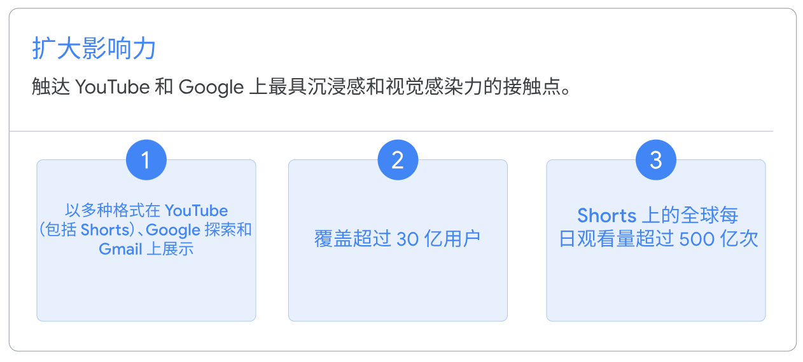
  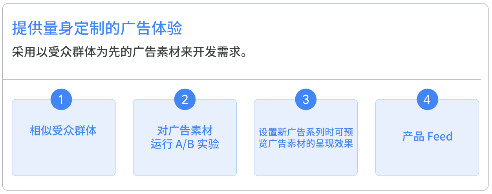
  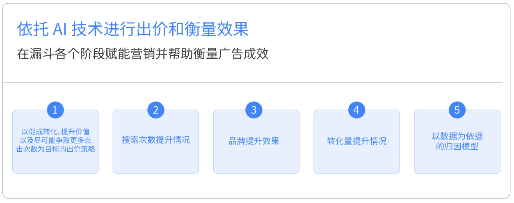

1. **扩大广告的影响力**：在 YouTube 和 Google 极具沉浸感的视觉平台（例如 YouTube、Google 探索、Gmail 和 Google 视频合作伙伴）上投放广告，让潜在客户产生购买欲望。借助需求开发广告系列，您可以覆盖多达 30 亿月活跃用户，并且 Google AI 则会将量身定制的高影响力视觉元素、广告内容和展示位置完美结合，让您可以吸引更多消费者按下“立即付费”。此外，您还可以轻松预览效果理想的视频和图片广告素材在 Google 和 YouTube 上的呈现效果，确保它们传达合适的信息。
1. **量身打造广告体验**：使用以受众群体为中心的广告素材来进一步发掘需求。只需点击几下，再加上 Google AI 技术的帮助，您便可以向最相关的潜在客户投放极具沉浸感和视觉吸引力的广告素材。相似细分受众群可帮助您覆盖现有客户群以外符合条件的新受众群体，包括购买过您的产品/服务、访问过您的网站或观看过您的 YouTube 频道视频的用户。您可以参考受众群体分析，根据自己的广告目标自定义匹配合适的受众群体。此外，A/B 实验还会帮助您优化广告素材制作方法，以不断提升效果。
1. **依托 AI 技术的出价和衡量**：为营销漏斗提供助力，并衡量成效。采用“尽可能争取更多点击次数”出价策略以提升网站访问量等与考虑度相关的目标作为优化方向，在整个漏斗中的各个阶段进行优化。使用品牌提升效果和搜索次数提升情况等衡量工具，以便确定广告支出是否获得了回报。需求开发广告系列依托于这些工具和 Google AI 提供的数据分析，可让您以提高网站流量为目标进行优化、转化高价值用户并依据高效的指标出价，同时还能使用以数据为依据的归因，在 Google 生态系统中展示广告系列的全部价值。

#### 从操作层面解释的优势/作用：

1. 灵活度更高，可使用的广告组多样，<text color="red">有单图广告、轮播广告、视频广告可选</text>，可根据客户提供的素材结合目标使用。
1. 成本更低，相对于转化型广告如搜索广告、购物广告、PMax广告（效果最大化广告）相比点击成本更为低廉。
1. 效果更佳，使用了恰当的受众及素材可有效降低过程数据的CPA（Cost Per Action，单次转化成本）。

### Demand Gen广告展示效果

> 💡 **提示**：Demand Gen在设置广告的时候有三个类型的广告形式可供选择，分别是 单图广告、轮播广告、视频广告，下面为三种广告类型在不同版位的展示效果。

#### 单图广告的展示位置：

##### Youtube的展示位置

Mobile展示 {align="center"}
    

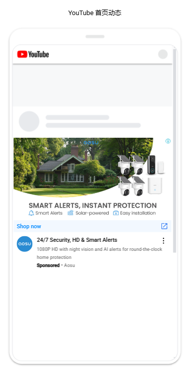
  PC端展示 {align="center"}
    

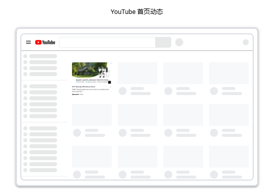

##### Google探索的展示位置

*Google 探索信息流广告格式仅在移动设备上播放。

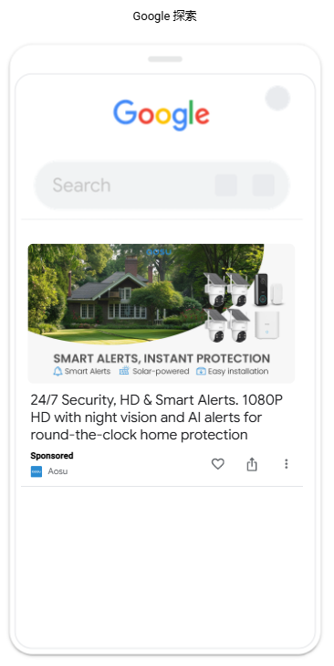

##### Gmail的展示位置

###### Gmail 手机端展示效果 {align="center"}
    

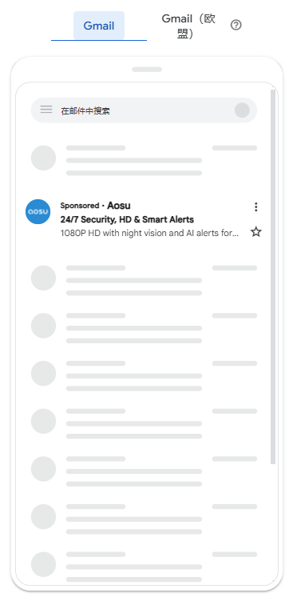
  ###### Gmail 手机端展示效果（欧盟） {align="center"}
    

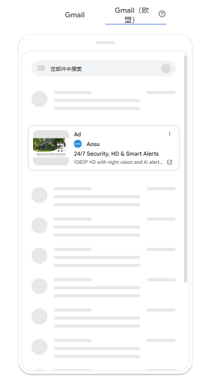

###### Gmail桌面端展示效果 {align="center"}
    

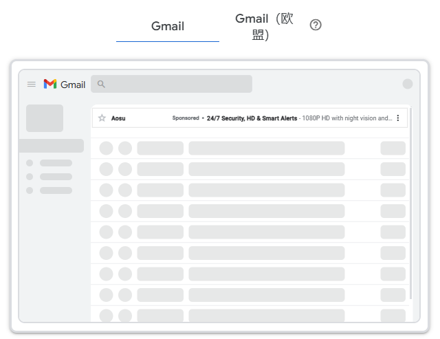
  ###### Gmail桌面端展示效果（欧盟） {align="center"}
    

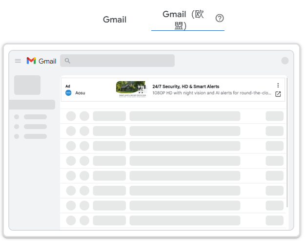

#### 视频广告的展示位置：

##### Youtube的展示位置

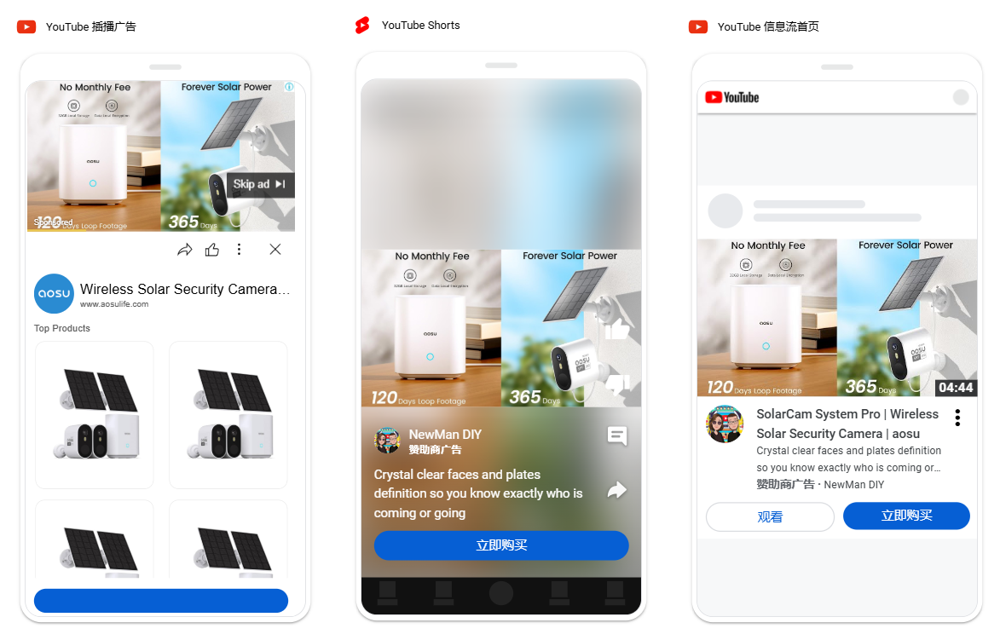

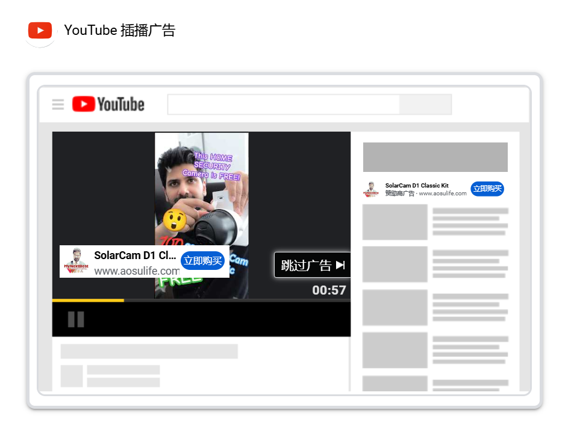

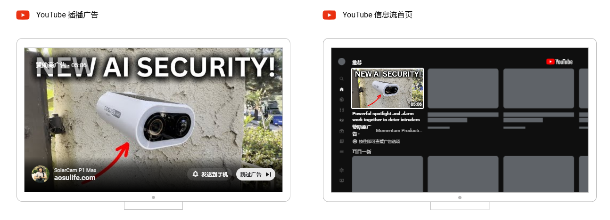

##### Google探索和Gmail的展示位置

视频广告将在移动设备上投放为 Gmail 广告。

Google探索中会有图文广告的展示。

#### 轮播广告的展示位置：

##### 手机端展示位置

- 横版图片
  

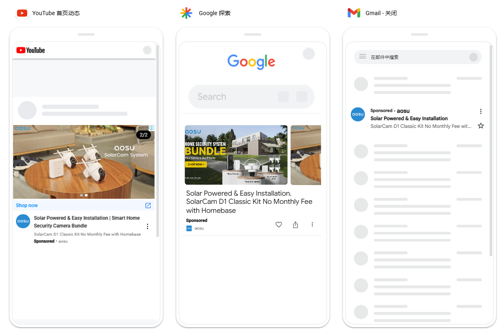

  

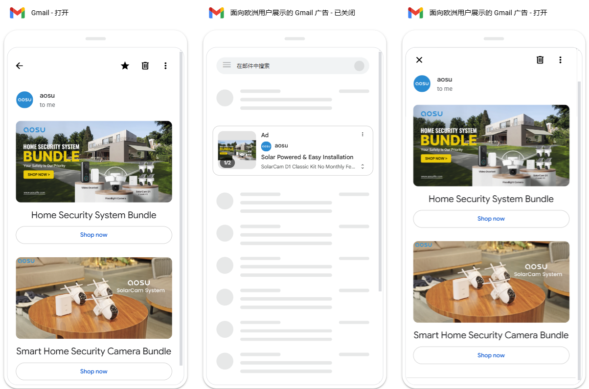

- 方形图片
  

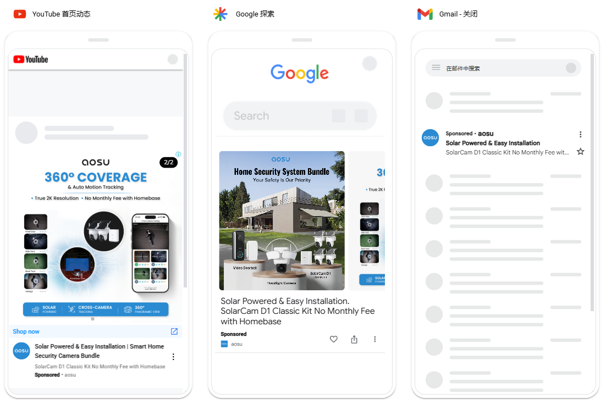

  

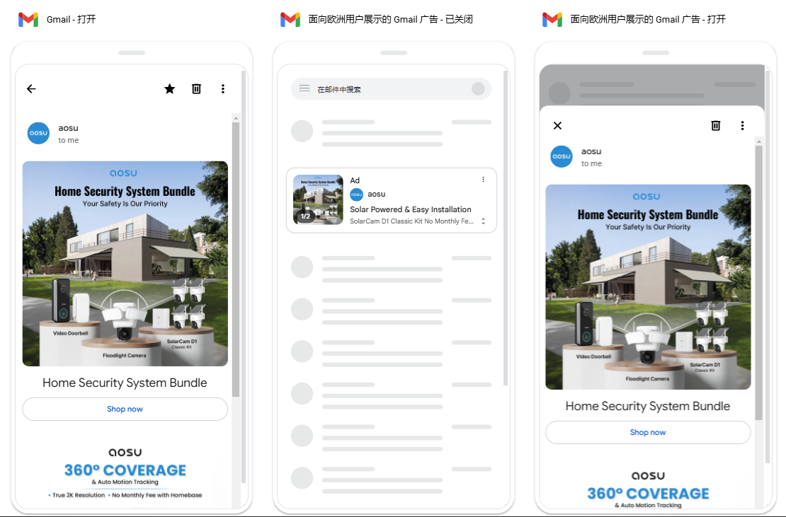

- 纵向图片
  

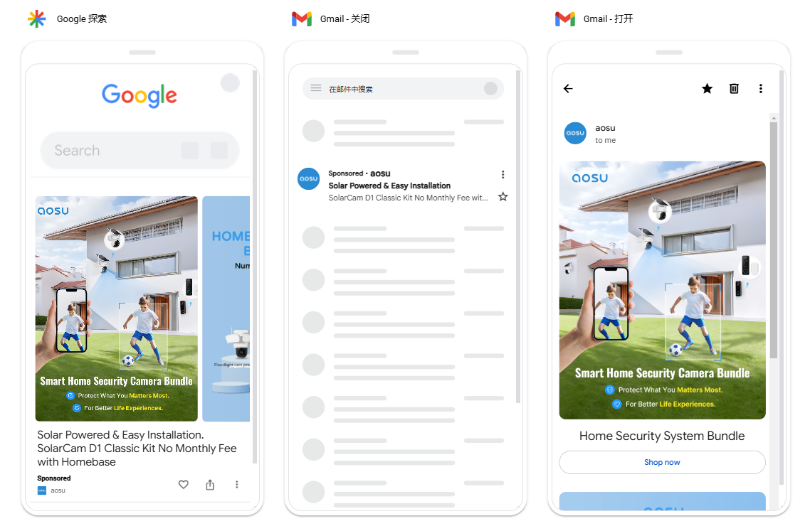

  

##### 桌面端展示位置

- 横版图片
  

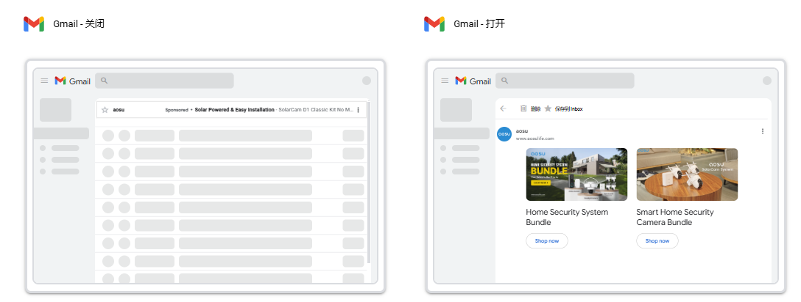

- 方形图片
  

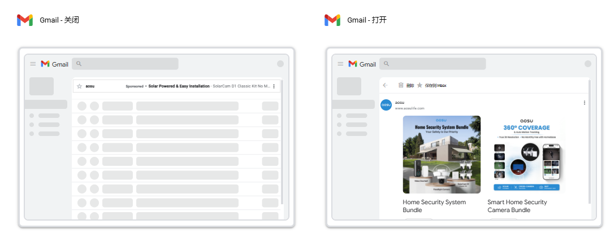

- 纵向图片
  

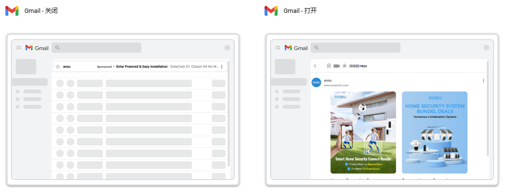

### Demand Gen对比Search/PMax的区别

> 📊 表格内容：点击 [此处](https://pwl28kvg7c4.feishu.cn/sheets/GhwZs3ioLhmPRZtaPXZclH16n3N_Y44PN0) 查看原表格（建议截图替换为本地图片）

