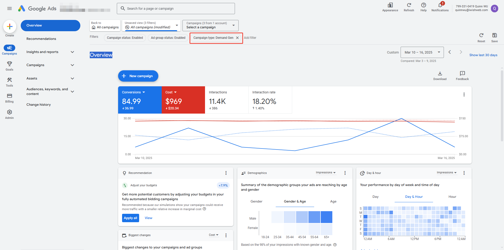
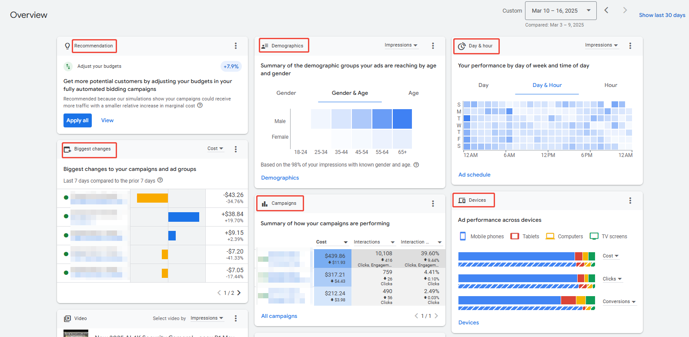
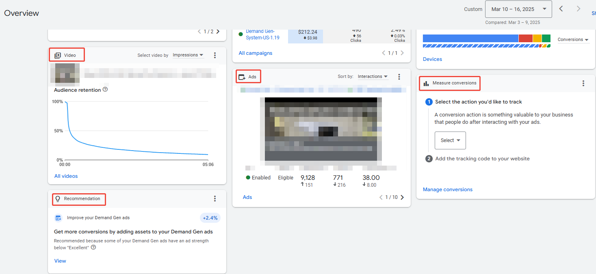
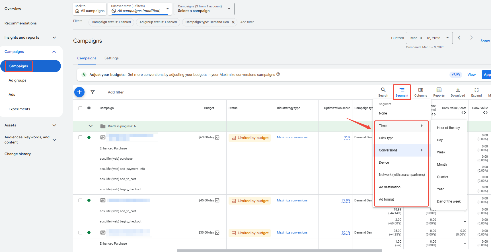
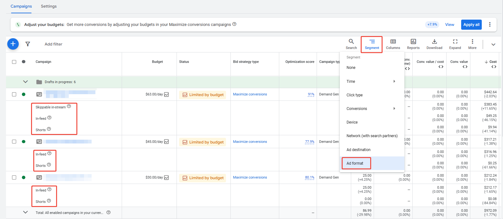
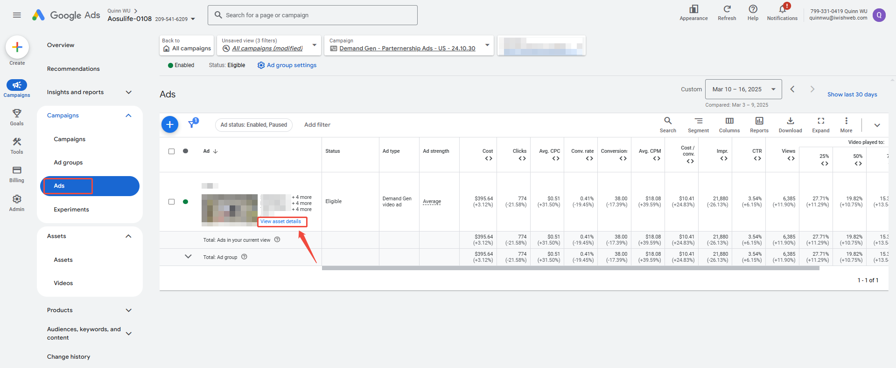
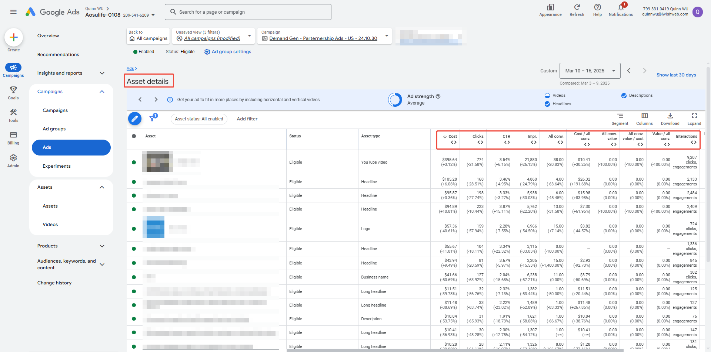
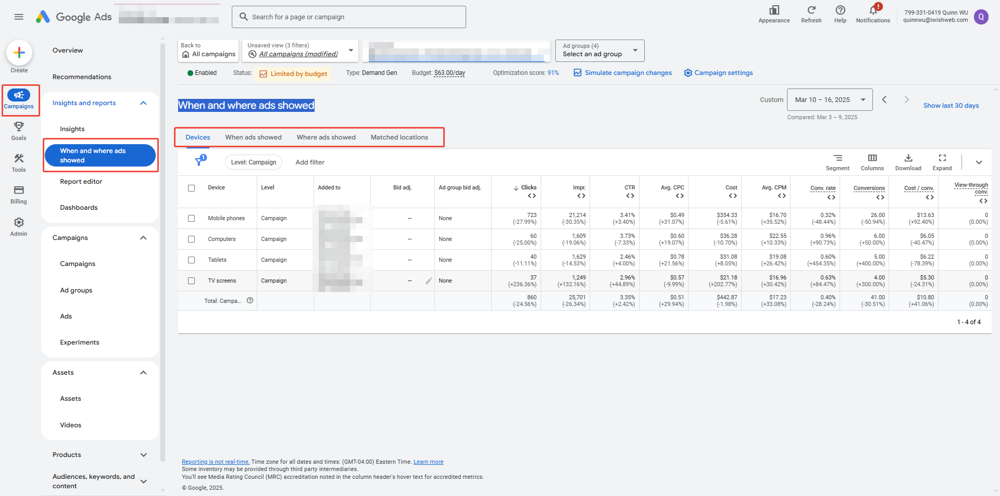

#### 1. 需求开发广告系列指标和报告简介

> 💡 **提示**：Google Ads 提供各种报告，帮助您深入了解广告客户的广告系列。这些报告可定制性强，能够提供各种指标的精细数据，包括<text color="red">点击次数、展示次数、转化次数、费用</text>等。

##### 查看报告的入口

###### Google Ads-概览（Overview）

1. Filters过滤Campaign Type - Demand Gen，可以看到仅包含Demand Gen的概览内容
  

1. 过滤后该板块包括：
  - 效果图表
  - 广告系列建议
  - “受众特征”卡片
  - Day & hour - 您每周或每天不同时间的表现
  - 系列最大变化
  - 广告系列摘要
  - 设备表现
  - 视频表现
  - 广告表现
  - Measure conversions
    

    

###### Google Ads-报告细分

> 💡 **提示**：可以按<text color="red">时间、设备、点击类型</text>和其他变量细分报告，以便更细致地了解广告系列的效果。对于需求开发广告系列，您还可以按其不同的广告格式（Ad format) 对报告进行细分，例如： 信息流广告：YouTube 信息流（接下来观看、首页动态、搜索结果）、Gmail 和 Google 探索信息流 Shorts 可跳过的插播广告

Campaign - Segment - Time/Devices/Click Type等 {folded="true"}

###### Google Ads-Asset details {folded="true"}

Campaign-Ads Group-Ads-View asset details

###### Google Ads-“展示了广告的位置”报告

Campaign-洞察和报告-When and where ads showed

##### 指标定义

> 📊 表格内容：点击 [此处](https://pwl28kvg7c4.feishu.cn/sheets/JmmqsiEWZhrcqttLFGdcRLNJnMe_WujJeb) 查看原表格（建议截图替换为本地图片）

#### 2. 需求开发广告衡量

##### Exposure 关注指标

- Reach/impression，CPM，frequency
- Video Views/completion rate，CTR  
- Social Engagement(e.g. Likes, follows, shares, etc.)
- Recall rate
- Impact in Brand Metrics

##### Exploration & Evaluation 关注指标

- Shallow Conversions (加购、结账、添加付款信息等）
- Landing Page Views, CTR
- Cost Per Landing page hit/view
- Traffic （e.g. Time spent, bounce rate)
- Incremental Searches

##### Purchase 关注指标

- Deeper Conversion
- Campaign Cost Per Conversions（系列单次转化费用）
- Account Roas & CPA
- ROI
- Revenue

#### 3. 影响需求开发广告效果的4个因素

##### 素材质量

使用社交源中的现有创意在几分钟内制作广告。

建议将所有宽高比的图像和不同尺寸的视频包含在一起，增加广告展示的自由组合的可能性，覆盖足够多的版面。

##### 受众投放

利用 Google 的强大信号和您自己的第一方数据来策划您的自定义受众群体,以便在正确的时间触达您的目标受众群体。

##### 预算与竞价模式

通过与客户的业务和营销目标紧密结合的策略进行有效的出价。

##### 转化跟踪

启用站点范围内的标记和转化跟踪，以确保活动成功(基于转化的出价类型也需要)。

> 💡 **提示**：Demand Gen综合测试：[Demand Gen综合测试](https://pwl28kvg7c4.feishu.cn/docx/COoYd5omCoM7HPxboa8cPYofnKd)

