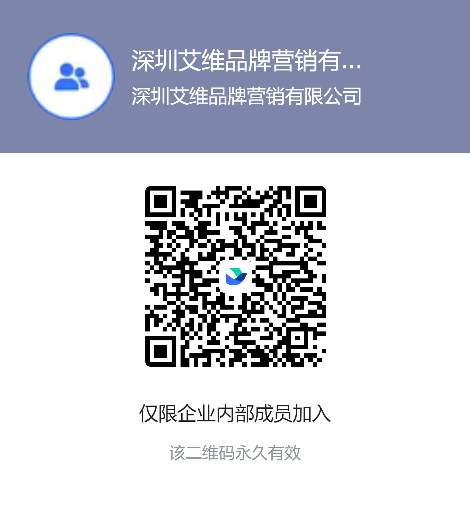

### 培训学习流程

<!-- mindmap:training-flow -->

### 一、了解艾维企业文化：

<button data-modal="letter" class="modal-trigger">致艾维人的一封信（点击进入）</button>

<button data-modal="intro" class="modal-trigger">艾维公司介绍（点击进入）</button>

### 二、申请企业邮箱、注册飞书帐号

1、企业邮箱申请：入职当天找Helen开通企业邮箱；

2、注册飞书账号：入职当天注册并加入到公司企业飞书（深圳艾维品牌营销有限公司）

a. 下载和安装飞书客户端：[官方参考链接](https://www.feishu.cn/hc/zh-CN/articles/360025035993-下载和安装飞书客户端)（点击进入）

b. 加入企业飞书：以下为深圳艾维品牌营销有限公司飞书二维码，请参考学习链接中 ”方式 2：通过企业二维码” 加入；新用户入门：[官方学习链接](https://www.feishu.cn/hc/zh-CN/category/7303381511270072348-新用户入门)（点击进入）

### 三、了解工作岗位

#### 1、Google优化师的岗位技能要求

**试用期：3个月**

**通过试用期的条件要求：**

> 📊 表格内容：点击 [此处](https://pwl28kvg7c4.feishu.cn/sheets/Hc4js2kAMhzr7St1b3hcLHIRn6f_dM7xgB) 查看原表格（建议截图替换为本地图片）

#### 2、培训考核要求：

**学习要求：**

按照培训流程学习每一部分的内容，掌握核心内容的应用，完成基本知识学习》模拟练习》实操运用》考试合格；完成项目负责人安排的日常工作。

**考核要求：**

- 通过艾维的阶段测试及日常的实践作业，学习期内每个章节的测试至少为80分以上；
- 执行并高质量完成项目负责人分配的工作内容；
- 满足公司对岗基本要求：较强的责任心、认真严谨的学习工作态度。

**（艾维优化师试用期通过比例为85%）**

#### 3、岗位晋升通道

优化师晋升通道：试用期》优化师 》 中级优化师 》高级优化师》资深优化师 》广告策略专家》项目经理》效果营销经理》效果营销总监

#### 4、阶段学习内容及要求

> 📊 表格内容：点击 [此处](https://pwl28kvg7c4.feishu.cn/sheets/Hc4js2kAMhzr7St1b3hcLHIRn6f_P7i1i4) 查看原表格（建议截图替换为本地图片）

### 四、开启学习

**学习时长：**4周-5周

**现在，请开启你的学习通道吧！ 祝你一切顺利！**
