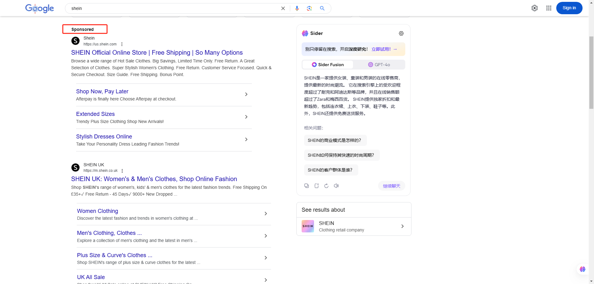
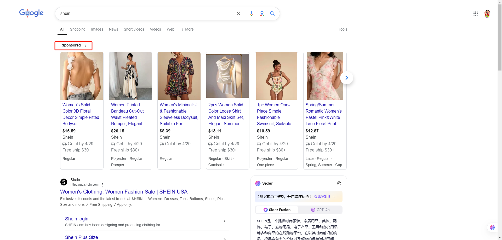
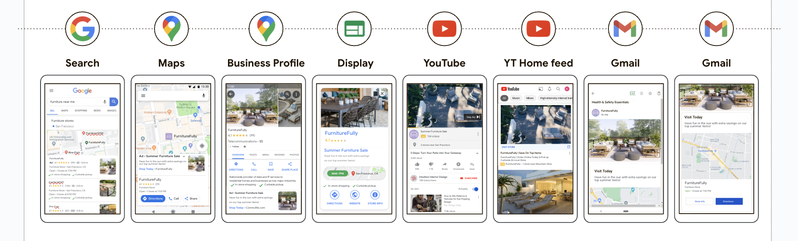

#### （**一）、什么是Google Ads？**

**定义**：

**Google Ads** 是 Google 推出的在线广告平台，允许广告主通过付费广告在 Google 搜索引擎、YouTube、Google 展示网络（数百万个网站和应用）以及 Google 地图等平台上推广自己的产品和服务。广告主可以针对特定关键词、广告版位及受众群体或兴趣投放广告，按点击（CPC）、展示（CPM）、观看（CPV）或转化（CPA）进行付费

**核心特点**：

- **用户意图驱动**：基于搜索词、浏览行为等数据匹配高意向用户。
- **多样化广告形式**：覆盖文字、图片、视频、商品目录等多种形式。
- **AI 智能优化**：自动出价、素材组合、跨渠道投放提升效率。

#### （二）、Google Ads包含哪些广告类型

> 📊 表格内容：点击 [此处](https://pwl28kvg7c4.feishu.cn/sheets/RFfPseIxdhGnK5tNn9pcrcSMnYa_Ungghl) 查看原表格（建议截图替换为本地图片）

除以上广告类型外，还有本地广告和应用广告，但这两种不适用于独立站，不详细讲述

#### （三）**、Google Ads展示在哪里？**

- Google ads能展示在包含Google Search、Google Shopping、Google Discovery、Youtube等在内的Google自有资源中
- 此外，Google Ads还能覆盖超3500 万个网站和应用合作，进一步拓宽广告覆盖面，帮助广告主完成阶段目标

    搜索广告 {align="center"}
  

    购物广告 {align="center"}

    视频广告 {align="center"}
  

    
    
    Demand Gen / Performance Max {align="center"}
