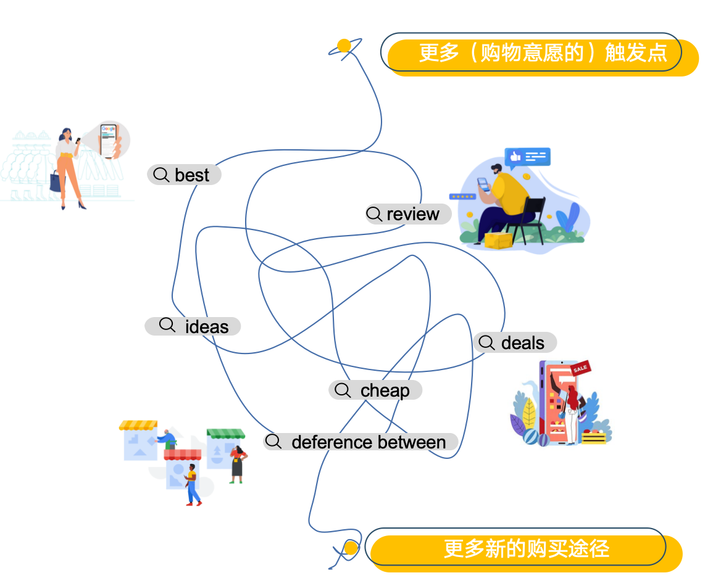
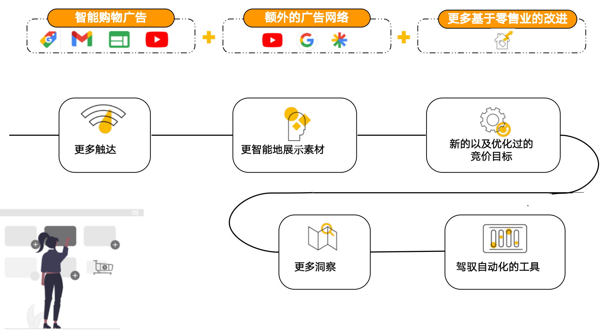

## PMax广告的核心特点

PMax（Performance Max的简称，可理解为AI赋能型广告或全自动化广告系列）

#### PMax诞生的背景：

1、随着消费者的购买旅程更加复杂，某些购物⾏为从计划到完成购买之间有多达500+ 网络触点
    

  2、复杂的购买旅程带来了获客成本的上升，单一渠道广告类型面临归因困难，很难找到合适的用户群体，广告设定非常复杂的局面，**PMax解决了这些痛点**
    
    

#### PMax广告的创新功能：

1. **全渠道覆盖，一站式投放**
- **覆盖渠道**：整合搜索、展示、YouTube、Gmail、Discover、地图等所有Google生态流量。
- **统一管理**：无需单独创建搜索广告、展示广告等，一个广告系列覆盖所有场景。
1. **AI驱动，目标导向**
- **智能优化**：根据广告主设定的目标（如ROAS、转化量），自动分配预算至高价值渠道和用户。
- **动态出价**：实时调整竞价策略，优先高转化概率的流量。
1. **动态素材组合（DCA）**
- **自动生成最优广告**：上传图片、视频、标题、描述等素材，AI自动拼接成适配不同场景的广告组合。
- **多模态展示**：根据用户偏好，动态展示图片、视频或文字广告。
1. **受众信号引导**
- **自定义受众输入**：可上传客户名单（如高价值用户邮箱）或设置受众特征（如“过去30天加购未购用户”），引导AI学习方向。

#### Pmax广告的应用场景(适合谁用)

- 所有零售电商及品牌商，符合购物广告的政策要求，都可以投放PMax广告，对于B2B获得用户线索及APP应用类也可使用。
- 但PMax不是万能药，而是“智能放大器”，通过合理设置目标、优化素材库、提供精准受众信号，PMax可成为增长的核心引擎！

##### Pmax广告的优**劣**势

##### Pmax广告的优势

> 📊 表格内容：点击 [此处](https://pwl28kvg7c4.feishu.cn/sheets/A25ds9df7h8o5Atay98cPKxfndb_dsmQfn) 查看原表格（建议截图替换为本地图片）

PMax广告的劣势

- 透明度低：无法查看具体投放渠道和关键词数据，依赖AI信任。
- 学习期长：需至少50次转化数据模型才能稳定（新手冷启动难）。
- 素材依赖强：素材质量直接影响效果，低质素材易导致效果波动。

#### Pmax广告的展示及组成(与PLA的区别)

##### Pmax广告与标准购物广告对比

> 📊 表格内容：点击 [此处](https://pwl28kvg7c4.feishu.cn/sheets/A25ds9df7h8o5Atay98cPKxfndb_Oj4Mpl) 查看原表格（建议截图替换为本地图片）

##### 如何选择PMax或标准购物广告？

> 📊 表格内容：点击 [此处](https://pwl28kvg7c4.feishu.cn/sheets/A25ds9df7h8o5Atay98cPKxfndb_bIqSM2) 查看原表格（建议截图替换为本地图片）

日常广告策略中，会建议**两者协同使用，**达到品效合一的效果

- **PMax广告**：适合全域增长，用“广度+智能”挖掘潜在用户。
- **标准购物广告**：适合精准转化，用“深度+控制”巩固购物流量。

> 💡 **提示**：相信学完上面的内容，你已经对Pmax有了一个初步的了解，让我们接下来继续学习Pmax的组成吧

