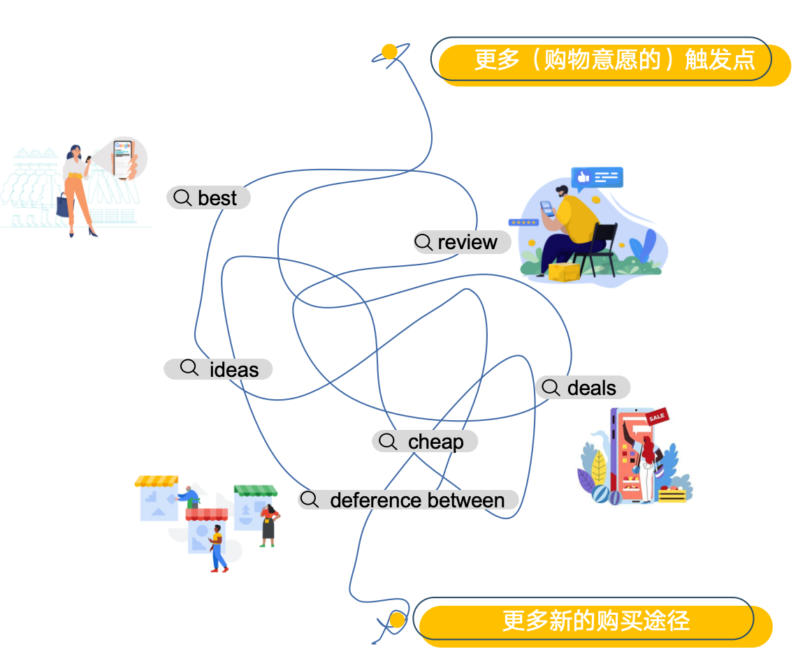
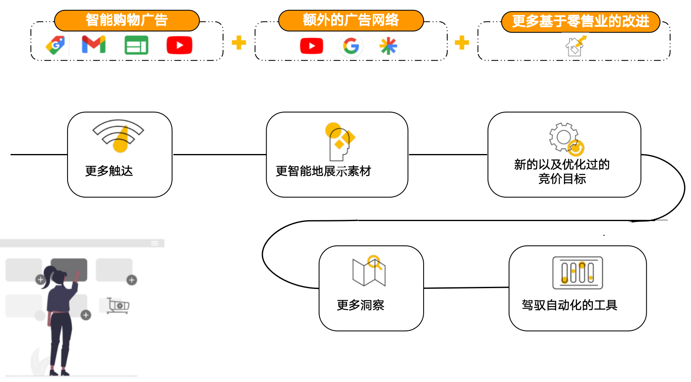

## PMax广告的核心特点

PMax（Performance Max的简称，可理解为AI赋能型广告或全自动化广告系列）

#### PMax诞生的背景：

1、随着消费者的购买旅程更加复杂，某些购物⾏为从计划到完成购买之间有多达500+ 网络触点
    

  2、复杂的购买旅程带来了获客成本的上升，单一渠道广告类型面临归因困难，很难找到合适的用户群体，广告设定非常复杂的局面，**PMax解决了这些痛点**
    
    

#### PMax广告的创新功能：

1. **全渠道覆盖，一站式投放**
- **覆盖渠道**：整合搜索、展示、YouTube、Gmail、Discover、地图等所有Google生态流量。
- **统一管理**：无需单独创建搜索广告、展示广告等，一个广告系列覆盖所有场景。
1. **AI驱动，目标导向**
- **智能优化**：根据广告主设定的目标（如ROAS、转化量），自动分配预算至高价值渠道和用户。
- **动态出价**：实时调整竞价策略，优先高转化概率的流量。
1. **动态素材组合（DCA）**
- **自动生成最优广告**：上传图片、视频、标题、描述等素材，AI自动拼接成适配不同场景的广告组合。
- **多模态展示**：根据用户偏好，动态展示图片、视频或文字广告。
1. **受众信号引导**
- **自定义受众输入**：可上传客户名单（如高价值用户邮箱）或设置受众特征（如“过去30天加购未购用户”），引导AI学习方向。

#### Pmax广告的应用场景(适合谁用)

- 所有零售电商及品牌商，符合购物广告的政策要求，都可以投放PMax广告，对于B2B获得用户线索及APP应用类也可使用。
- 但PMax不是万能药，而是“智能放大器”，通过合理设置目标、优化素材库、提供精准受众信号，PMax可成为增长的核心引擎！

##### Pmax广告的优**劣**势

##### Pmax广告的优势

| 优势维度 | 具体表现 |
|------|------|
| 流量覆盖 | 触达传统广告难以覆盖的长尾渠道，如 YouTube、Gmail、Discover 等，实现全渠道覆盖 |
| 效率提升 | 减少人工优化时间，AI 自动分配预算至高效渠道，降低运营复杂度 |
| 获客成本 | 动态优化高意向用户触达，降低单次转化成本，提升 ROI |
| 创意适应性 | 自动生成适配不同设备的广告，根据用户偏好动态展示图片、视频或文字广告 |

PMax广告的劣势

- 透明度低：无法查看具体投放渠道和关键词数据，依赖AI信任。
- 学习期长：需至少50次转化数据模型才能稳定（新手冷启动难）。
- 素材依赖强：素材质量直接影响效果，低质素材易导致效果波动。

#### Pmax广告的展示及组成(与PLA的区别)

##### Pmax广告与标准购物广告对比

| 对比维度 | PMax | 标准购物广告 |
|------|------|------|
| 核心目标 | 跨渠道最大化转化价值 | 通过商品 Feed 获取精准流量 |
| 投放渠道 | 全渠道（搜索、展示、YouTube、Gmail、Discover、地图等） | 仅限购物网络 |
| 广告形式 | 动态组合多种形式（图片、视频、文字） | 单一形式（商品图片+标题+价格） |
| 依赖数据 | 需 Feed + 创意素材 | 仅需 Feed |
| 关键词控制 | 无关键词，AI 自动匹配 | 可设置否定关键词 |
| 广告素材控制 | 需上传多类型素材（图片、视频、标题、描述） | 素材由 Feed 生成 |
| 定向能力 | 全自动定向 + 受众信号 | 仅依赖 Feed 和人口统计 |
| 数据要求 | 需 30 天 50 次转化 | 无硬性门槛 |
| 预算分配 | 自动分配 | 可手动调整 |

##### 如何选择PMax或标准购物广告？

| 决策因素 | 优先选 PMax | 优先选标准购物广告 |
|------|------|------|
| 业务目标 | 品牌曝光 + 销售转化，追求全域增长 | 单纯追求直接销售，精准转化 |
| 广告预算 | ≥ $50/天，有足够预算让 AI 学习优化 | < $30/天，预算有限需精细控制 |
| 团队能力 | 能提供多样化素材（图片、视频、文案） | 仅有基础 Feed 能力，素材资源有限 |
| 数据透明度 | 接受聚合数据，信任 AI 自动优化 | 需详细分析，对数据有强控制需求 |

日常广告策略中，会建议**两者协同使用，**达到品效合一的效果

- **PMax广告**：适合全域增长，用“广度+智能”挖掘潜在用户。
- **标准购物广告**：适合精准转化，用“深度+控制”巩固购物流量。

> 💡 **提示**：相信学完上面的内容，你已经对Pmax有了一个初步的了解，让我们接下来继续学习Pmax的组成吧

