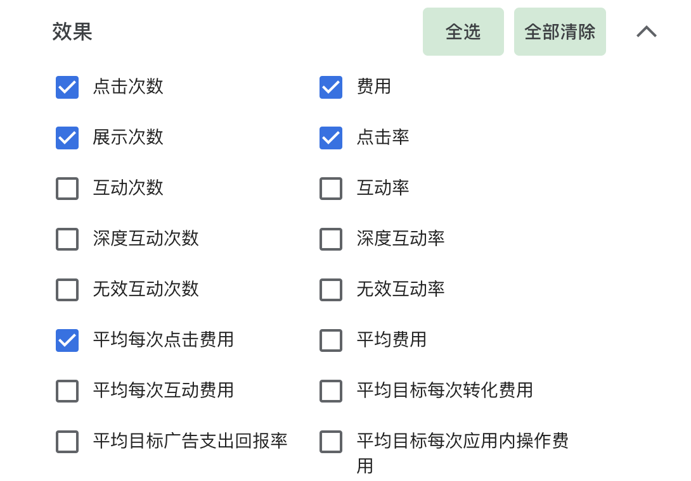
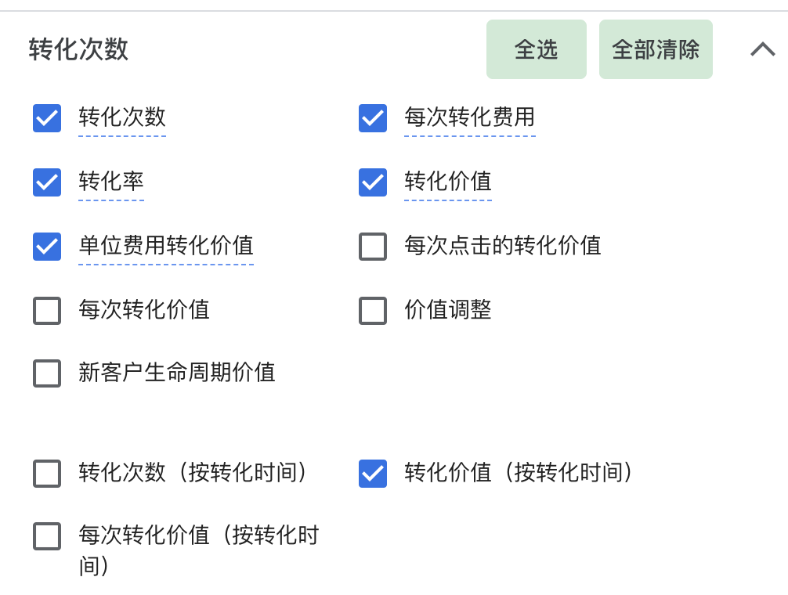

##### Pmax的洞察页面提示

PMax的**洞察页面**提供了一系列关于广告投放的分析数据，帮助优化广告表现。以下是常见的洞察点及其作用：

        1.        **搜索趋势（Search Trends）**
        •        发现用户搜索行为的变化趋势，帮助调整广告策略。
        •        例如，某类关键词的搜索量激增，可以考虑优化产品 Feed 以更好地匹配需求。
        2.        **受众群体表现（Audience Insights）**
        •        展示哪些受众群体（兴趣、购买意向、再营销）对广告反应良好。
        •        可用于调整广告创意或出价策略，以更精准地触达高价值用户。
        3.        **资产表现（Asset Performance）**
        •        PMax 广告会自动测试不同的素材（图片、视频、标题等），并按 **低表现/优秀表现** 进行评级。
        •        低表现的素材建议替换或优化，以提升广告效果。

##### Pmax广告核心数据指标

PMax 广告的核心数据指标可以帮助衡量广告效果，并进一步优化投放策略。以下是关键指标：

1. **展示与点击相关指标**
    

  2. **转化相关指标**
    

3. **素材与广告表现**
- **资产评级（Asset Performance）** = PMax 自动评估的素材表现（低、中、高）
- **展示份额（Impression Share）** = 广告的展示量 ÷ 可获得的展示量
- **视频观看率（Video View Rate）** = 视频播放次数 ÷ 展示次数（适用于视频资产）

1. **受众与渠道表现**
- **受众群体（Audience Segments）** = 哪些受众群体转化率更高
- **广告投放渠道表现（Channel Performance）** = 购物、YouTube、Gmail、展示广告等不同渠道的效果

##### 关键指标的衡量及优化

为了优化 PMax 广告，必须针对不同的关键指标采取相应的优化措施。

1. **优化 ROAS 和转化率**

**方法：**

- 使用 **目标 ROAS（tROAS）** 竞价策略，让系统自动优化出价
- **排除无效流量**：查看搜索词报告，添加无转化的搜索词为“否定关键词”
- **提高产品 Feed 质量**，优化标题、描述、图片，以匹配高价值搜索意图

1. **提高点击率（CTR）**

**方法：**

- **优化广告素材**，更换低表现的图片、视频、文案
- **增强广告吸引力**，使用**限时折扣、促销信息**提高用户点击意愿
- **投放更精准的受众**，避免广告展示给无兴趣的用户

1. **降低 CPC，提高预算利用率**

**方法：**

- **调整竞价策略**，尝试**最大化转化价值** 或**tROAS**
- **减少低转化率的渠道**，如某些展示广告位置效果较差，则降低其出价
- **优化移动端和桌面端出价**，如果移动端转化率更高，可提高移动端预算

1. **提高展示份额**

**方法：**

- **增加预算**，如果广告的展示份额低，可能是竞争激烈导致曝光不足
- **优化产品数据**，确保 Google Merchant Center 的产品信息完整
- **提高出价**，特别是对高转化率的产品，可适当提升 CPC 以增加展示量

1. **提升视频和展示广告效果**

**方法：**

- **提升视频质量**，确保 PMax 的视频素材符合最佳实践（清晰、有吸引力）
- **优化展示广告投放**，排除表现不佳的网站和展示位置
- **增强品牌信号**，让广告内容更具品牌风格，提高用户记忆度

> 💡 **提示**：PLA与Pmax综合考核：[PLA与Pmax综合考试](https://pwl28kvg7c4.feishu.cn/docx/MEtidzBBtoIOKnxvaU4calcqnEg)

