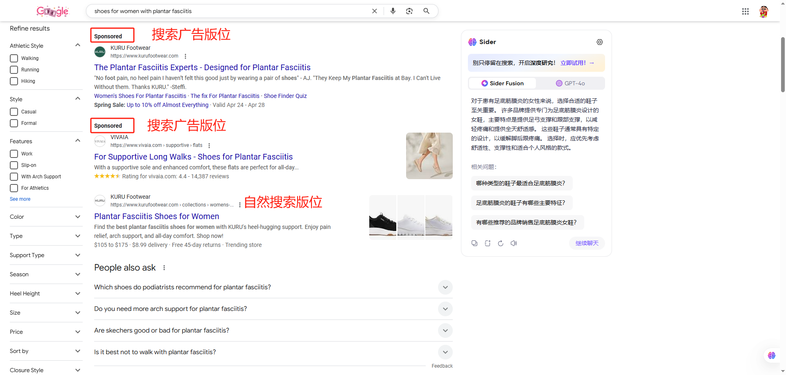
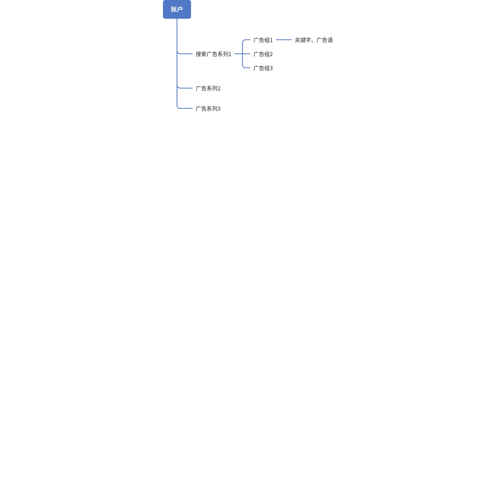

### 什么是搜索广告

> 💡 **提示**：付费搜索广告是指在谷歌搜索结果页面上呈现的付费广告形式 用户输入的搜索词与卖家购买的关键词的关联性等因素决定卖家的搜索广告能否出现在搜索结果的页面上，以及出现的位置是否靠前 关键字、文案、着陆页、产品信息这几大因素是做好 搜索付费广告缺一不可的要素

**搜索广告（Search Ads）** 是 Google Ads 中最核心的广告类型，当用户在 Google 搜索框中输入关键词时，广告主可以通过竞价方式，让自己的文字广告展示在搜索结果页的顶部（标注“广告”）或底部，精准触达有明确需求的用户。

### **搜索广告的核心特点**：

- **用户主动意图强**：广告基于用户搜索的关键词触发，匹配高购买意向。
- **流量精准**：用户有需求时，主动搜索才会展示，转化率显著高于其他广告形式（平均高3-5倍）
- **按点击付费（CPC）**：只有用户点击广告时，广告主才需付费。
- **高度可优化性**：通过关键词策略、广告文案、质量得分提升广告效果。
- **促进即时转化：**用户搜索时通常处于购买旅程的“考虑”或“决策”阶段，广告可以直接引导用户访问官网或完成购买

### 搜索广告的运作逻辑

### 付费搜索广告与自然搜索之间的区别

> 📊 表格内容：点击 [此处](https://pwl28kvg7c4.feishu.cn/sheets/L2tVsrXi1hCvNttXCntcvfPznWh_2cphPN) 查看原表格（建议截图替换为本地图片）

### 搜索广告的层级结构

###### Google搜索广告采用 **“账户→广告系列→广告组→广告与关键词”** 的四级架构，每层级的核心功能如下：

> 📊 表格内容：点击 [此处](https://pwl28kvg7c4.feishu.cn/sheets/L2tVsrXi1hCvNttXCntcvfPznWh_SBU8kP) 查看原表格（建议截图替换为本地图片）

###### 各层级的核心逻辑与协同关系

1. **账户层：全局控制与资源分配**
- **重要性**：统一管理多市场、多品牌广告活动，避免预算冲突。
- **最佳实践**：
  - 按业务线分账户（如独立站美国与欧洲帐户分开）。
  - 设置账户级否定关键词（如排除“免费”“教程”等无效词）。
1. **广告系列层：策略分界点**
- **核心逻辑**：不同广告系列对应不同目标或市场，相互独立优化。
- **示例策略**：
- 解释什么是品牌词？

> 📊 表格内容：点击 [此处](https://pwl28kvg7c4.feishu.cn/sheets/L2tVsrXi1hCvNttXCntcvfPznWh_PIC4Oy) 查看原表格（建议截图替换为本地图片）

1. **广告组层：主题化精细管理**
- **黄金法则**：**“一主题一广告组”**，确保关键词与广告内容高度相关。
  - **正确示例**：

广告组“防水登山鞋”包含关键词：“男士防水登山鞋”“登山鞋 防滑”，广告文案均围绕防水功能展开。

  - **错误示例**：

广告组“户外装备”混杂关键词：“登山鞋”“帐篷”“冲锋衣”，导致广告相关性低，质量得分下降。

1. **广告语与关键词层：效果执行单元**
- **关键词**：决定广告触发条件（流量精准度）。
  - 匹配类型选择：品牌词用精确匹配，长尾词用词组匹配。
- **广告文案**：影响点击率（CTR）与质量得分。
  - 标题需含核心关键词，描述需强化卖点（如“30天退换”“限时折扣”）。

---

###### 层级结构对广告效果的影响

1. **正向影响案例**
- **合理结构**：账户（全球市场） → 系列（美国黑五促销） → 广告组（冬季羽绒服） → 关键词“加厚羽绒服” + 广告“黑五5折，抗寒-30℃”。
- **结果**：广告相关性高 → 质量得分8分 → CPC成本降低20%。CTR达7%，ROAS 1:5。
1. **错误影响案例：层级混乱**：同一广告组包含“运动鞋”和“笔记本电脑”关键词，广告文案无法聚焦。
- **结果**：质量得分3分 → CPC成本飙升，广告排名下降。CTR<1%，转化率为0。

###### 常见问题解答

**Q：一个广告系列应该包含多少个广告组？**

A：根据产品线或帐户整体结构来定，通常5-10个，确保每个广告组主题明确。例如，服饰类可按“男装”“女装”“童装”划分。

**Q：为什么质量得分低的广告组需要优化结构？**

A：质量得分低通常因广告组内关键词与广告文案不相关。需拆分广告组或优化文案。

> 💡 **提示**：学完这块相信你对搜索广告是什么一定有了一些认识和了解，咱们趁热打铁，进入下一章的内容学习 [4.2搜索广告的组成](https://pwl28kvg7c4.feishu.cn/docx/KssbdawFJoiwg1xAM8ccd5LYnIf)

