### 搜索广告的核心要素(关键字、广告语、出价策略)

1. **关键字（Keywords）——流量入口的「精准度」 决定流量质量**
- **作用**：决定广告何时被触发，匹配用户真实搜索意图。
1. **广告文案（Ads）——用户点击的「吸引力」 决定流量转化效率**
- **作用**：传递卖点，刺激用户点击并进入落地页。
1. **出价策略（Bidding）——成本与效果的「调节器」 科学调控放大收益**
- **作用**：平衡广告排名与成本，最大化投放目标

**三者协同**：数据驱动下持续迭代，形成“更低成本 → 更高转化 → 更多数据 → 更准优化”的正向循环。

### 如何筛选挖掘关键字及关键字分组

#### 一、关键字筛选与挖掘的核心逻辑

**目标**：找到**高相关性、高转化潜力、合理竞争度** 的关键字，匹配用户真实搜索意图。

**关键指标**：搜索量（Volume）、竞争程度（Competition）、每次点击费用（CPC）、转化率（CVR）。

**关键字选择的原则**：

- 相关性：与产品或服务高度相关。
- 搜索量：有一定搜索量，确保广告曝光。
- 适当的数量：为保证广告能够正常触发，关键字不宜过少，可根据关键字搜索量进行判断，一般建议10个以上

#### 二、关键字挖掘的5种方法及工具

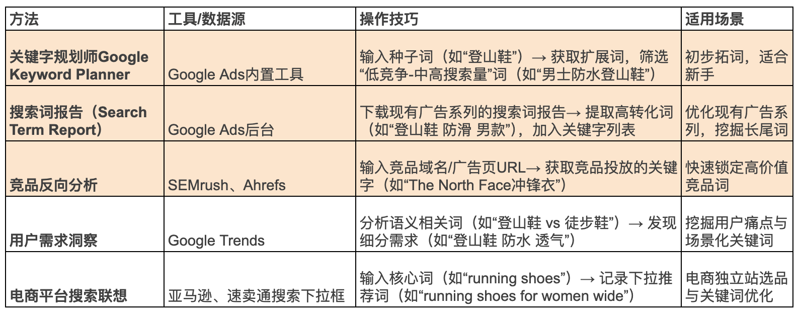

**关键字规划师的使用方法：**

在广告后台进入关键字规划师工具》发现新关键字》输入关键字及条件》在给出的结果中选择适合的关键字》复制或下载备用

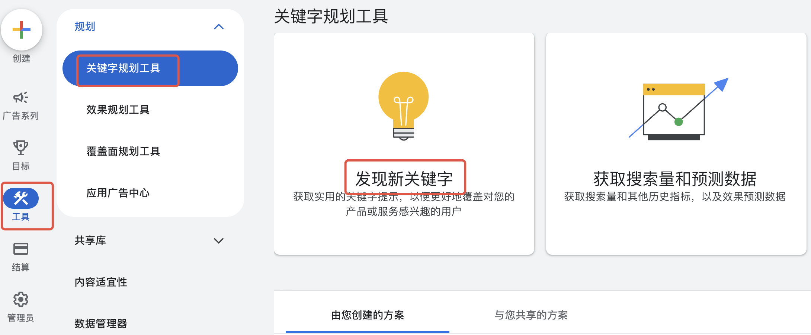
  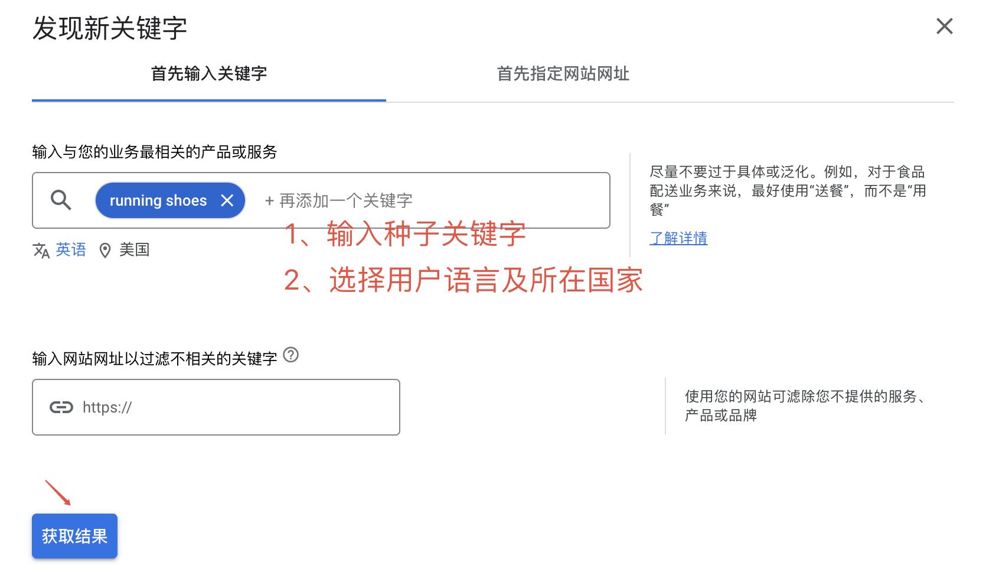

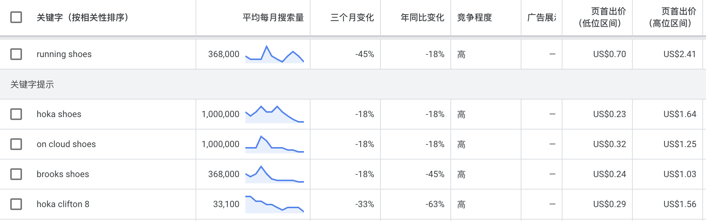

#### 三、关键字筛选的4个核心维度

1. **业务相关性**：
  - 剔除与产品无关词（如“登山鞋图纸”对销售实物无意义）。
1. **商业意图强弱**：
  - 优先选择含购买意图的词（如“登山鞋推荐”“登山鞋 折扣” > “登山鞋品牌历史”）。
1. **竞争度与CPC平衡**：
  - 高转化品类（如电子产品）：可接受CPC $2-5，竞争度中等；
  - 低利润品类（如服装）：CPC需≤$2，优先长尾词。
1. **搜索量合理性**：
  - 避免“零搜索词”（如“超轻碳纤维登山鞋 2024款”）和“超泛词”（如“鞋子”）。

#### 四、关键字分系列的2种策略

1. **按用户意图分层（购买阶段）**

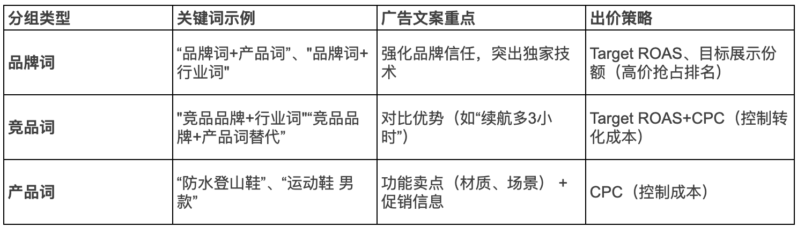

> 💡 **提示**：搜索广告系列前期建议都以cpc出价进行成本控制，后续根据效果情况及目标切换对应出价策略

1. **按主题细分（产品/服务类目）**
- **错误示范**：宽泛分组“户外装备”（含登山鞋、帐篷、冲锋衣）。
- **正确分组**：
  - 广告组1：**男士防水登山鞋**

关键词：男士防水登山鞋、登山鞋 防滑 男、Gore-Tex登山鞋

广告标题：“男士防水登山鞋 | 黑科技防滑大底”

  - 广告组2：**轻量化帐篷**

关键词：超轻帐篷 双人、徒步帐篷 防风、帐篷 便携

广告标题：“徒步帐篷仅1.2kg | 3秒速开设计”

#### 五、关键字分组的实操步骤（以电商为例）

1. **确定核心产品线**：如“户外运动鞋”下的子类“登山鞋”“跑步鞋”。
1. **挖掘初始关键词库**：
  - 工具：Keyword Planner输入“登山鞋”→ 导出500个相关词。
1. **清洗与分类**：
  - 剔除无效词（如“登山鞋简笔画”）。
  - 按“品牌/竞品/产品/长尾”分类，并按细分属性分组（如“防水”“减震”“男款”）。
1. **构建广告组结构**：
  - 每组5-20个紧密相关词（如“防水登山鞋”组：男士防水登山鞋、登山鞋 防滑 防水）。
  - 每组对应2-3条针对性广告（如标题含“防水”，描述强调“Gore-Tex技术”）。
1. **设置否定关键词**：
  - 账户级排除“免费”“教程”“二手”；
  - 广告组级排除“登山鞋 女”（若主推男款）。

#### 六、避坑指南：常见错误与解决方案

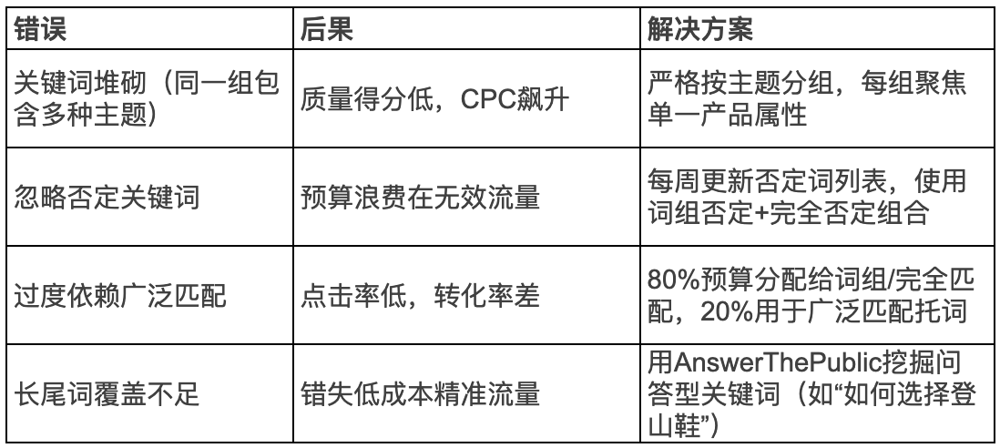

### 如何选择关键字的匹配类型

Google 搜索广告的关键词匹配类型决定了用户的搜索词如何触发你的广告展示。**正确选择匹配类型是平衡流量精准度和覆盖范围的核心**。以下是四种匹配类型及其使用策略：

###### 关键词匹配类型及原理

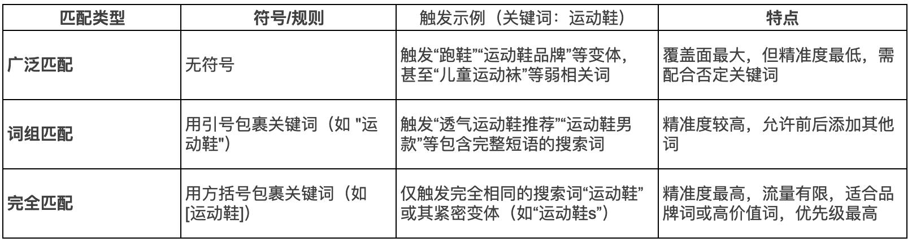

###### 使用场景与策略

1. **广泛匹配（Broad Match）**
- **适用阶段**：
  - **市场调研期**：快速发现用户搜索词，扩充关键词库。
  - **预算充足时**：覆盖长尾流量，需配合否定关键词过滤无效词。
- **优化技巧**：
  - 定期下载**搜索词报告**，将高转化词升级为词组/完全匹配，低效词加入否定列表。
  - 示例：关键词“运动鞋”触发“儿童运动袜” → 添加否定关键词“儿童”“袜”。
1. **词组匹配（Phrase Match）**
- **最佳实践**：
  - **竞品拦截**：投放 `"最佳运动鞋"`，覆盖用户比价搜索。
  - **地域限定词**：如 `"纽约 运动鞋店"`，精准定位本地客户。
- **注意事项**：
  - 避免过度限制：若关键词过长（如 `"2023新款男士透气运动鞋"`），可能错过相关变体。
1. **完全匹配（Exact Match）**
- **核心用途**：
  - **品牌保护**：投放 `[Nike运动鞋]`，防止竞品截流。
  - **高转化词锁定**：对ROAS>1:5的关键词（如 `[防水登山鞋]`）独占流量。
- **扩展技巧**：
  - 使用**紧密变体**功能（默认开启），允许单复数、错别字、词序调换（如“运动鞋男士”→“男士运动鞋”）。

###### 关键词分层策略（组合使用匹配类型）

1. **广告系列结构建议**
- **品牌词系列**：完全匹配（如 `[Anker]`）+ 词组匹配（如 `"Anker Charger"`）。
- **竞品词系列**：词组匹配（如 `"Bose Replace"`）+ 完全匹配（如 [`Bose` Earphone]）。
- **通用词系列**：词组匹配（如 `"Patchwork cap sleeve maxi dress"`）。

###### 否定关键词（Negative Keywords）的配合使用

1. **否定类型**
- **广泛否定**：排除所有包含该词的搜索（如 free → 排除所有包含free的关键字）。
- **词组否定**：排除包含完整词组的搜索（如 `"shoes wholesale"` → 允许“shoes for man”）。
- **完全否定**：仅排除精确词（如 `[shoes for man]` → 允许“shoes for woman”）。
1. **应用场景**
- **排除无效流量**：
  - 添加“免费”“教程”“售后”“如何制作”等非购买意图词。
- **区分用户类型**：
  - B2B企业否定“家用”“学生用”等B2C相关词。

---

###### 关键字如何优化

1. **每周下载搜索词报告**，分析触发词转化数据：
  - 高转化词 → 升级为词组/完全匹配，单独出价。
  - 低效词 → 添加至否定关键词列表。
1. **监控质量得分**：
  - 若关键词质量得分<6分，优化广告文案相关性（如标题包含关键词）。
1. **A/B测试匹配组合**：
  - 示例：对比 男士运动鞋（广泛匹配）与 `"防水运动鞋"`（词组匹配）的CPC和ROAS。

---

### 如何写好广告语（标题、广告描述）

搜索广告的文字内容，目前搜索广告仅支持自适应搜索广告，一个广告组最多可以创建3个自适应广告，其中广告文案包括标题和内容描述。广告主可以根据自己的产品或服务的内容、特点撰写想要呈现在用户面前的广告文案内容

###### 标题与描述的基础结构

- **标题（Headlines）**：
  - 有 15 个标题字段，每个字段最多 30 个字符
  - 作用：突出产品核心卖点，突出品牌服务亮点
  - 要求：单词首字母大写，不要出现连续大写，不要出现诱导性字符，字符数不要过少（低于10字符）
- **描述（Descriptions）**：
  - 有 4个描述字段，每个字段最多 90 个字符
  - 作用：补充品牌或产品详细信息，引导用户点击
  - 要求：句子首字母大写，结尾不要加句号，不要出现过于绝对的内容

###### [**标题与描述的撰写建议**](https%3A%2F%2Fsupport.google.com%2Fgoogle-ads%2Fanswer%2F6167122)

- 撰写富有吸引力、全新构思的广告文案
- 制作能够反映您的品牌以及您提供的产品和服务的广告内容
- 巧妙设置广告以取得出色成效
- 使用尽可能多的素材资源类型
- 测试和优化广告内容
1. **标题与描述的获取来源**
- 行业趋势与用户需求：关注行业动态和用户需求变化，调整标题与描述
- 产品页面与用户评价：从官网产品页面和用户评价中提取核心卖点及用户关注点
- 竞争对手分析：研究竞争对手的广告文案，提取优秀标题与描述的核心元素

###### 标题分类与内容方向

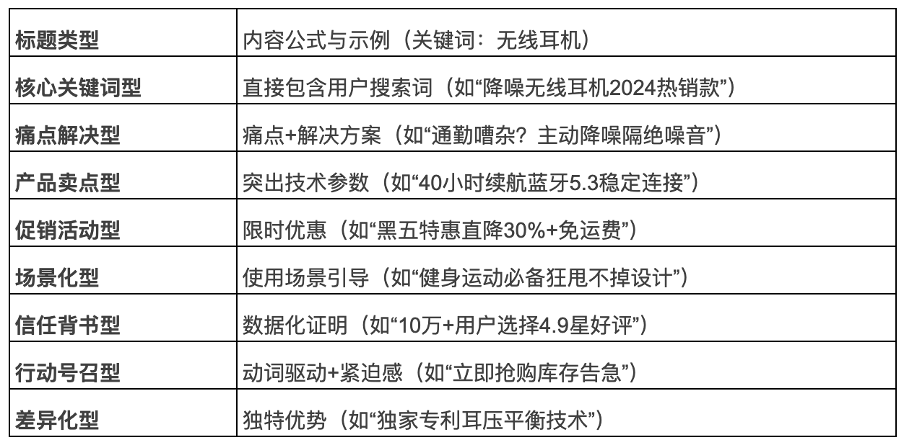

###### 标题优化技巧

- [**动态关键词插入**](https%3A%2F%2Fsupport.google.com%2Fgoogle-ads%2Fanswer%2F2454041%3Fctx%3Dtltp%26_gl%3D1*1b4ypnf*_ga*MTA4MDUwMzY2LjE3Mzg3MjUwMzY.*_ga_V9K47ZG8NP*MTc0NTQ3NzQ2NS4xMTguMS4xNzQ1NDc3NDY2LjU5LjAuMA..)：至少1条标题使用 `{Keyword}`（如“{Keyword}限时特价中”）。
  - 通过关键字插入功能，可以自动向广告添加广告组中触发广告展示的关键字。这样可以提高广告与搜寻您所提供产品或服务的用户的相关性。
  - 如广告标题：**购买**`**{KeyWord:巧克力}**`，若用户搜索黑巧克力，则显示的标题会变为：**购买黑巧克力**
  - 在插入关键字是，有三个选项，**词首字母大写**：所有关键字的第一个字母都采取大写形式；**句首字母大写**：只有第一个关键字的第一个字母采取大写形式；**小写**：任何字母都不采取大写形式（按需选择，一般建议采用词首字母大写）
- **符号分隔**：用竖线 `|`、连字符 `-` 提升可读性（如“Hi-Fi音质 - 沉浸式体验”）。
- **A/B测试组合**：
  - 测试促销型 vs 功能型标题（如“Up to $50 Off” vs “24-hour battery life”）。
  - 测试长尾词 vs 通用词标题（如“Sports wireless headphones” vs “headphones”）。

###### 15条标题示例（无线耳机）

- Shokz Official Site
- The Best Headphone In 2025
- Spring Sale Up to 15% Off
- Bone Conduction Headphone
- Perfect for Sports and Fitness
- Sign up for exclusive Discount
- Your ultimate open-ear audio
- Open fit Air Support – Shokz
- Waterproof Swimming Headphone
- Resetting Your Headphones
- Two-year Warranty
- Free & Fast Shipping
- Pairing Your Headphones
- Shop Shokz Open Ear Headphones
- Openrun- Buy Direct from Shokz

---

###### 4条内容描述撰写策略

每条描述≤90字符，需独立传递完整信息（系统可能只展示1条或组合多条）：

**描述内容分层**

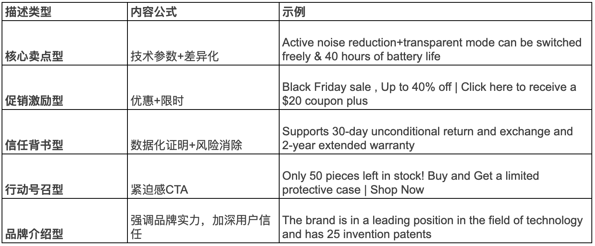

**广告文案模板**

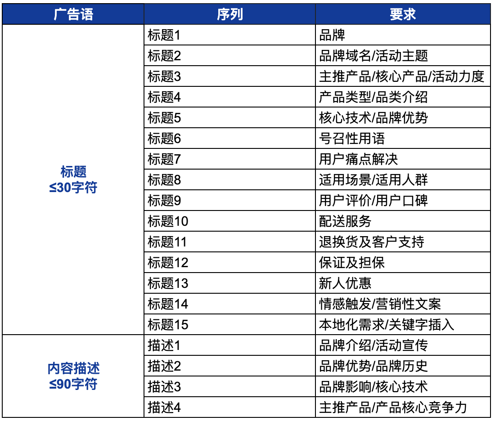

---

### <text color="red" bgcolor="light-yellow">什么是附加信息，如何使用</text>

###### 适用于Google搜索广告的附加信息类型（电商版）

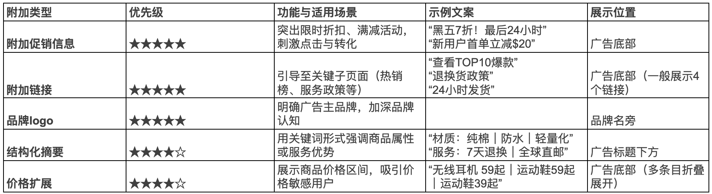

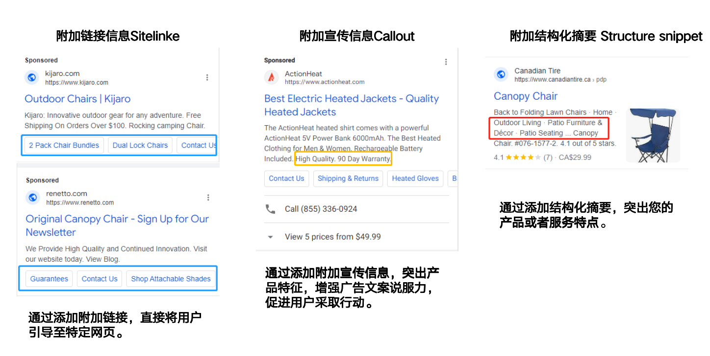

---

###### 搜索广告附加信息的核心作用

1. **提升广告排名**：附加信息越多，广告占据的搜索结果页面积越大（尤其在移动端），点击率平均提升**10-20%**。
1. **降低用户决策成本**：直接展示价格、促销、服务政策等关键信息，减少跳转后流失。
1. **适配多需求场景**：通过不同链接满足用户比价、查看详情、咨询等需求。

---

###### 优化技巧与注意事项

1. **优先设置促销扩展+附加链接**：
  - 促销扩展点击率最高，附加链接可分流至高转化页面（如活动专题页）。
1. **移动端适配**：
  - 附加链接文案≤15字（如“爆款推荐”），避免折叠。
  - 促销扩展设置移动端优先展示。
1. **定期更新内容**：
  - 促销到期后立即关闭扩展，避免误导用户。
  - 根据节日/季节更新结构化摘要关键词（如夏季主推“透气｜速干”）。

**总结**：搜索广告的附加信息是“免费流量杠杆”，建议电商广告至少启用**促销扩展+附加链接+价格扩展** 组合，最大化广告版位与转化效率！

---

> 💡 **提示**：理解了搜索广告的组成后，下一步我们将实操演练——从搭建第一个搜索广告系列开始，学习如何选择关键词、撰写高转化文案，并利用数据持续优化投放效果 [4.3搜索广告的出价策略](https://pwl28kvg7c4.feishu.cn/docx/ZU56dxGKMoXj6zx8w27ctnYunoe)

> 💡 **提示**：实操作业：请与leader确认品牌网站，并根据网址的产品来完成搜索广告的方案
1、找到不少于50个关键字并完成分组 
2、撰写不少于15条广告标题、5条广告描述以及对应附加信息内容 
3、将方案内容放在以下文档中：[搜索广告练习作业](https%3A%2F%2Fpwl28kvg7c4.feishu.cn%2Fsheets%2FCCL5skRjuhgA1xt8SFEcRRxJnCb)模板 
4、将以上方案内容在测试帐户模拟搭建 
**考核点**：策略是否匹配品牌定位，逻辑链条是否完整

> 💡 **提示**：**每周进行学习心得总结：** 总结内容：格式不限，要求对所学习内容进行提炼总结，同时需要总结个人学习过程中的收获、遇到的问题以及如何解决的？个人的感受如何？

