### 搜索广告的结构搭建

##### 搭建广告结构的4个步骤

1. **确定广告系列目标**：
  - 选择目标类型（销售、潜在客户、网站流量）。
  - 设置预算（如$50/天）和投放地域（如美国）。
1. **规划广告组主题**：
  - 按产品/服务细分（如“瑜伽垫”“健身服”）。
  - 每组包含5-20个紧密相关的关键词。
1. **撰写针对性广告**：
  - 每个广告组至少2条广告（A/B测试）。
  - 标题插入关键词，描述强调促销与服务（如“免费退换”）。
1. **设置否定关键词**：
  - 账户级：排除绝对无效词（如“免费”“教程”）。
  - 广告组级：排除相关性低的词（如“瑜伽垫”广告组排除“瑜伽课”）。

### 搜索广告的创建流程

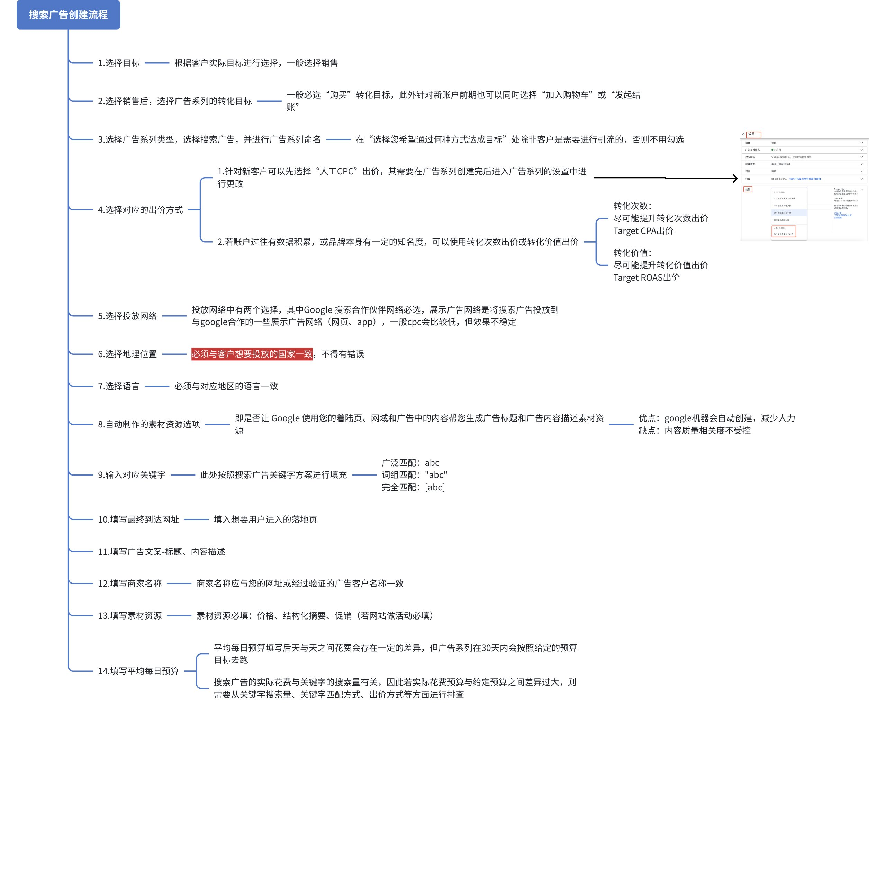

##### 搭建广告结构的4个步骤

1. **确定广告系列目标**：
  - 选择目标类型（销售、潜在客户、网站流量）。
  - 设置预算（如$50/天）和投放地域（如美国）。
1. **规划广告组主题**：
  - 按产品/服务细分（如“瑜伽垫”“健身服”）。
  - 每组包含5-20个紧密相关的关键词。
1. **撰写针对性广告**：
  - 每个广告组至少2条广告（A/B测试）。
  - 标题插入关键词，描述强调促销与服务（如“免费退换”）。
1. **设置否定关键词**：
  - 账户级：排除绝对无效词（如“免费”“教程”）。
  - 广告组级：排除相关性低的词（如“瑜伽垫”广告组排除“瑜伽课”）。

### 搜索广告的基础设置

###### 制作搜索广告系列并选择目标
<lark-table rows="6" cols="2" column-widths="473,466">

  <lark-tr>
    <lark-td>
      1. 制作一个新广告系列
    </lark-td>
    <lark-td>
      

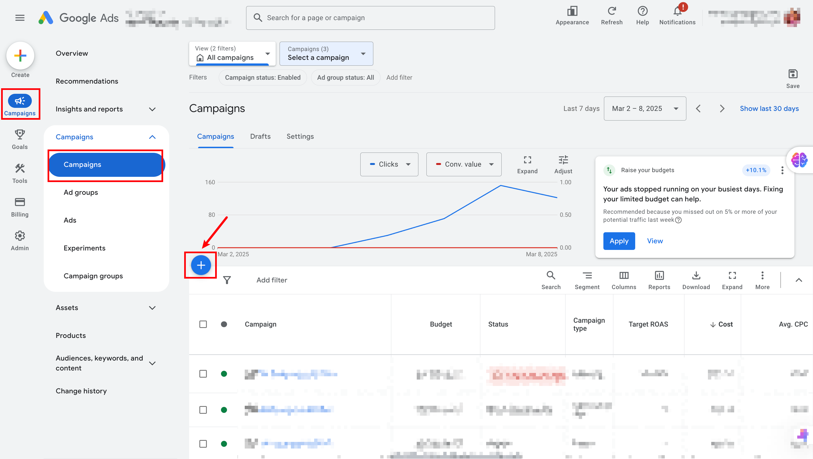

    </lark-td>
  </lark-tr>
  <lark-tr>
    <lark-td>
      2. 选择<text bgcolor="light-yellow">销售</text>、潜在客户或网站流量作为目标。
        - 您也可以选择在没有目标导向的情况下制作广告系列。
    </lark-td>
    <lark-td>
      

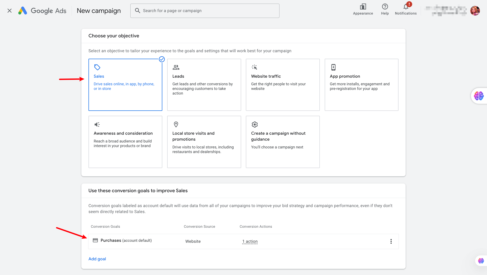

    </lark-td>
  </lark-tr>
  <lark-tr>
    <lark-td>
      3. 在“选择广告系列类型”下，选择<text bgcolor="light-yellow">搜索</text>。
    </lark-td>
    <lark-td>
      

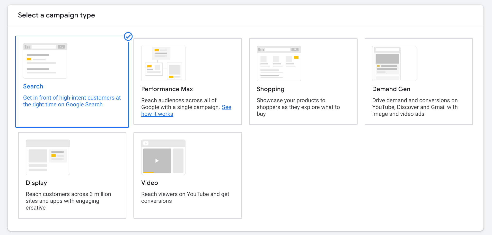

    </lark-td>
  </lark-tr>
  <lark-tr>
    <lark-td>
      4. （选填）在“选择您希望通过何种方式达成目标”下，您可以输入更多有关您业务的信息。
      1. 点击<text bgcolor="light-yellow">继续</text>
    </lark-td>
    <lark-td>
      

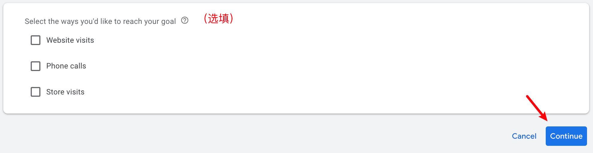

    </lark-td>
  </lark-tr>
  <lark-tr>
    <lark-td>
      6. 输入：Campaign name
      1. 点击继续
    </lark-td>
    <lark-td>
      Search-Brand-US-20250101
      

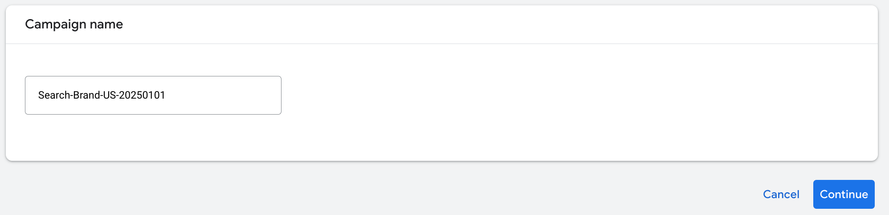

    </lark-td>
  </lark-tr>
  <lark-tr>
    <lark-td>
      8. 选择出价目标（这里以Max Conv.Value举例）
      1. 点击继续
    </lark-td>
    <lark-td>
      

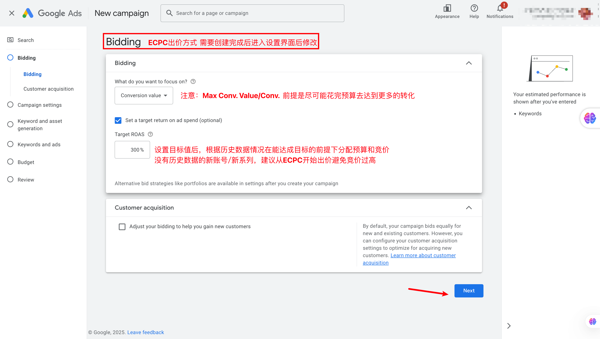

    </lark-td>
  </lark-tr>
</lark-table>

> 💡 **提示**：[展示广告系列](https%3A%2F%2Fsupport.google.com%2Fgoogle-ads%2Fanswer%2F2404190)、[购物广告系列](https%3A%2F%2Fsupport.google.com%2Fgoogle-ads%2Fanswer%2F2454022)和[视频广告系列](https%3A%2F%2Fsupport.google.com%2Fgoogle-ads%2Fanswer%2F6340491)也可以帮助您达成同样的“销售”“潜在客户”和“网站流量”目标，但这些广告系列需要用到更多素材资源（例如图片、产品 Feed 和视频）。

###### 选择广告系列定位和关键字

现在，您需要选择让广告定位哪些用户、如何使用预算，以及如何借助素材资源提升广告系列效果。

<lark-table rows="9" cols="2" column-widths="456,582">

  <lark-tr>
    <lark-td>
      <text bgcolor="light-yellow">**选择定位条件**</text>
      1. 如果取消选中此复选框，您的广告将在[搜索网络](https%3A%2F%2Fsupport.google.com%2Fgoogle-ads%2Fanswer%2F1722047)中的 Google 搜索页上展示，但不会在[搜索网络合作伙伴](https%3A%2F%2Fsupport.google.com%2Fgoogle-ads%2Fanswer%2F2616017)网站上展示。
      1. 勾选展示广告网络对应的复选框，可将覆盖面扩大到搜索结果以外的其他网站。
        - 您的大部分广告可能都展示在搜索结果页上，但只要机会得当，Google 同样会在其他网站上展示您的广告。[详细了解展示广告和 Google 展示广告网络](https%3A%2F%2Fsupport.google.com%2Fgoogle-ads%2Fanswer%2F2404190)
      1. 您可以选择地理位置选项，以根据用户与所选地理位置之间的关系来优化定位范围。
        - 例如，如果您要推广一场在得克萨斯州奥斯汀市开展的活动，但该活动的参与者主要来自奥斯汀市以外的地方，那么此项设置可能会有所帮助。在这种情况下，您可以选择搜索您定位到的地理位置的用户。
      1. 选择要在哪些地理位置展示您的广告，或者要排除哪些地点。[了解如何将广告定位到特定地理位置](https%3A%2F%2Fsupport.google.com%2Fgoogle-ads%2Fanswer%2F1722043)
        - 如果您要定位到某个较大的区域并希望避开该区域内的某一地点，[排除](https%3A%2F%2Fsupport.google.com%2Fgoogle-ads%2Fanswer%2F1722040)功能可能就会派上用场。例如，您可能想要定位除某个特定州或城市之外的整个美国。
        - 如果您的地理位置定位范围过窄，导致预测的点击次数为 0，系统就会提醒您扩大地理位置定位范围。
    </lark-td>
    <lark-td>
      

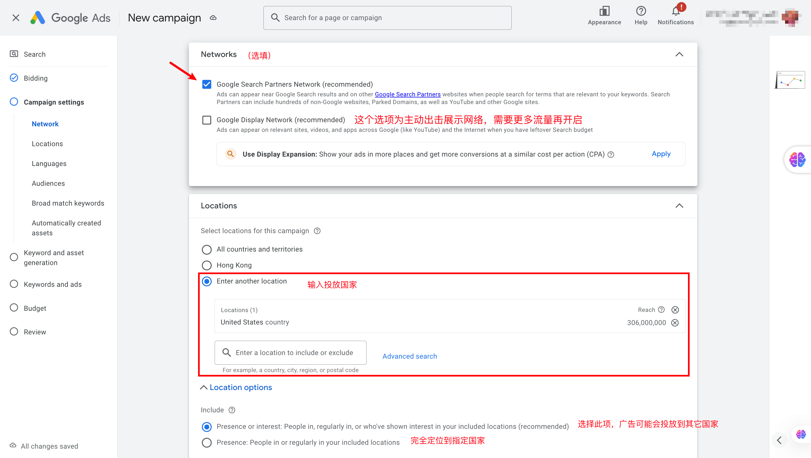

      

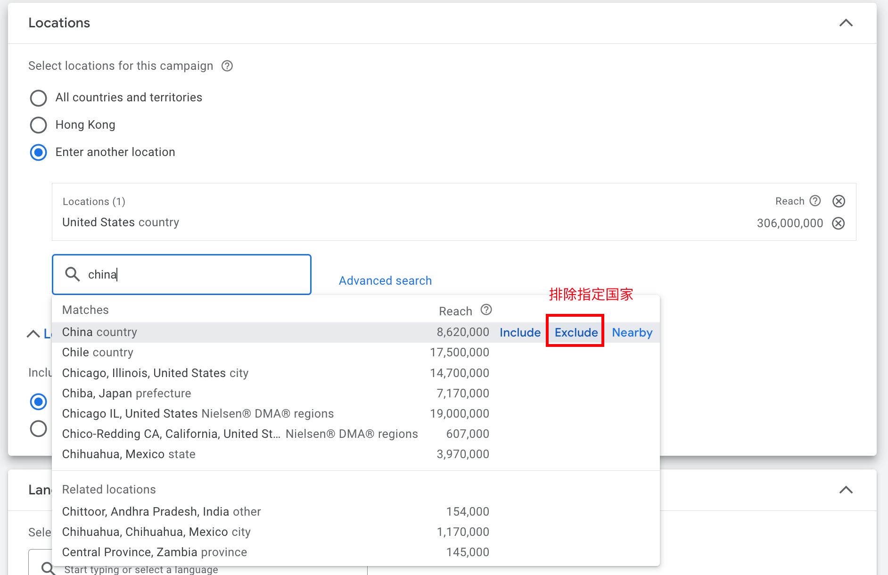

    </lark-td>
  </lark-tr>
  <lark-tr>
    <lark-td>
      5. 输入您要定位的语言。您要制作的广告和关键字应采用您在此处选择的语言。[详细了解语言定位](https%3A%2F%2Fsupport.google.com%2Fgoogle-ads%2Fanswer%2F1722078)
      1. 选择自定义关键字匹配方式
      1. 关闭自动生成素材
      1. 点击继续
    </lark-td>
    <lark-td>
      

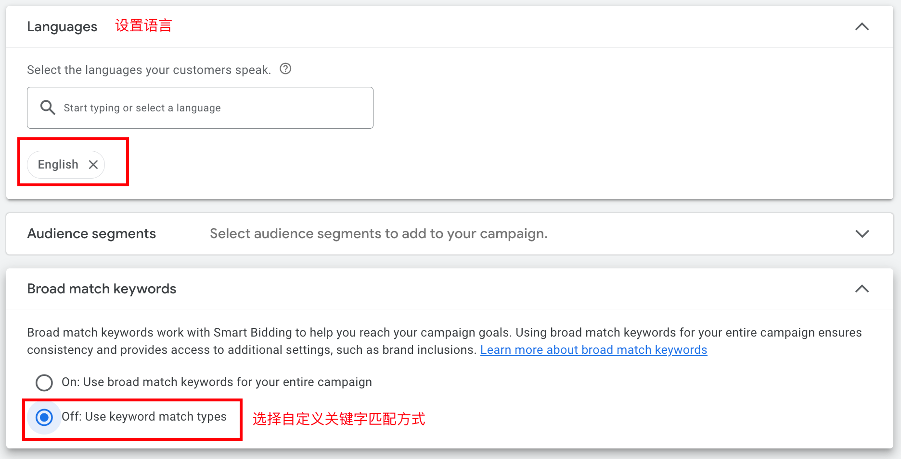

      

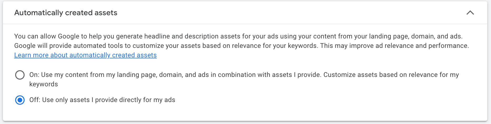

    </lark-td>
  </lark-tr>
  <lark-tr>
    <lark-td>
      9. 跳过自动生成关键字和素材
    </lark-td>
    <lark-td>
      

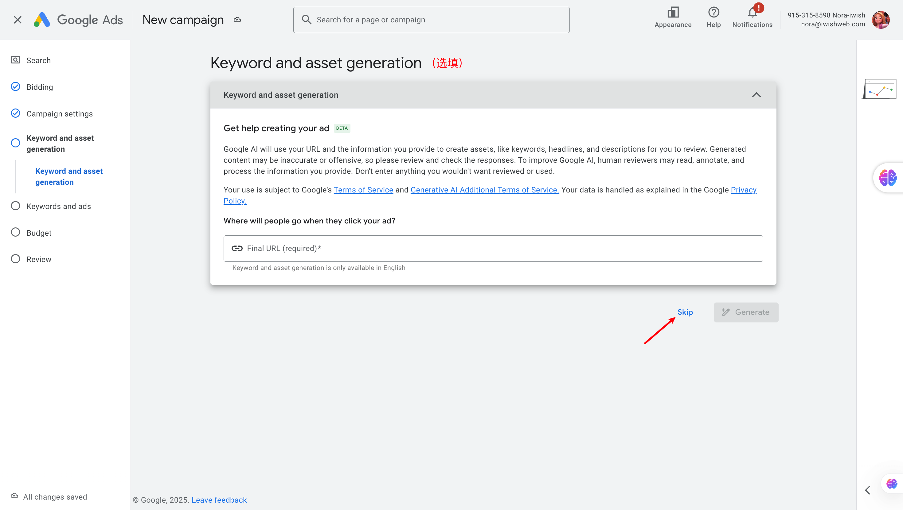

    </lark-td>
  </lark-tr>
  <lark-tr>
    <lark-td>
      <text bgcolor="light-yellow">创建搜索广告-广告组</text>
      您可以通过以下 2 种方式制作广告组：
      1. <text bgcolor="light-yellow">标准</text>：输入一组与搜索查询相关的[关键字](https%3A%2F%2Fsupport.google.com%2Fgoogle-ads%2Fanswer%2F1704371)，然后根据这些关键字制作广告。
    </lark-td>
    <lark-td>
      

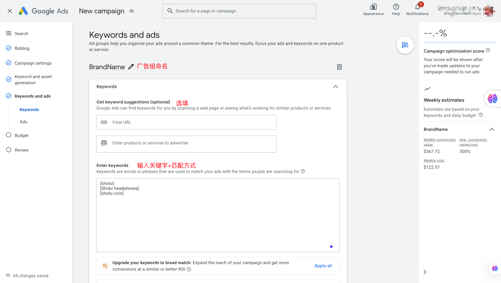

    </lark-td>
  </lark-tr>
  <lark-tr>
    <lark-td>
      2. 动态：Google 会利用您网站上的内容定位合适的搜索查询，并制作广告。
        - 新建系列后进入广告组创建动态搜索广告
    </lark-td>
    <lark-td>
      1.1.3 讲解
    </lark-td>
  </lark-tr>
  <lark-tr>
    <lark-td>
      <text bgcolor="light-yellow">制作搜索广告-广告语</text>
      - 输入最终到达网址/标题/描述
      - 选择或新建附加信息
    </lark-td>
    <lark-td>
      

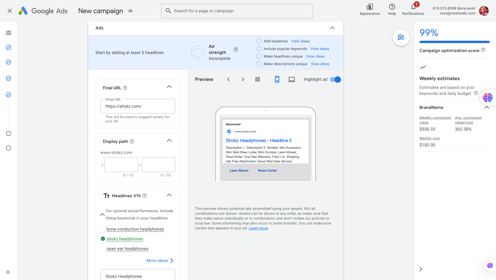

    </lark-td>
  </lark-tr>
  <lark-tr>
    <lark-td>
      制作动态搜索广告-广告语
      - 对于动态搜索广告，Google 会为您生成最终到达网址、标题和显示网址。不过，您仍需自定义广告内容描述文字。
    </lark-td>
    <lark-td>
      1.1.3 讲解
    </lark-td>
  </lark-tr>
  <lark-tr>
    <lark-td>
      <text bgcolor="light-yellow">选择预算</text>
    </lark-td>
    <lark-td>
      

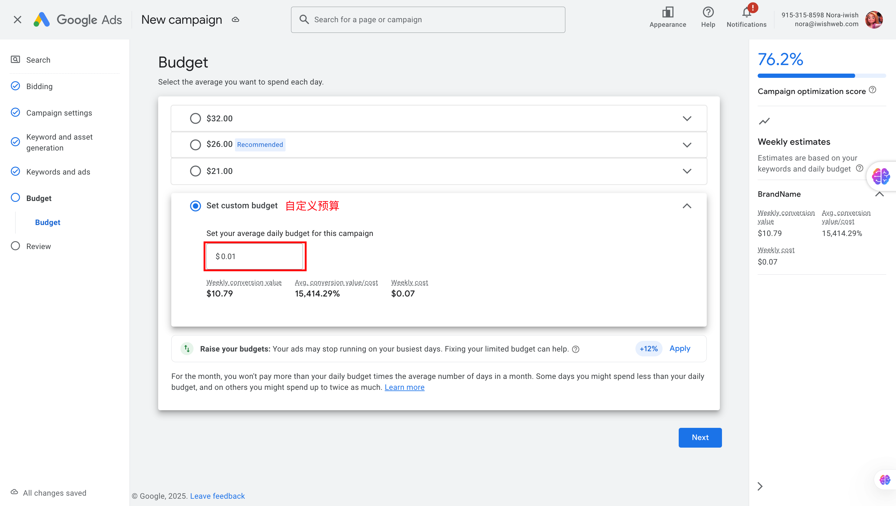

    </lark-td>
  </lark-tr>
  <lark-tr>
    <lark-td>
      预览
      - 检查无误后发布广告
    </lark-td>
    <lark-td>
      

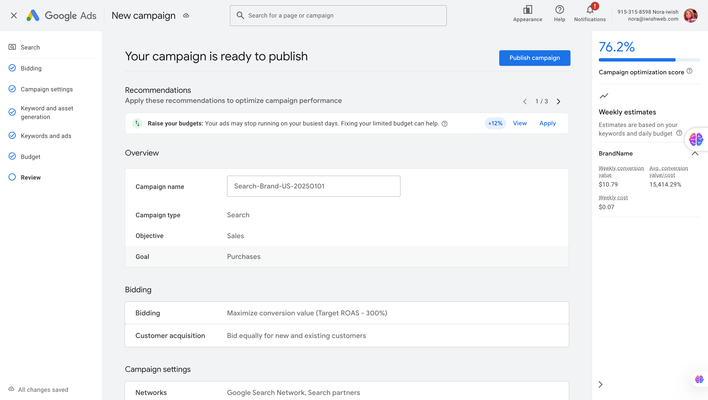

    </lark-td>
  </lark-tr>
</lark-table>

###### 设置ECPC和创建动态搜索广告

<lark-table rows="7" cols="2" column-widths="449,467">

  <lark-tr>
    <lark-td>
      <text bgcolor="light-yellow">设置搜索广告出价- Manual CPC </text>
      - 进入广告系列设置
    </lark-td>
    <lark-td>
      

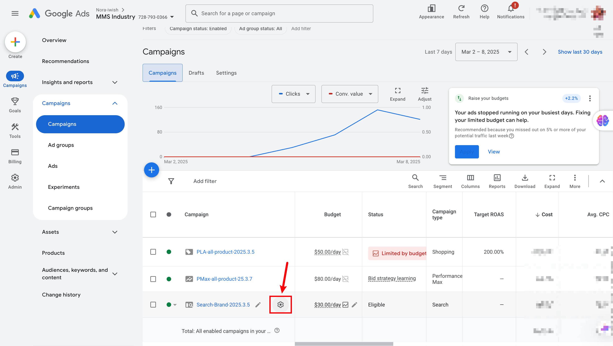

    </lark-td>
  </lark-tr>
  <lark-tr>
    <lark-td>
      - 更改出价方式为Manual CPC
    </lark-td>
    <lark-td>
      

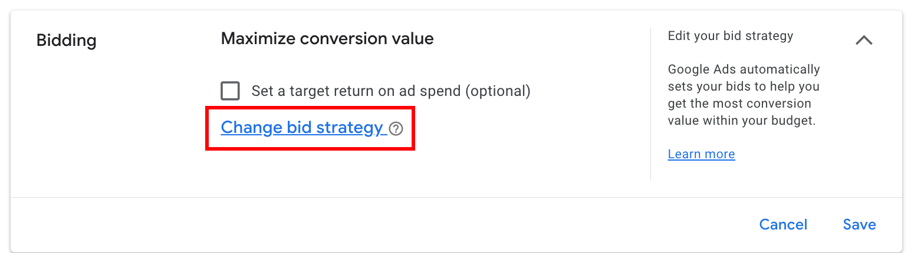

      

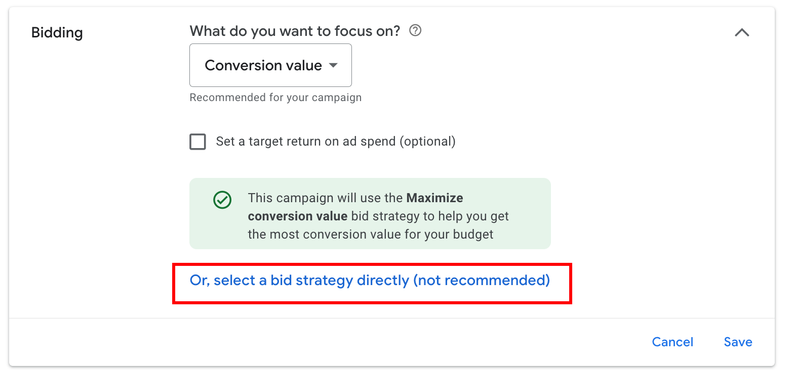

      

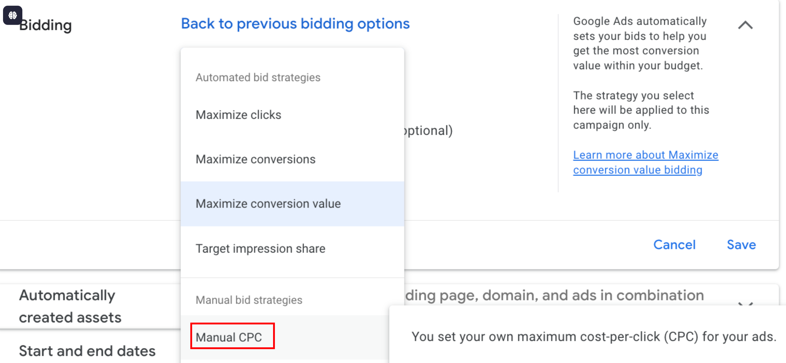

    </lark-td>
  </lark-tr>
  <lark-tr>
    <lark-td>
      - 进入广告组设置并更改竞价
    </lark-td>
    <lark-td>
      

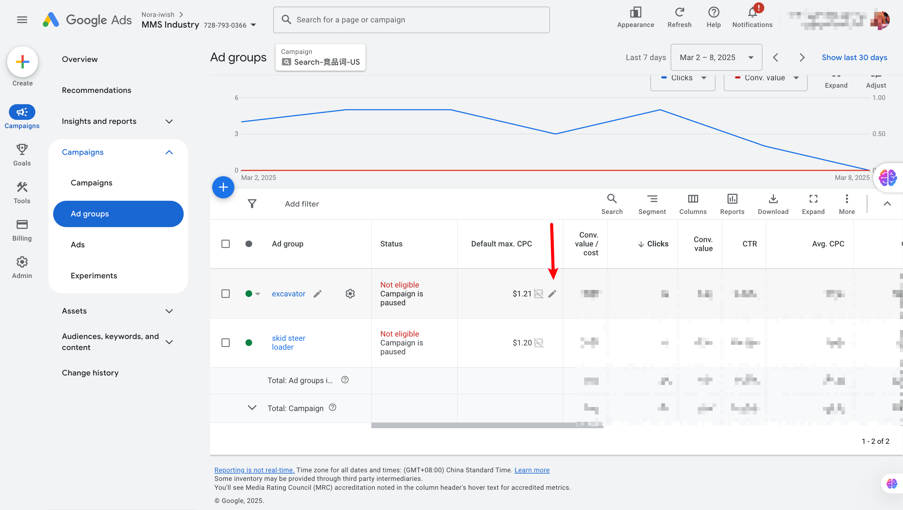

    </lark-td>
  </lark-tr>
  <lark-tr>
    <lark-td>
      - 进入关键字界面并更改竞价
    </lark-td>
    <lark-td>
      

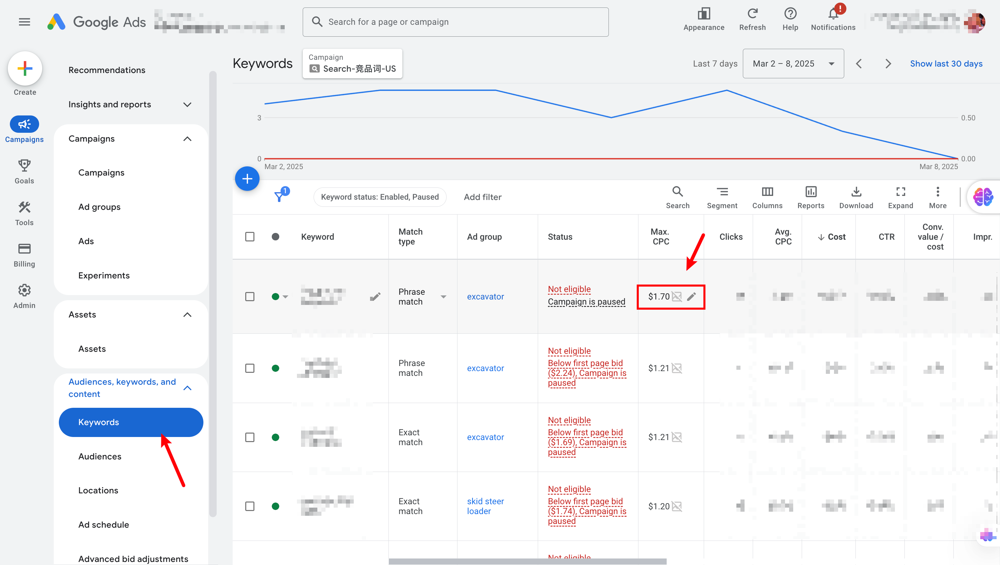

    </lark-td>
  </lark-tr>
  <lark-tr>
    <lark-td>
      <text bgcolor="light-yellow">动态搜索广告创建</text>
      - 新建广告组
    </lark-td>
    <lark-td>
      

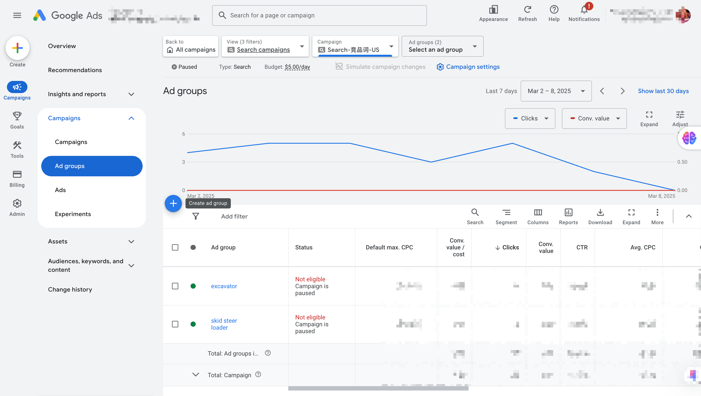

    </lark-td>
  </lark-tr>
  <lark-tr>
    <lark-td>
      - 选择dynamic
      - 输入落地页
      - 设置广告组名称和出价
    </lark-td>
    <lark-td>
      

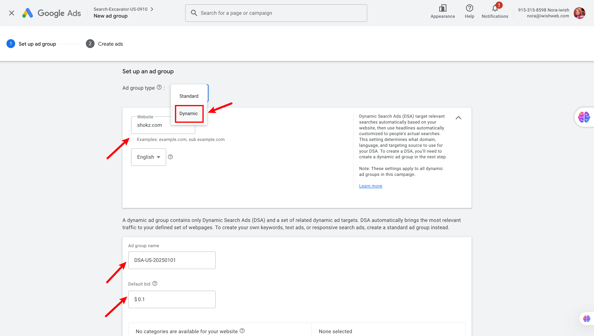

    </lark-td>
  </lark-tr>
  <lark-tr>
    <lark-td>
      - 输入两条描述并保存
    </lark-td>
    <lark-td>
      

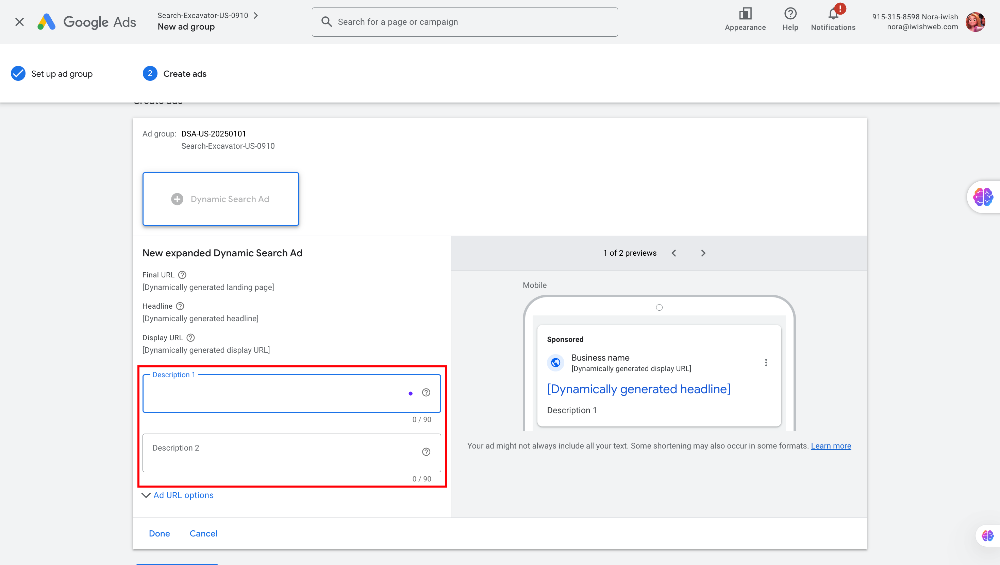

    </lark-td>
  </lark-tr>
</lark-table>

###### 广告检查清单

<lark-table rows="14" cols="4" column-widths="100,50,550,231">

  <lark-tr>
    <lark-td colspan="3">
      **搜索广告Search检查表** {align="center"}
    </lark-td>
    <lark-td>
      **错误示例** {align="center"}
    </lark-td>
  </lark-tr>
  <lark-tr>
    <lark-td rowspan="7">
      搜索方案 {align="center"}
    </lark-td>
    <lark-td>
      - [ ]
    </lark-td>
    <lark-td>
      关键字释义唯一，无其他含义
    </lark-td>
    <lark-td>
      apple既指苹果公司，也是水果名
    </lark-td>
  </lark-tr>
  <lark-tr>
    <lark-td>
      - [ ]
    </lark-td>
    <lark-td>
      关键字不包含售后相关词
    </lark-td>
    <lark-td>
      installation、Refund
    </lark-td>
  </lark-tr>
  <lark-tr>
    <lark-td>
      - [ ]
    </lark-td>
    <lark-td>
      广告标题与大部分关键字匹配，前三条标题包含主要关键字
    </lark-td>
    <lark-td>
    </lark-td>
  </lark-tr>
  <lark-tr>
    <lark-td>
      - [ ]
    </lark-td>
    <lark-td>
      广告标题在30字符以内，广告描述在90字符以内，单词拼写规范，标点符号使用合规
    </lark-td>
    <lark-td>
      20% OFF、bike!
    </lark-td>
  </lark-tr>
  <lark-tr>
    <lark-td>
      - [ ]
    </lark-td>
    <lark-td>
      广告标题维度丰富，排列组合不产生矛盾
    </lark-td>
    <lark-td>
    </lark-td>
  </lark-tr>
  <lark-tr>
    <lark-td>
      - [ ]
    </lark-td>
    <lark-td>
      广告描述与短标题不重复
    </lark-td>
    <lark-td>
    </lark-td>
  </lark-tr>
  <lark-tr>
    <lark-td>
      - [ ]
    </lark-td>
    <lark-td>
      广告标题准确突出卖点，无错误描述（与客户沟通确认）
    </lark-td>
    <lark-td>
      品牌名没按品牌部要求书写
    </lark-td>
  </lark-tr>
  <lark-tr>
    <lark-td rowspan="6">
      广告设置 {align="center"}
    </lark-td>
    <lark-td>
      - [ ]
    </lark-td>
    <lark-td>
      已移除展示广告网络
    </lark-td>
    <lark-td>
    </lark-td>
  </lark-tr>
  <lark-tr>
    <lark-td>
      - [ ]
    </lark-td>
    <lark-td>
      出价无误
      人工出价（ecpc需广告发布后再修改）：关键字层级出价无误
      智能出价：广告组层级出价无误
    </lark-td>
    <lark-td>
      ecpc广告组调整了出价，关键字未同步出价
    </lark-td>
  </lark-tr>
  <lark-tr>
    <lark-td>
      - [ ]
    </lark-td>
    <lark-td>
      关键字匹配方式无误
    </lark-td>
    <lark-td>
    </lark-td>
  </lark-tr>
  <lark-tr>
    <lark-td>
      - [ ]
    </lark-td>
    <lark-td>
      投放地理位置无误
      *排除偏远地区（客户确认物流无法送达）
    </lark-td>
    <lark-td>
    </lark-td>
  </lark-tr>
  <lark-tr>
    <lark-td>
      - [ ]
    </lark-td>
    <lark-td>
      取消根据兴趣定位
      *客户要求完全定位目标市场
    </lark-td>
    <lark-td>
    </lark-td>
  </lark-tr>
  <lark-tr>
    <lark-td>
      - [ ]
    </lark-td>
    <lark-td>
      已添加通用否定关键字列表
    </lark-td>
    <lark-td>
    </lark-td>
  </lark-tr>
</lark-table>

> 💡 **提示**：学完了搜索广告的创建后你是否已经迫不及待的想要上线广告了，咱们赶紧把前面写的搜索广告方案上线上去吧~ [点击进入ads账号链接](https%3A%2F%2Fads.google.com%2Faw%2Foverview%3Focid%3D6958549101%26ascid%3D6958549101%26uscid%3D6923870547%26__c%3D5296929403%26euid%3D1037217585%26__u%3D5731154665%26cmpnInfo%3D%257B%25228%2522%3A%2522ff6df4b8-37fa-4a08-a145-5addd926d10e%2522%257D)（记得先找自己的师傅帮忙授权） 完成测试后，进入咱们最后一块内容的学习：[4.5搜索广告数据分析与优化](https://pwl28kvg7c4.feishu.cn/docx/W9VsdYuRaoPbj9xDlrZcZUJcnoe)

