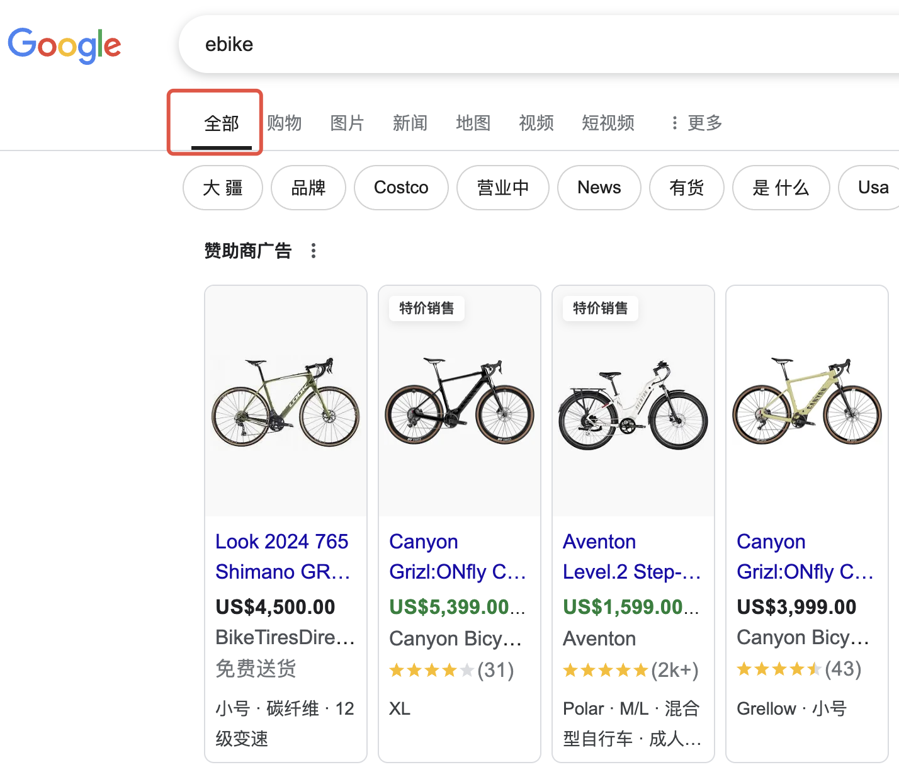
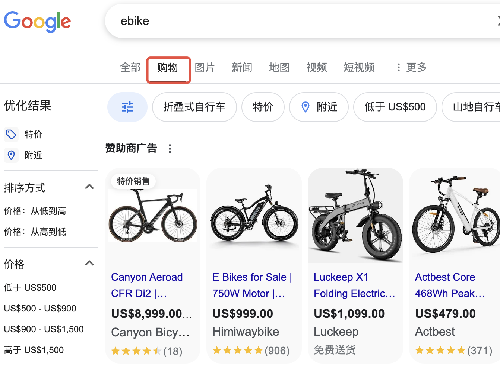
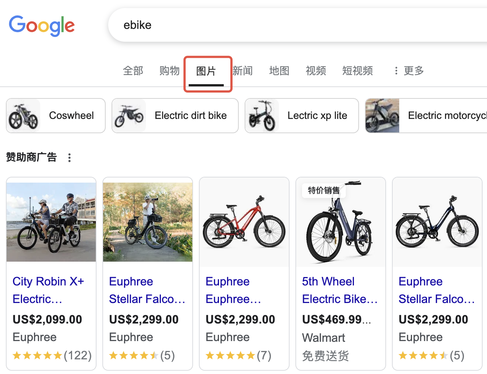
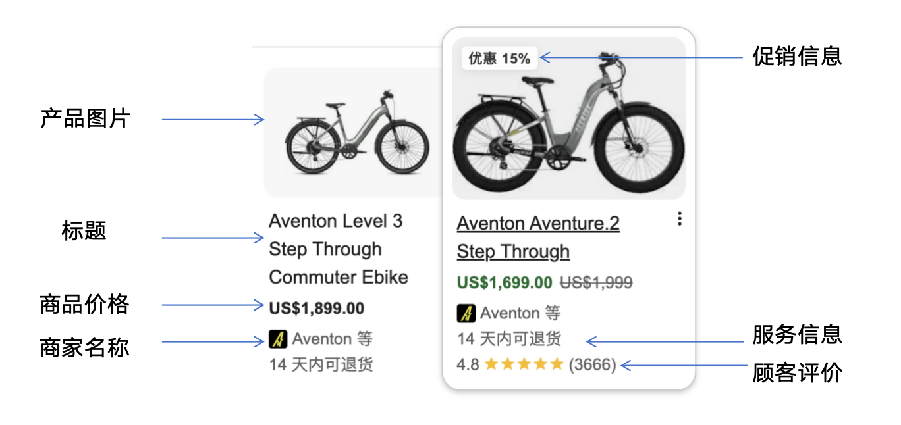

### （一）了解购物广告

Google 购物广告对于独立站商家来说是**必不可少的流量渠道**，能够帮助商家在Google平台上展示产品，吸引精准购买意向的用户。相较于搜索广告，购物广告**更具视觉冲击力、匹配度更高、转化率更好**，是提升销量的有效方式

### 什么是购物广告(原理和运作逻辑)

##### Google 购物广告的定义

Google 购物广告（Shopping Ads）是一种基于产品信息的广告形式，主要用于推广在线零售商的产品。通过抓取商家在Google Merchant Center（GMC）上传的产品数据（如标题、图片、价格），自动匹配用户的搜索意图并展示。与传统的搜索广告不同，购物广告以**产品图片、标题、价格、商家名称**等信息展示，用户可以在Google搜索结果页、Google 购物（Shopping）页面、YouTube、Gmail等多个渠道看到这些广告

##### 主要**展示位置**

（**简单总结：在搜索结果中，带有商品**<text color="blue">**图片和价格**</text>**的都是购物广告）**

- **Google搜索页顶部**：带图片的购物广告卡片（标注“Sponsored”）
    

  **Google Shopping标签页**：用户点击“购物”后展示的商品列表
    

  - **图片搜索页**：与图片相关的商品推荐。
    

  - **YouTube商品侧栏**：视频内容相关的商品推荐。
    

##### 购物广告的触发原理

- **核心依赖：商品Feed数据**
- **触发原理：** 系统根据用户搜索词与Feed中的标题、描述、GTIN等字段进行匹配，被触发的商品有机会展示出
- **匹配优先级**：标题关键词 > 产品类型 > 品牌

### 购物广告的展示及组成

**购物广告在前端的展示内容和结构如下：**

### 购物广告的应用场景(适合谁用)

**一句话理解，能直接面向C端消费者按数量购买的商品，且符合购物广告政策的，均可以投放购物广告，以下品类除外：**

> 📊 表格内容：点击 [此处](https://pwl28kvg7c4.feishu.cn/sheets/EsGjsSVx4h9bUPtMbffcfR2UnXc_OMasir) 查看原表格（建议截图替换为本地图片）

### 购物广告的优势

- **直观的视觉体验**：购物广告包含图片、价格、商家名称，能够直观展示产品，有助于提高点击率和购买意愿。
- **精准匹配用户意图**：购物广告基于**产品数据**而非关键词，能够更好地匹配有购买意向的用户，提高转化率。
- **更高的点击率（CTR）**：由于广告直接展示了产品信息，用户点击的意愿更强，通常CTR高于文字搜索广告。
- **覆盖多个Google平台**：购物广告不仅展示在 Google 搜索结果页，还可以出现在 YouTube、Gmail、Google 购物等多个渠道，增加曝光机会。适配“搜索→比价→购买”全链路
- **自动优化投放**：Google 通过机器学习优化广告展示，广告主无需手动调整关键词匹配方式，提高广告投放效率

**购物广告与搜索广告的区别如下：**

> 📊 表格内容：点击 [此处](https://pwl28kvg7c4.feishu.cn/sheets/EsGjsSVx4h9bUPtMbffcfR2UnXc_yEEvFK) 查看原表格（建议截图替换为本地图片）

