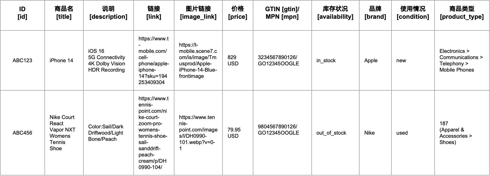
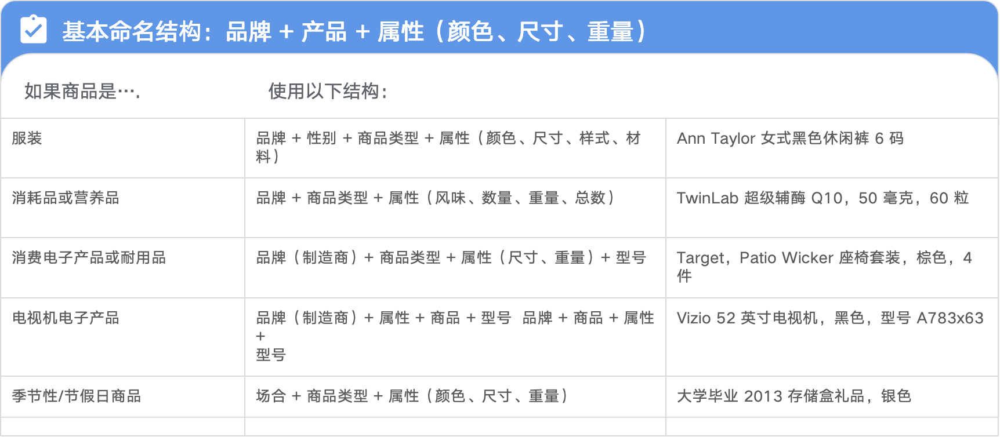
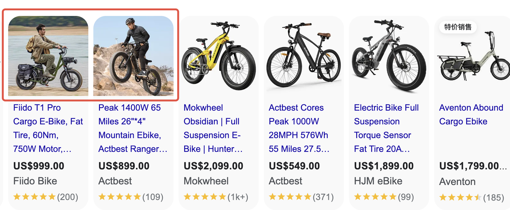
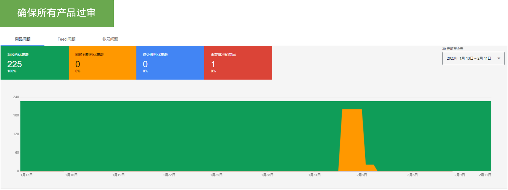

### 与购物广告相关联的核心--GMC

#### 定义：

Google Merchant Center，简称GMC，商家可以上传他们的产品数据（商品Feed），然后将这些数据用于 Google Shopping 广告、Google 搜索以及其他 Google 服务。通过 Merchant Center，商家可以管理产品信息，设置广告活动，并分析其产品的表现。

#### 主要功能

1. 产品数据上传：商家可以通过 CSV 文件、API 或其他方式上传产品信息。
1. Google Shopping广告：Merchant Center 与 Google Ads 结合，允许商家创建产品广告。
1. 产品展示：产品信息会展示在 Google Shopping、Google 搜索以及其他 Google 属性。
1. 性能分析：提供产品的点击率、转化率和其他关键指标。

### 商品Feed 的组成要素-购物广告的核心要素(Feed、标题、图片)

##### <text color="red">商品Feed</text>：**广告的“数据引擎”**

1. Feed是购物广告的基础，包含商品所有信息的结构化数据文件（如标题、描述、价格、图片链接、GTIN等），是购物广告的底层基础。
1. **Feed的作用：**
- 它是广告平台了解产品信息的唯一数据来源。
- 广告平台会根据Feed中的数据生成广告，并匹配用户的搜索意图。
- Feed的质量直接影响广告的相关性和表现。
- Feed的核心字段：

> 📊 表格内容：点击 [此处](https://pwl28kvg7c4.feishu.cn/sheets/QedssdswchTQkNtmv8OcB5FCn2g_ei9E31) 查看原表格（建议截图替换为本地图片）

- 以下为常用字段项

##### <text color="red">产品标题</text>：流量的“关键词入口”

**1、产品标题**

是Feed中最重要的字段之一，也是购物广告中最关键的文本元素

**2、产品标题的作用：**

- 用户在广告前端首先看到的内容，直接影响用户是否会“点击”广告
- 帮助广告平台理解产品的核心特征，从而更好地匹配用户的搜索意图

**3、标题的基础要求：**

- 简洁明了：直接传达产品的核心信息（通常在60-70个字符以内，前25个字符最为重要，会展示出来）
- 包含关键词：加入用户可能搜索的关键词（如品牌、型号、颜色、尺寸等）。
- 将最重要的信息放在标题的前面（如品牌、产品名称、关键属性）。
- 避免使用特殊字符或无关的关键词。

---

##### <text color="red">产品图片</text>：**用户的“视觉决策点”**

产品图片是广告的视觉核心，直接影响用户的第一印象。高质量的图片可以显著提高广告的点击率和转化率。

产品图片的作用：

- 它是用户在广告中最直观的信息来源，帮助用户快速了解产品的外观和特点。
- 优质的图片可以增强用户的信任感，降低购买顾虑。

最佳实践：

- 使用高分辨率的图片，确保清晰度。
- 避免使用过多的文字或水印，保持图片的简洁性。
- 展示产品的多个角度（如白底图，场景图、模特图等）。
- 根据广告平台的要求，确保图片尺寸和格式符合规范。

### 与GMC审核有关的重要内容

####### **一、账户与企业信息合规**

1. **基本信息真实性**
- **企业名称**：与营业执照一致，禁止使用虚假名称（如“全球旗舰店”需提供授权证明）。
- **联系方式**：提供真实地址、客服电话/邮箱，且网站中需明确展示。
- **域名所有权**：验证网站域名所有权（通过HTML文件上传或DNS解析）。
1. **绑定支付与广告账户**
- 关联有效的Google Ads账户，确保付款方式无欠费或风险记录。
- 新账户需完成两步验证（2SV），提升账户安全性。

####### **二、商品数据（Feed）规范**

1. **Feed字段完整性**

> 📊 表格内容：点击 [此处](https://pwl28kvg7c4.feishu.cn/sheets/QedssdswchTQkNtmv8OcB5FCn2g_papBYf) 查看原表格（建议截图替换为本地图片）

1. **禁止Feed违规操作**
- **重复商品**：同一商品不同变体（如颜色/尺寸）需用同一ID，通过`item_group_id`区分。
- **虚假信息**：禁止虚构商品参数（如虚标防水等级）。
- **误导性分类**：按Google分类树填写，禁止为获取流量将商品归入错误类目（如耳机不可归入“电脑”）。

####### **三、网站合规性要求**

1. **网站内容规范**
- **透明化信息**：

✅ 明确展示退货退款政策（含时间限制、条件）。

✅ 提供真实联系方式（电话、邮箱、实体地址）。

✅ 隐私政策页面需说明数据收集与使用方式。

- **禁止内容**：

❌ 虚假促销（如“全网最低价”无法证明）。

❌ 仿品或侵权商品（如山寨品牌、盗版软件）。

❌ 违禁品（如药品、武器、成人用品）。

1. **用户体验与功能**
- **页面加载速度**：移动端加载时间≤3秒（可用Google PageSpeed Insights检测）。
- **购物流程顺畅**：

✅ 结账页面无死链或404错误。

✅ 支持主流支付方式（信用卡、PayPal等）。

✅ 商品详情页与广告信息一致（如价格、库存）。

- **移动端适配**：网站需为响应式设计，禁止移动端排版错乱。

####### **四、广告与销售政策合规**

1. **禁止虚假宣传**
- 广告内容需与落地页一致，禁止“钓鱼”行为（如广告标低价但页面高价）。
- 禁止使用绝对化用语（如“第一”“最佳”），除非有权威证明。
1. **促销信息规范**
- 限时促销需标明截止日期（如“黑五折扣截至11月30日”）。
- 折扣价需标注原价对比（如“原价199，现价199，现价149”）。
1. **用户评价与信任**
- 禁止伪造用户评价或评分。
- 若展示第三方认证（如“SSL安全认证”），需真实有效。

####### **五、GMC审核常见拒登原因与解决方案**

> 📊 表格内容：点击 [此处](https://pwl28kvg7c4.feishu.cn/sheets/QedssdswchTQkNtmv8OcB5FCn2g_o7soDu) 查看原表格（建议截图替换为本地图片）

**总结**：GMC审核核心在于**数据真实性、网站透明性、政策合规性**。严格遵循这些要求，可大幅提升过审率。若首次被拒，务必根据拒登原因逐条修正后重新提交！

####### **六、GMC自检清单**

[GMC诊断清单](https://pwl28kvg7c4.feishu.cn/docx/T7j9smmTThGexStAX99cbGe0nxe)

> 💡 **提示**：**实操练习：** 根据GMC的诊断要求，对以下网站进行问题诊断排查，并给出调整建议 网址： https://eiweisonic.com/

### 如何检查GMC的安全性

##### 1、定期查看违规提醒，解决所有问题后提交重新审核，确保所有产品过审（绿色标识）

**2、尽可能提供详细的产品属性：**

如果您未提供必填的的属性，产品将无法投放广告。如果您希望提高广告效果，建议您尽量将选填的属性也填上：

以下非必填的项目增加（根据品类补充）：

<text color="blue">google_product_category</text>

<text color="blue">product_type</text>

<text color="blue">mobile_link</text>

<text color="blue">condition</text>

<text color="blue">color</text>

<text color="blue">gender</text>

<text color="blue">material</text>
