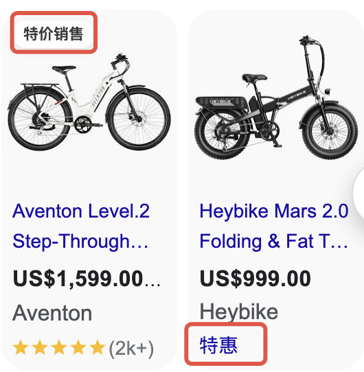
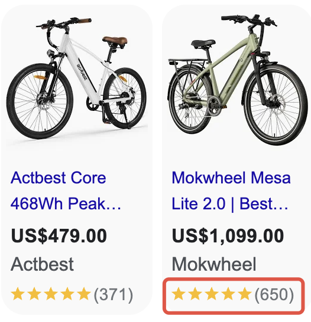

### GMC设置流程：

[如何设置GMC帐户](https://pwl28kvg7c4.feishu.cn/docx/Oulmdg6oUo58Otx7AUncuTqnn4f)

**GMC的最佳实践：**

- 数据准确性：确保产品数据准确无误，避免因错误信息导致广告被拒绝。
- 使用高质量图片：图片是吸引用户的重要因素，确保图片清晰且符合 Google 的图片政策。
- 定期更新：如果你是通过手动上传方式管理产品Feed，Google要求你每30天内至少更新一次产品数据。如果超过30天未更新，GMC可能会暂停或下架相关产品。
- 更新内容：价格、库存、促销信息等变化需要及时更新。即使产品信息没有变化，也需要在30天内重新上传完整的Feed文件。
- 自动化更新：如果你有大量产品或频繁的更新需求，建议使用Google Shopping API或内容API来自动化更新流程。
- 注意：一个 Google 账号电子邮件地址只能用于创建一个 Merchant Center 账号

### 如何创建及拓展手工Feed

**有两种创建Feed的方式：**

- 手工上传：填写Feed表格上传，抓取Feed
- 自动连接：通过插件上传Feed，（Shopify后台：Google shopping feed，Google & Youtube）

**手动Feed的步骤：**
    - 按照Feed要求填写表格(12个必要属性)
    - 添加Feed，选择目标销售国家及语言
    - 选择Google表格上传Feed
    - 立即提取，等待审核
    - 通过在线表格更新产品
    - 投放多个国家需要上传多个Feed
  **Content API的步骤：**
    - 安装Google Shopping Feed插件
    - 关联Google Merchant Center帐户
    - 选择目标销售国家及语言
    - 同步产品信息(SYNC)等待审核
    - 更新产品后会自动抓取
    - 只需将对应国家的按钮打开即可

**Feed字段介绍与要求：**

> 📊 表格内容：点击 [此处](https://pwl28kvg7c4.feishu.cn/sheets/TTSYsIvBSh0vO0thMQKcSLoUnxd_Tv3yWM) 查看原表格（建议截图替换为本地图片）

**最佳实践：**

- ID编号：可按自己编辑（字母数字等都可以，确保不重复）
- 标题：详情页的产品标题，也可重新编辑
- 图片链接：产品主图点右键查看图片链接   
- 价格：折后价
- 品牌名：单个产品的对应品牌，通常为商店名称

具体数据规范可参考Google帮助中心链接：[商品数据规范](https%3A%2F%2Fsupport.google.com%2Fmerchants%2Fanswer%2F7052112%3Fsjid%3D2384847926042998480-NC)、[Google商品类别](https%3A%2F%2Fsupport.google.com%2Fmerchants%2Fanswer%2F6324436%3Fhl%3Den)

<text bgcolor="light-yellow">手工Feed表格模版：</text>[手工feed](https://pwl28kvg7c4.feishu.cn/docx/ZzCCscMHIhGoHZt5Ak5c5t7endc)

> 💡 **提示**：实操作业：请为以下网站制作20条手工Feed 网址：

### GMC 后台如何设置展示促销信息

**广告前端展示效果**

**商家促销：** {align="center"}
    

  **商品评分：** {align="center"}
    

#### 使用促销活动构建工具

> 📊 表格内容：点击 [此处](https://pwl28kvg7c4.feishu.cn/sheets/TTSYsIvBSh0vO0thMQKcSLoUnxd_1qOFtX) 查看原表格（建议截图替换为本地图片）

#### 使用来自第三方合作伙伴的促销活动 

您可以使用 Shopify 将商品折扣与 Merchant Center 账号相关联，以便轻松在 Google 上展示商品促销活动。

这样做的主要优势包括：

- 简单集成：您通过受支持的第三方合作伙伴提供的现有折扣/促销活动和新折扣/促销活动将与您的 Merchant Center 账号无缝集成，以便展示您的促销活动。
- 提升效果：商品在展示时若带有促销信息注释，其点击次数和转化次数通常会有所增加。

> 📊 表格内容：点击 [此处](https://pwl28kvg7c4.feishu.cn/sheets/TTSYsIvBSh0vO0thMQKcSLoUnxd_uMh3kL) 查看原表格（建议截图替换为本地图片）

### 如何设置自定义标签

对于附带 Merchant Center Feed 的购物广告系列和效果最大化广告系列，如果您想使用自己选择的值对广告系列中的产品进行细分，则可以使用自定义标签。例如，您可以使用自定义标签表明产品是：季节性商品、清仓甩卖、畅销商品等。之后您可以在附带 Merchant Center Feed 的购物广告系列和效果最大化广告系列中选择这些值用于监控、生成报告和设置出价。

**通过自定义标签为产品设定不同的目标，有利于区分效果，更易于达成目标**

1）针对不同产品做不同标签，对于无优势无推广价值产品，通过标签排除

2）针对不同产品按价格区分标签，对于低价产品采用低单次点击成本竞价

3）针对不同优势类产品区分主推产品，在广告系列层级选择优先层级并提高出价。

### 自定义标签示例

第 1 步：确定您的`自定义标签`属性的定义和可能的值。

> 📊 表格内容：点击 [此处](https://pwl28kvg7c4.feishu.cn/sheets/TTSYsIvBSh0vO0thMQKcSLoUnxd_ZKOiPm) 查看原表格（建议截图替换为本地图片）

第 2 步：在产品数据中为每项产品分配适当的值

**在商品Feed表格中标签位置调整:**

> 📊 表格内容：点击 [此处](https://pwl28kvg7c4.feishu.cn/sheets/TTSYsIvBSh0vO0thMQKcSLoUnxd_MxYszM) 查看原表格（建议截图替换为本地图片）

