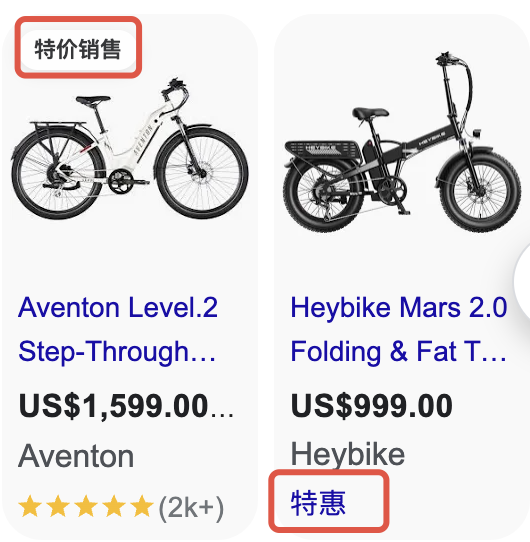
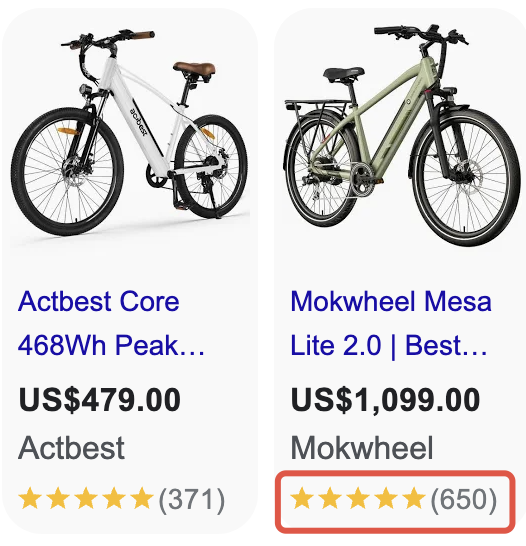

### GMC设置流程：

[如何设置GMC帐户](https://pwl28kvg7c4.feishu.cn/docx/Oulmdg6oUo58Otx7AUncuTqnn4f)

**GMC的最佳实践：**

- 数据准确性：确保产品数据准确无误，避免因错误信息导致广告被拒绝。
- 使用高质量图片：图片是吸引用户的重要因素，确保图片清晰且符合 Google 的图片政策。
- 定期更新：如果你是通过手动上传方式管理产品Feed，Google要求你每30天内至少更新一次产品数据。如果超过30天未更新，GMC可能会暂停或下架相关产品。
- 更新内容：价格、库存、促销信息等变化需要及时更新。即使产品信息没有变化，也需要在30天内重新上传完整的Feed文件。
- 自动化更新：如果你有大量产品或频繁的更新需求，建议使用Google Shopping API或内容API来自动化更新流程。
- 注意：一个 Google 账号电子邮件地址只能用于创建一个 Merchant Center 账号

### 如何创建及拓展手工Feed

**有两种创建Feed的方式：**

- 手工上传：填写Feed表格上传，抓取Feed
- 自动连接：通过插件上传Feed，（Shopify后台：Google shopping feed，Google & Youtube）

**手动Feed的步骤：**
    - 按照Feed要求填写表格(12个必要属性)
    - 添加Feed，选择目标销售国家及语言
    - 选择Google表格上传Feed
    - 立即提取，等待审核
    - 通过在线表格更新产品
    - 投放多个国家需要上传多个Feed
  **Content API的步骤：**
    - 安装Google Shopping Feed插件
    - 关联Google Merchant Center帐户
    - 选择目标销售国家及语言
    - 同步产品信息(SYNC)等待审核
    - 更新产品后会自动抓取
    - 只需将对应国家的按钮打开即可

**Feed字段介绍与要求：**

| 字段 | 标题 | 描述 | 链接 | 使用情况 | 价格 | 图片链接 | GTIN | MPN | 品牌 | Google 商品类别 |
|------|------|------|------|----------|------|----------|------|-----|------|----------------|
| 标识每款商品。账户内商品的编号必须保持不变 | 商品标题，不得包含言语、图形信息 | 商品简介，不得包含宣传文字，也拒绝发送信息 | 商品在 Google 购物上的链接 | 商品的使用情况，接受的值：全新、翻新、二手 | 商品的基准价格及货币，例如，美元为 USD | 商品的图片的 URL，必须提供 Google 抓取 | 商品的全球贸易商品代码（GTIN）、UPC | 制造商用于标识商品的代码，也称为「制造商品部件号」 | 商品的品牌名称 | Google 类目中商品所属类别的分类ID及完整路径 |

**最佳实践：**

- ID编号：可按自己编辑（字母数字等都可以，确保不重复）
- 标题：详情页的产品标题，也可重新编辑
- 图片链接：产品主图点右键查看图片链接   
- 价格：折后价
- 品牌名：单个产品的对应品牌，通常为商店名称

具体数据规范可参考Google帮助中心链接：[商品数据规范](https://support.google.com/merchants/answer/7052112?sjid=2384847926042998480-NC)、[Google商品类别](https://support.google.com/merchants/answer/6324436?hl=en)

<text bgcolor="light-yellow">手工Feed表格模版：</text>[手工feed](https://pwl28kvg7c4.feishu.cn/docx/ZzCCscMHIhGoHZt5Ak5c5t7endc)

> 💡 **提示**：实操作业：请为以下网站制作20条手工Feed 网址：

### GMC 后台如何设置展示促销信息

**广告前端展示效果**

**商家促销：** {align="center"}
    

  **商品评分：** {align="center"}
    

#### 使用促销活动构建工具

**步骤说明**（详细截图请查看[原飞书表格](https://pwl28kvg7c4.feishu.cn/sheets/TTSYsIvBSh0vO0thMQKcSLoUnxd_1qOFtX)）：

1. 在 GMC 后台，选择**「增长-管理计划」**，申请开启**「促销」**选项。
2. 选择想进行促销的活动的**国家和语言**选项。
3. 根据实际情况选择不同的**促销类型**（此处有六种促销方式进行选择）。
4. 进入「促销设置」栏目：
   - **商品名**：填写将展示在广告前端的促销活动名称。
   - **促销 ID**：填写将定位手工 feed 里选择作为促销产品的产品 SKU（如果只需针对部分产品作为促销，同时需要在手工 feed 将特定的产品加上相关标签操作）。
   - 接着再选择促销产品的访问。
5. **促销代码**：填写具体的促销活动 coupon code，同样会在广告前端展示。
6. 切回到手工 feed 文档里：
   - 在指定的促销产品的 **product_applicability** 标签填写上 `specific_products` 属性值。
   - 接着在 **promotion_id** 标签填写相应的值，此处的 promotion_id 属性值需与 GMC 创建促销活动时的 promotion_id 值对应，就可以匹配上了。

#### 使用来自第三方合作伙伴的促销活动 

您可以使用 Shopify 将商品折扣与 Merchant Center 账号相关联，以便轻松在 Google 上展示商品促销活动。

这样做的主要优势包括：

- 简单集成：您通过受支持的第三方合作伙伴提供的现有折扣/促销活动和新折扣/促销活动将与您的 Merchant Center 账号无缝集成，以便展示您的促销活动。
- 提升效果：商品在展示时若带有促销信息注释，其点击次数和转化次数通常会有所增加。

**操作步骤**（详细截图请查看[原飞书表格](https://pwl28kvg7c4.feishu.cn/sheets/TTSYsIvBSh0vO0thMQKcSLoUnxd_uMh3kL)）：

1. 选择促销活动来源，点击**「添加促销信息」**。
2. 选择用 **Google 表格文档**。
3. 首次可以选择对应模板创建新电子表格，或者使用已有文档。
4. 补充促销所对应的维度信息，提交完成活动创建。

### 如何设置自定义标签

对于附带 Merchant Center Feed 的购物广告系列和效果最大化广告系列，如果您想使用自己选择的值对广告系列中的产品进行细分，则可以使用自定义标签。例如，您可以使用自定义标签表明产品是：季节性商品、清仓甩卖、畅销商品等。之后您可以在附带 Merchant Center Feed 的购物广告系列和效果最大化广告系列中选择这些值用于监控、生成报告和设置出价。

**通过自定义标签为产品设定不同的目标，有利于区分效果，更易于达成目标**

1）针对不同产品做不同标签，对于无优势无推广价值产品，通过标签排除

2）针对不同产品按价格区分标签，对于低价产品采用低单次点击成本竞价

3）针对不同优势类产品区分主推产品，在广告系列层级选择优先层级并提高出价。

### 自定义标签示例

第 1 步：确定您的`自定义标签`属性的定义和可能的值。

| 自定义标签 | 定义 | 供选择的可能值 |
|-----------|------|---------------|
| 自定义标签 0 | 季节/节日 | 冬季、春季、母亲节、黑五 |
| 自定义标签 1 | 销售率 | 畅销商品、滞销商品 |
| 自定义标签 2 | 促销 | 清仓、促销名称、折扣 |
| 自定义标签 3 | 利润率 | 低利润率、高利润率 |
| 自定义标签 4 | 价格 | 价格区间 |

第 2 步：在产品数据中为每项产品分配适当的值

**在商品Feed表格中标签位置调整:**

| id | 自定义标签 0 | 自定义标签 1 | 自定义标签 2 | 自定义标签 3 | 自定义标签 4 |
|----|-------------|-------------|-------------|-------------|-------------|
| 商品 1 | 冬季 | 畅销商品 | | 低利润率 | |
| 商品 2 | 夏季 | | | 高利润率 | 2013 |
| 商品 3 | | | 清仓甩卖 | | 2012 |

