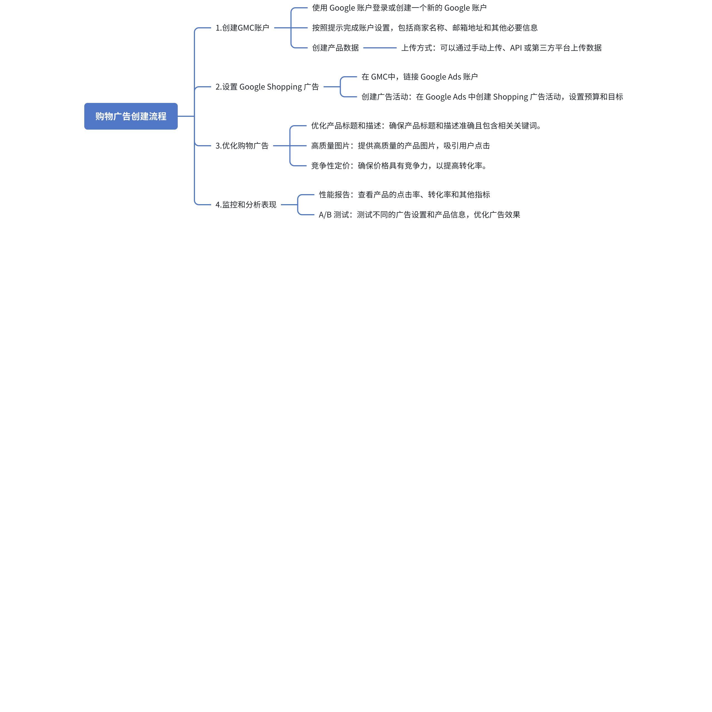
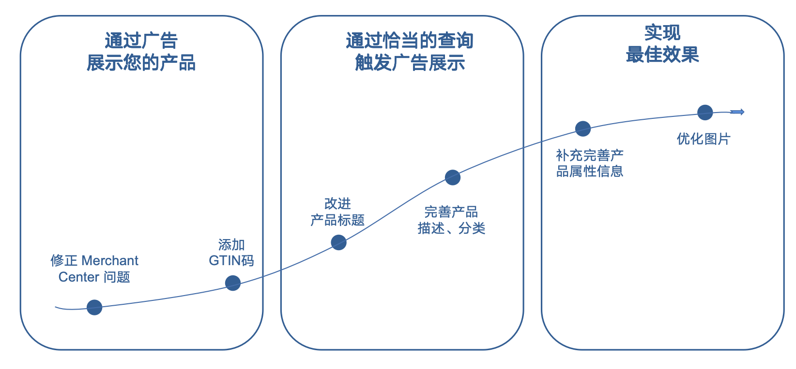
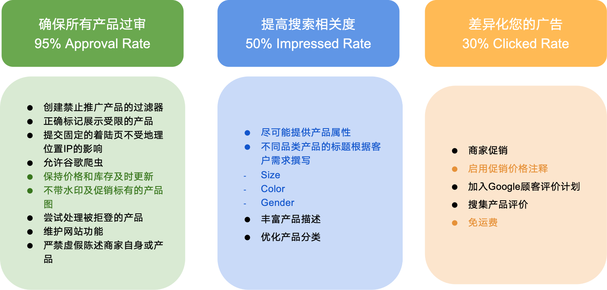

## 购物广告结构层级

广告系列结构：可以根据网站的结构以及标准购物广告系列的结构

例如：广告系列对应国家，广告组对应网站一级类目>二级产品类目>品牌(重点SKU)进行设置

<lark-table rows="7" cols="4" column-widths="173,218,162,152">

  <lark-tr>
    <lark-td>
      **帐户结构** {align="center"}
    </lark-td>
    <lark-td>
      **广告系列层级** {align="center"}
    </lark-td>
    <lark-td>
      **广告组层级** {align="center"}
    </lark-td>
    <lark-td>
      **产品组层级** {align="center"}
    </lark-td>
  </lark-tr>
  <lark-tr>
    <lark-td>
      结构1 {align="center"}
    </lark-td>
    <lark-td>
      产品类别 {align="center"}
    </lark-td>
    <lark-td>
      产品类别 {align="center"}
    </lark-td>
    <lark-td>
      商品ID {align="center"}
    </lark-td>
  </lark-tr>
  <lark-tr>
    <lark-td>
      结构2 {align="center"}
    </lark-td>
    <lark-td>
      产品类别 {align="center"}
    </lark-td>
    <lark-td>
      价格标签 {align="center"}
    </lark-td>
    <lark-td>
      商品ID {align="center"}
    </lark-td>
  </lark-tr>
  <lark-tr>
    <lark-td>
      结构3 {align="center"}
    </lark-td>
    <lark-td>
      设备+产品类别 {align="center"}
    </lark-td>
    <lark-td>
      价格标签 {align="center"}
    </lark-td>
    <lark-td>
      商品ID {align="center"}
    </lark-td>
  </lark-tr>
  <lark-tr>
    <lark-td>
      结构4 {align="center"}
    </lark-td>
    <lark-td>
      价格标签 {align="center"}
    </lark-td>
    <lark-td>
      产品类别 {align="center"}
    </lark-td>
    <lark-td>
      商品ID {align="center"}
    </lark-td>
  </lark-tr>
  <lark-tr>
    <lark-td>
      结构5 {align="center"}
    </lark-td>
    <lark-td>
      价格标签 {align="center"}
    </lark-td>
    <lark-td>
      商品ID {align="center"}
    </lark-td>
    <lark-td>
      {align="center"}
    </lark-td>
  </lark-tr>
  <lark-tr>
    <lark-td>
      结构6 {align="center"}
    </lark-td>
    <lark-td>
      设备+价格标签 {align="center"}
    </lark-td>
    <lark-td>
      商品ID {align="center"}
    </lark-td>
    <lark-td>
      {align="center"}
    </lark-td>
  </lark-tr>
</lark-table>

# 购物广告的创建流程

### 购物广告的基础设置

[04. 创建PLA广告步骤.mp4](https://pwl28kvg7c4.feishu.cn/docx/ZZk1bXnKmowfNxxlWp2cHXRenFd)

## 购物广告的数据指标

### 购物广告核心数据指标

优化Feed 可帮助您提高查询匹配、点击率和转化次数

Feed优化的三大进程和调整方式

### 关键指标的衡量及优化

**主要转化指标-**<text color="red">**-最重要的指标**</text>

> 📊 表格内容：点击 [此处](https://pwl28kvg7c4.feishu.cn/sheets/ZLuWs3wnPhuydbtkfVGcXRhXnsd_J7oSAx) 查看原表格（建议截图替换为本地图片）

**点击与互动相关指标**

> 📊 表格内容：点击 [此处](https://pwl28kvg7c4.feishu.cn/sheets/ZLuWs3wnPhuydbtkfVGcXRhXnsd_gY7CGn) 查看原表格（建议截图替换为本地图片）

**竞价与市场份额**

> 📊 表格内容：点击 [此处](https://pwl28kvg7c4.feishu.cn/sheets/ZLuWs3wnPhuydbtkfVGcXRhXnsd_fWZdCd) 查看原表格（建议截图替换为本地图片）

**产品表现与优化**

> 📊 表格内容：点击 [此处](https://pwl28kvg7c4.feishu.cn/sheets/ZLuWs3wnPhuydbtkfVGcXRhXnsd_AZq6Ls) 查看原表格（建议截图替换为本地图片）

### F&Q：如何拓展购物广告的流量

1. **优化产品数据，提高曝光机会**

**优化产品标题**：在产品标题中加入高搜索量的关键词，如品牌、型号、功能等，提高搜索匹配度。

**丰富产品描述**：提供详细的产品信息，包括规格、特点和使用场景，以提高广告的相关性。

**优化产品图片**：使用高清、多角度的产品图片，吸引更多点击。

**确保 GTIN/MPN 正确**：Google 购物广告依赖 GTIN（全球贸易项目编号）来识别产品，正确填写可提高展示机会。

**定期更新 Feed**：保持库存、价格和促销信息的准确性，以提高广告质量评分。

1. **竞价策略调整，提高竞争力**

**提高竞争性产品的出价**：对高转化、高需求的产品提高出价，以增加曝光率。

**使用智能竞价策略**：采用**目标 ROAS（tROAS）** 或**最大化转化价值**，让 Google 自动优化竞价以获取更多流量。

**调整设备出价**：根据数据分析不同设备（移动端、桌面端、平板）的表现，对高效设备提高出价。

**分时竞价调整**：识别高转化时间段（如早上、中午或晚上）并适当提高出价。

1. **扩展广告覆盖范围**

**开启展示广告网络（GDN）**：启用**展示广告网络（Google Display Network, GDN）** 的购物广告，以获取更多流量。

**投放到 YouTube 和 Gmail**：Google 购物广告可以在**YouTube 和 Gmail** 上展示，拓展新的流量来源。

**使用本地库存广告（LIA）**：如果有线下店铺，可以使用本地库存广告，向附近的潜在买家展示产品信息。

**跨境销售（Google Merchant Center 设定多个国家）**：不要局限于一个国家市场，可以扩展到更多区域，提高流量来源。

1. **关键词和受众优化**

**优化搜索词报告**：定期查看**搜索词报告**，添加高转化的搜索词作为**否定关键词**，减少无效流量，同时增强与目标用户的匹配度。

**使用受众群体数据**：结合 Google Ads 的**受众群体（Audiences）**，例如**购物意图受众**、**再营销受众**，提高广告的精准度。

**增加动态再营销广告（Dynamic Remarketing）**：向过去访问过网站但未购买的用户展示个性化购物广告，提升转化率。
