### 什么是Video广告

> 💡 **提示**：1. 视频广告系列：在 YouTube 上投放视频广告 1. 通过投放视频广告系列，您可以在 YouTube 视频中以及 Google 视频合作伙伴的网站和应用中展示广告。 1. 视频广告系列有6种系列类型：行动号召视频广告系列（促成转化）、视频覆盖面广告系列（覆盖更多的唯一身份用户或通过展示完整讯息来覆盖用户）、外播广告系列、吸引用户观看、广告序列

### 目标和目的

- <text color="red">提高认知度和钟意度</text>：投放视频广告可以让用户知道您的品牌或考虑购买您的产品。
- <text color="red">提高销量和潜在客户数量</text>：若要设置侧重于促成用户采取行动的视频广告，可以使用“吸引用户完成转化”这一广告系列子类型。
- <text color="red">扩大覆盖面</text>：在用户访问 YouTube 时，在搜索结果以外定位他们。
- <text color="red">跟进您的数据细分受众群</text>：再度吸引看过您的广告或访问过您网站的用户。

### 视频广告系列的优势

- 以您的目标为导向：通过制作视频广告系列，可助力销售、提升网站流量、提高企业认知度，为您带来诸多优势。
- 精准覆盖合适的受众群体：通过定位主题、关键字、受众特征等多种手段，覆盖 YouTube 和整个 Google 视频合作伙伴上的用户。
- 评估成效：了解您是否覆盖了合适的受众群体。查看您的 Google Ads 账号，跟踪观看次数、费用和预算明细。

### 视频广告系列的类型

您可从以下 6 种视频广告系列类型中进行选择：

- 促成转化：采用侧重于吸引用户采取行动的广告和定位条件，提升销量并吸引更多潜在客户（也称为<text color="red">行动号召视频广告系列</text>）。
- 视频覆盖面广告系列：覆盖更多的唯一身份用户（通过使用导视广告、可跳过的插播广告或根据需要搭配使用这两种格式），或者通过展示完整讯息来覆盖用户（通过使用不可跳过的插播广告），从而在不超出预算的前提下尽可能扩大覆盖面。
- 外播广告系列：在 YouTube 之外的网站和应用上展示专门面向移动设备的视频广告（在网页内容中或应用内播放）。
- 吸引用户观看：投放可跳过的插播广告或信息流视频广告来吸引用户考虑购买您的产品。
- 广告序列：按顺序投放一系列视频广告，向用户讲述完整的故事。

###  使用场景

- **新产品上市:**在产品发布前后使用 Video 广告提升知名度，让潜在客户了解新产品。
- **品牌重塑:**帮助品牌在市场上重新定位或进行品牌升级时吸引注意力。
- **推广活动:**在特定活动、促销或节日时，通过广告活动吸引目标受众。
- **日常拉新：**宣传产品的重要卖点或展示产品使用场景，持续低成本获客。

### 视频广告格式介绍和展示效果

您可以使用各种广告格式制作富有吸引力的视频广告系列，然后在 YouTube 和整个 Google 视频合作伙伴上投放，从而以不同的方式吸引客户。

#### 可跳过的插播广告

##### 在什么情况下应使用此广告格式？ {folded="true"}

如果您想在 YouTube 上以及 Google 视频合作伙伴的网站和应用中宣传您的视频内容，并让该内容在其他视频播放前、播放过程中或播放后展示，就可以使用可跳过的插播广告。

##### 这种格式的广告如何运作？

可跳过的插播广告在其他视频播放前、播放过程中或播放后展示；或者在移动应用内以全屏插页式广告的形式展示，观看者看完或略过后才能继续操作。广告播放 5 秒钟之后，观看者可以选择跳过广告。

##### 这种格式的广告在哪里展示？

可跳过的插播广告可在 YouTube 观看页面上以及 Google 视频合作伙伴的网站和应用中展示。

##### 展示效果

插播广告

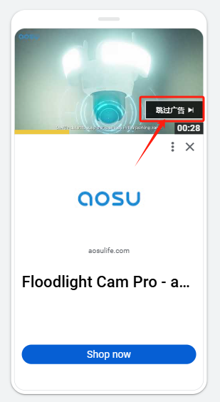
  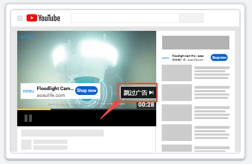
  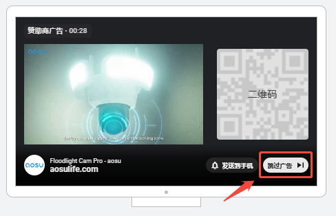

##### 系统如何向我收费？

采用“每次观看费用”出价策略时，如果观看者观看您的视频达到 30 秒（如果视频不足 30 秒，则为整个视频的时长），或者与您的视频进行互动（二者取其先），您就需要付费。

使用“目标每千次展示费用”“目标每次转化费用”和“尽可能提高转化次数”出价策略时，则按照展示次数付费。

##### 如需使用此广告格式，我需要选择什么广告系列目标？

- 销售
- 潜在客户
- 网站流量
- 认知度和考虑度

#### 不可跳过的插播广告

##### 在什么情况下应使用此广告格式？

如果您想在 YouTube 上或 Google 视频合作伙伴的网站和应用中宣传您的视频内容，并让该内容在其他视频播放前、播放过程中或播放后展示，同时希望观看者看完所有内容而不要跳过您的视频，则可采用不可跳过的插播广告。

##### 这种格式的广告如何运作？

不可跳过的插播广告时长不超过 15 秒，可在其他视频播放前、播放过程中或播放后播放。观看者无法选择跳过此类广告。

##### 这种格式的广告在哪里展示？

不可跳过的插播广告可在 YouTube 视频中以及 Google 视频合作伙伴的网站和应用中展示。

##### 展示效果

不可跳过的插播广告

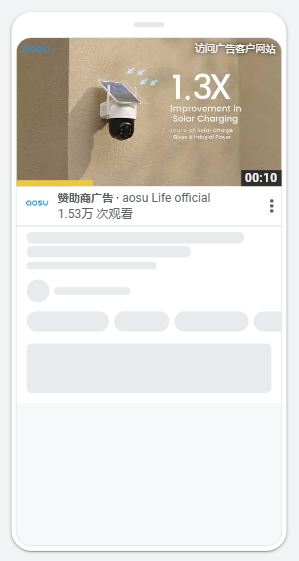
  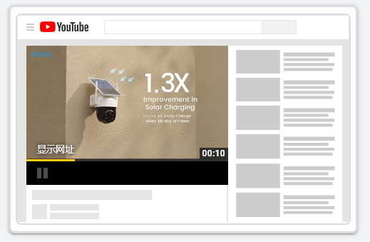

    ####
  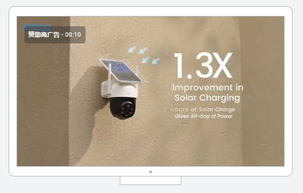

##### 系统如何向我收费？

不可跳过的插播广告采用“目标每千次展示费用”出价策略，因此您需要根据展示次数付费。

##### 如需使用此广告格式，我需要选择什么广告系列目标？

- 认知度和考虑度

#### 信息流视频广告

##### 在什么情况下应使用此广告格式？

您可以使用信息流视频广告在相关 YouTube 视频旁边、YouTube 搜索结果中或移动版 YouTube 首页上等用户有可能查看的位置宣传您的视频内容。

##### 这种格式的广告如何运作？

信息流视频广告由一张从视频中截取的缩略图和一些文字组成。虽然这种广告的确切尺寸和外观可能会因展示位置而有所变化，但其往往能够吸引用户点击观看视频。用户点击后，相应的视频会在 YouTube 观看页面或频道首页上播放。

##### 这种格式的广告在哪里展示？

信息流视频广告会在以下位置展示：

- YouTube 搜索结果中
- 相关 YouTube 视频的旁边
- 移动版 YouTube 的首页上

##### 展示效果

- 信息流视频

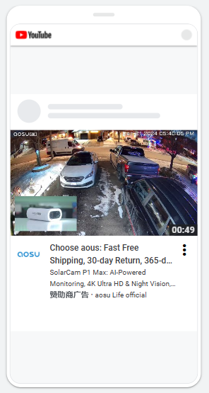
  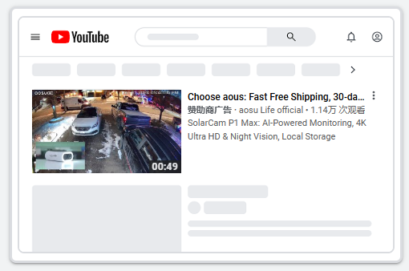
  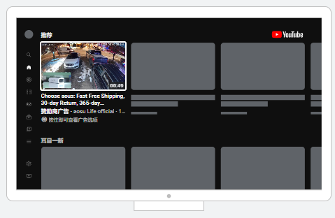

##### 系统如何向我收费？

仅当有人点击观看广告或者在某些情况下观看广告自动播放至少 10 秒时，您才需要付费。

##### 如需使用此广告格式，我应选择哪些广告系列目标？

- 认知度和考虑度

#### Short广告

##### 在什么情况下应使用此广告格式？ {folded="true"}

当您想在 YouTube 上的 Shorts 动态中宣传视频内容时，可以使用此格式，以便在针对移动设备进行了优化的体验中覆盖大量感兴趣的观看者。

##### 这种格式的广告如何运作？ {folded="true"}

Shorts 广告的用户体验与自然 Shorts 短视频类似。

- 广告将在自然 Shorts 短视频之间随机呈现和展示。
- 用户可以通过向上或向下滑动以立即跳过广告。
- 系统会保留广告视频，并在用户滚动回来后重新显示。
- 点击号召性用语 (CTA) 按钮后，用户会转到指定的着陆页

##### 这种格式的广告在哪里展示？

Shorts 广告会在平板电脑、移动应用以及联网设备（例如流媒体设备、游戏机和电视）上投放。

##### 展示效果

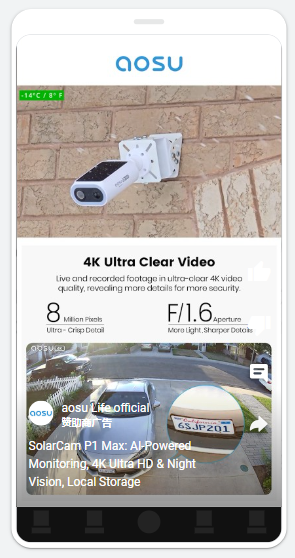

##### 系统如何向我收费？

对于 Shorts 广告，系统会按展示次数、观看次数或互动次数向您收费。

系统会将以下情况统计为一次观看：

- 自动播放 10 秒后
- 点击后（如果广告素材循环播放，您只需支付一次费用，并计为一次观看）
- 如果广告最短时长为 6 秒，则为在观看时长小于 10 秒至完全观看完之后

点击 Shorts 广告是指点击号召性用语 (CTA)；暂停广告不会计为一次点击。

Shorts 上的展示次数是指广告开始播放，可见的展示次数是指广告播放 2 秒。如果您采用目标 [CPM](https%3A%2F%2Fsupport.google.com%2Fadmob%2Fanswer%2F3436338)（每千次展示费用）出价策略，则系统会按展示次数向您收取费用。

当用户观看广告 5 秒或点击号召性用语 (CTA) 时，在 Shorts 上就会发生一次互动。

#### 导视广告

##### 在什么情况下应使用此广告格式？

如果您想通过简短却令人难忘的内容触达海量的观看者，可使用导视广告。

##### 这种格式的广告如何运作？

导视广告的时长不超过 6 秒，可在其他视频播放前、播放过程中或播放后展示。观看者无法选择跳过此类广告。

##### 这种格式的广告在哪里展示？

导视广告可在 YouTube 视频中以及 Google 视频合作伙伴的网站和应用中展示。

##### 展示效果

导视广告

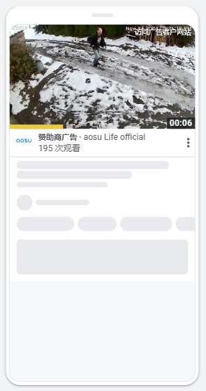
  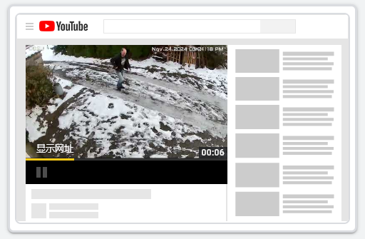

    #####
  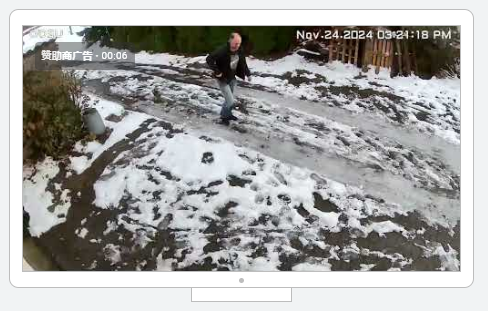

##### 系统如何向我收费？

导视广告采用“目标每千次展示费用”出价策略，因此您需要根据展示次数付费。

##### 如需使用此广告格式，我需要选择什么广告系列目标？ {folded="true"}

- 认知度和考虑度

#### 标头广告（不常用）

##### 在什么情况下应使用此广告格式？

如果您希望提高新产品或新服务的知名度，或者希望在短时间内（例如促销活动期间）覆盖大量观众，请使用此格式。

标头广告只能通过 Google 销售代表以预订方式进行投放。

##### 这种格式的广告如何运作？

桌面设备

标头广告中的精选视频会在 YouTube 首页动态顶部以静音模式自动播放，最长可播放 30 秒。标头广告可采用宽屏格式或宽高比为 16:9 的格式展示，并在右侧包含一个信息面板；面板中的信息是自动根据您频道中的素材资源确定的。您可以视需要在此面板中添加最多 2 个随播视频。用户如果想听到视频中的声音，可以点击静音图标。

主视频自动播放完毕后，默认会显示视频缩略图。用户点击视频或缩略图后，会转至相应视频的 YouTube 观看页面。

移动设备

标头广告中的精选视频会在 YouTube 应用顶部或 m.youtube.com 首页动态顶部以静音模式自动播放完整视频内容。

移动视频标头广告配有视频缩略图、可自定义的标题、说明文字，以及点击后会跳转到外部页面的号召性用语 (CTA)。移动视频标头广告还会自动添加广告客户频道的频道名称和图标。用户点击移动视频标头广告后，会转至相应精选视频的 YouTube 观看页面。

电视屏幕

标头广告中的精选视频会在适用于电视的 YouTube 应用的顶部以静音模式自动播放（如果支持的话）完整视频内容。标头广告可采用宽屏格式或宽高比为 16:9 的格式。用户可以使用电视遥控器与标头广告互动。主视频自动播放完毕后，默认会显示视频缩略图。用户点击视频或缩略图后，会转至相应视频的观看页面进行全屏观看。

您不能向电视屏幕上的标头广告添加号召性用语。

##### 系统如何向我收费？

由于标头广告只能以预订方式进行投放，因此您需要按每千次展示费用 (CPM) 付费。您可以与 Google 广告团队一起估算费率和确定广告系列的展示次数目标。
