### 视频广告系列素材准备

> 💡 **提示**：需要将符合Youtube广告规格的视频上传至Youtube上<text color="red">生成链接</text>，再用于广告创建和投放。简而言之，Google Ads的视频投放一定需要有视频link。 品牌自有频道，上传视频生成链接即可投放 红人的视频link，需要从Ads后台申请绑定，红人同意后才能投放

1. 视频尺寸建议
  

> 📊 表格内容：点击 [此处](https://pwl28kvg7c4.feishu.cn/sheets/OzuXspQyxhp5OHtQJYAcGk92nmh_ZT4iJ9) 查看原表格（建议截图替换为本地图片）

1. Short版位和YouTube版位视频广告的建议：

  <lark-table rows="6" cols="2" column-widths="409,400">

    <lark-tr>
      <lark-td>
        **Short版位视频建议**
      </lark-td>
      <lark-td>
        **YouTube版位视频建议**
      </lark-td>
    </lark-tr>
    <lark-tr>
      <lark-td>
        - 短小精悍，信息传递清晰有效
      </lark-td>
      <lark-td>
        - 制作高质量、专业的内容，确保故事性
      </lark-td>
    </lark-tr>
    <lark-tr>
      <lark-td>
        - 开头引人注目，抓住观众注意力
      </lark-td>
      <lark-td>
        - 配合内容复杂程度和目标受众调整视频时长
      </lark-td>
    </lark-tr>
    <lark-tr>
      <lark-td>
        - 明确的号召性用语，指导观众采取行动
      </lark-td>
      <lark-td>
        - SEO优化，使用关键字提升可见性
      </lark-td>
    </lark-tr>
    <lark-tr>
      <lark-td>
        - 适合移动端播放，确保在小屏幕上清晰可见
      </lark-td>
      <lark-td>
        - 清晰展示品牌元素，增强品牌认知
      </lark-td>
    </lark-tr>
    <lark-tr>
      <lark-td>
        - 使用字幕，以适应静音观看习惯
      </lark-td>
      <lark-td>
        - 加入互动元素，增加用户参与感
      </lark-td>
    </lark-tr>
  </lark-table>

1. 视频素材建议
  

> 📊 表格内容：点击 [此处](https://pwl28kvg7c4.feishu.cn/sheets/OzuXspQyxhp5OHtQJYAcGk92nmh_Zq7GyQ) 查看原表格（建议截图替换为本地图片）

### 视频广告的创意制作

> 💡 **提示**：制作效果出色的 YouTube 视频广告的 4 大原则分别是吸引观众注意力、塑造品牌、建立联系并引导观众采取行动。本文将介绍 ABCD 核心原则以及按营销目标划分的这些原则，以帮助您制作效果更理想的 YouTube 视频广告。

#### ABCD 核心原则

> 📊 表格内容：点击 [此处](https://pwl28kvg7c4.feishu.cn/sheets/OzuXspQyxhp5OHtQJYAcGk92nmh_Xi2VNS) 查看原表格（建议截图替换为本地图片）

#### 发挥创意

> 💡 **提示**：确保您为广告制作的视频富有吸引力。请记住，您的受众群体并不会目不转睛地盯着您的广告看，这是因为观看者在 5 秒后可以跳过视频。

- 保证视频简短且富有吸引力。将您最重要的信息放在视频较前的部分，以防观看者在视频结束之前停止观看。45 秒后[播放率](https%3A%2F%2Fsupport.google.com%2Fgoogle-ads%2Fanswer%2F38679)会显著下降。
- 由于视频可能是您与网站观看者沟通的唯一途径，因此请务必表述清楚您的业务范畴。
- 在视频结束后，为客户提供明确的后续操作。这可以是进行购买，或者是访问您的网站或商店。

#### 广告文字建议

- 避免在广告文字中使用宽泛的主题，而应使您的广告文字重点阐述为什么人们在看到您的宣传广告时，应该点击广告以观看您介绍的内容。举例来说，相对于电视广告，电影预告片中通常使用什么风格的语言？电影预告片会使用标语和字幕来激发观众对电影故事的兴趣，并吸引他们继续关注该影片。尝试鼓励用户通过您的视频了解或查看更多内容，而不是一味地突出强调产品或服务的销售。
- 选择相关的关键字和宣传文字可以帮助您以合理的价格将视频内容展示给感兴趣的观看者。尝试使用不同的关键字和宣传文字是实现您的目标的理想方式。
- 如果您希望用户采取行动，请邀请他们执行可以在 YouTube 进行的操作，如：“订阅”、“观看”、“录制视频回复”或“评论”。

#### 视频静态图片

- 制作信息流视频广告时，您会看到有多种视频静态图片或“缩略图图片”可供选择。这些静态图片是 YouTube 用户在点击您的宣传广告之前第一眼看到的内容。请选择最能突显您的广告内容的视频静态图片。您还可以尝试将此图片与您的宣传文字内容或关键字进行匹配。
- 例如，如果您的视频展示的是冲浪的场面，您可以选择刚好捕捉了冲浪瞬间的视频静态图片。撰写宣传广告文字和选择关键字时，您应对冲浪有所提及。这样，您制作了一个结构合理的推荐视频广告，如果用户在搜索有关冲浪的视频时看到了您的推荐视频并进行了点击和观看，他们会认为您的广告很有意思。

### 创建视频覆盖面广告系列（含上线思维导图及SOP)

> 💡 **提示**：视频覆盖面广告系列是 Google Ads 中用于<text color="red">购买覆盖面</text>的新一代广告系列。利用该广告系列，您可以投放导视广告、可跳过的插播广告、不可跳过的插播广告、信息流广告或 Shorts 广告，在不超出预算的前提下覆盖更多用户。

#### 视频覆盖面广告系列优势

- 推动实现覆盖面目标：视频覆盖面广告系列会<text color="red">以扩大覆盖面为目标</text>进行优化，可根据您的预算和定位条件尽可能多地覆盖唯一身份用户。
- <text color="red">可灵活选择</text>希望以何种方式达成覆盖面目标：您既可以在保持预算不变的情况下，通过高效组合导视广告、可跳过的插播广告、信息流广告和 Shorts 广告格式来最大限度地扩大覆盖面；也可以只使用不可跳过的插播广告格式，在触达用户时向其传递完整讯息；甚至还可以使用导视广告、可跳过的插播广告和不可跳过的插播广告格式的不同组合，每周多次覆盖相同用户。
- <text color="red">培养品牌认知度</text>：无论您选择以何种方式达成覆盖面目标，覆盖面广告系列都是最具成本效益的方式，可以最大限度地提高品牌在广大受众群体中的曝光度。

#### 视频覆盖面广告系列适用情形

- 您是设定了覆盖面或认知度目标的品牌买方，希望 Google 帮助您<text color="red">以尽可能低的价格找到</text>目标受众群体中<text color="red">尽可能多的用户</text>。
- 您想要设置一个包含多种广告格式的广告系列，以经济实惠的方式尽可能扩大覆盖面，而不是制作多个分别采用不同广告格式的广告系列。
- 您只想使用不可跳过的插播广告来覆盖用户，确保对方能看到您的完整讯息。
- 您想要多次覆盖相同用户，从而提高广告回想度，并提升用户对您产品或服务的考虑度。

#### 视频覆盖面广告系列运作方式

- 经济实惠地扩大覆盖面：可使用[导视广告](https%3A%2F%2Fsupport.google.com%2Fgoogle-ads%2Fanswer%2F2375464%2Fabout-video-ad-formats%23bumper-ads)、[可跳过的插播广告](https%3A%2F%2Fsupport.google.com%2Fgoogle-ads%2Fanswer%2F2375464%2Fabout-video-ad-formats%23skippable-instream)或根据需要在同一个广告系列中搭配使用这两种广告格式，以更低的费用覆盖更多的唯一身份用户。如果您启用了“多格式广告”，还可以使用信息流广告和 Shorts 广告，在不超出预算的前提下覆盖更多用户。
- 不可跳过的插播广告：可使用时长不超过 15 秒的不可跳过的插播广告，在触达受众群体时向其传递完整讯息。
- 目标频次：可使用导视广告、可跳过的插播广告和[不可跳过的插播广告](https%3A%2F%2Fsupport.google.com%2Fgoogle-ads%2Fanswer%2F2375464%2Fabout-video-ad-formats%23nonskippable-instream)每周按设定次数覆盖相同用户。

#### 视频覆盖面广告系列广告素材指南

> 📊 表格内容：点击 [此处](https://pwl28kvg7c4.feishu.cn/sheets/OzuXspQyxhp5OHtQJYAcGk92nmh_2X92x7) 查看原表格（建议截图替换为本地图片）

> 📊 表格内容：点击 [此处](https://pwl28kvg7c4.feishu.cn/sheets/OzuXspQyxhp5OHtQJYAcGk92nmh_pfCr1a) 查看原表格（建议截图替换为本地图片）

> 📊 表格内容：点击 [此处](https://pwl28kvg7c4.feishu.cn/sheets/OzuXspQyxhp5OHtQJYAcGk92nmh_xZmJ7v) 查看原表格（建议截图替换为本地图片）

#### 创建视频覆盖面广告系列步骤（有思维导图和后台操作SOP)

##### 创建视频覆盖面广告系列 （思维导图）

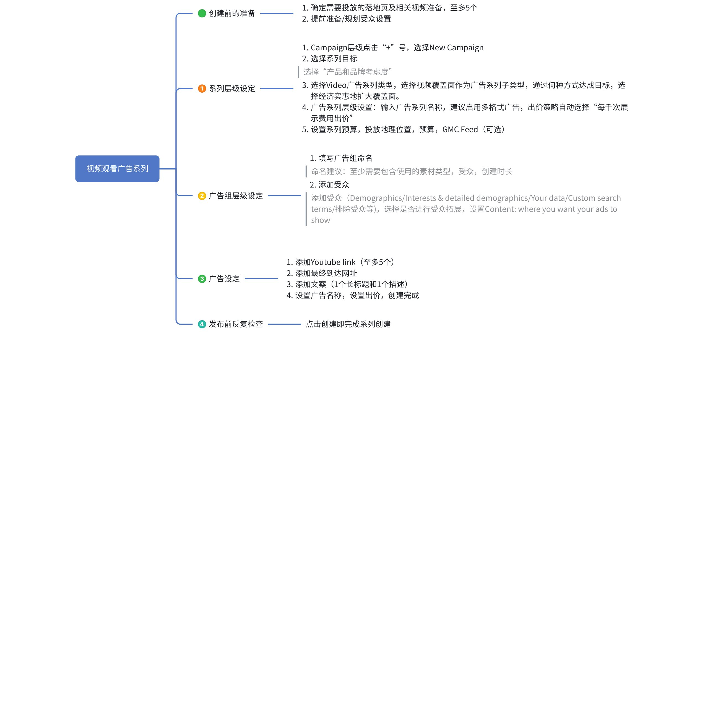

##### 创建视频覆盖面广告系列 （SOP）

###### Campaign层级点击“+”号，选择New Campaign

###### 选择认知度和考虑度作为广告系列目标，选择视频广告系列类型，选择视频覆盖面作为广告系列子类型；通过何种方式达成目标，选择经济实惠地扩大覆盖面。

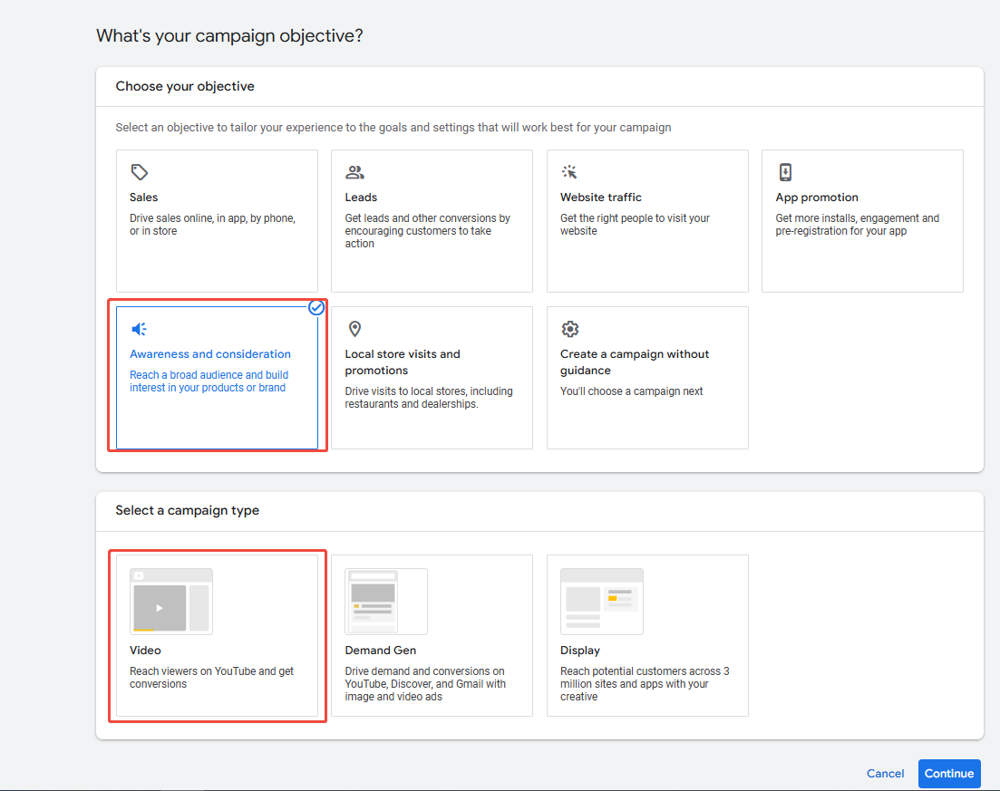

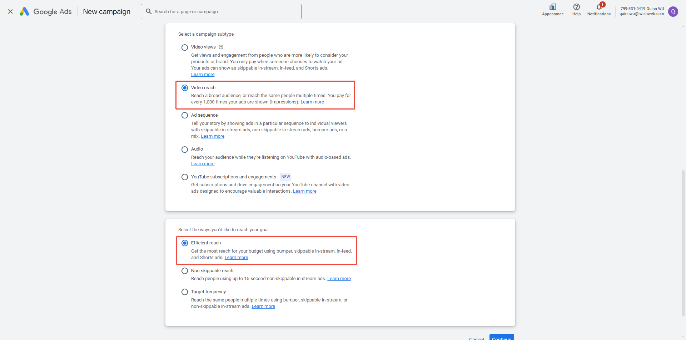

###### 广告系列层级设置：输入广告系列名称，建议启用多格式广告，出价策略自动选择“每千次展示费用出价”。

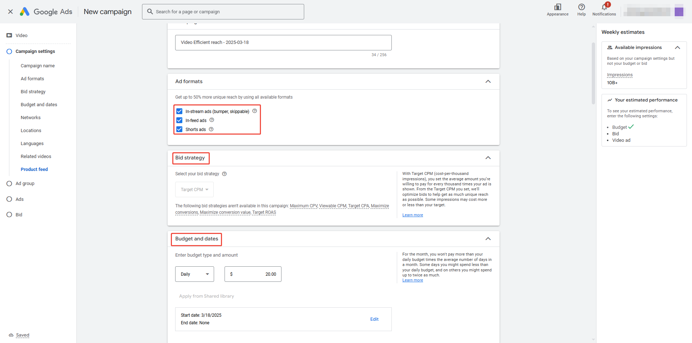

###### 设置系列预算，投放地理位置，预算，GMC Feed（可选）

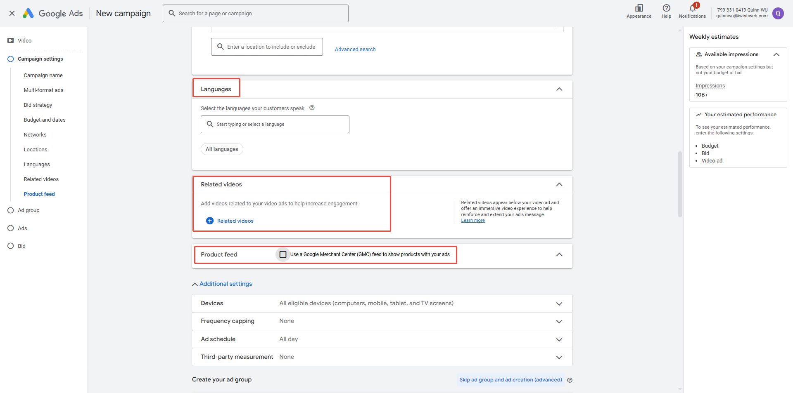

###### 广告组层级设置：输入广告组名称，添加受众（Demographics/Interests & detailed demographics/Your data/Custom search terms/排除受众等)，选择是否进行受众拓展，设置**Content**: where you want your ads to show

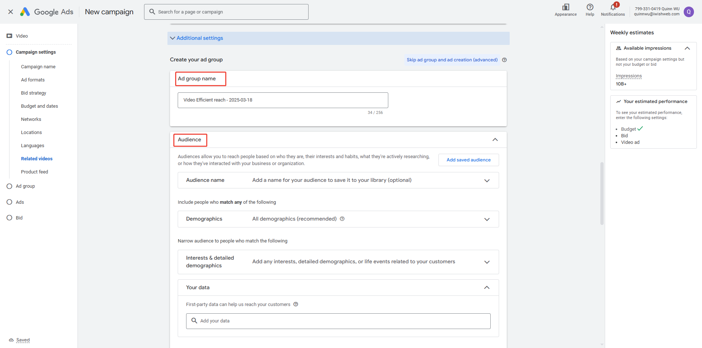

###### 广告设置：添加Youtube link（至多5个），添加最终到达网址，添加文案（1个长标题和1个描述），设置广告名称，设置出价，创建完成。

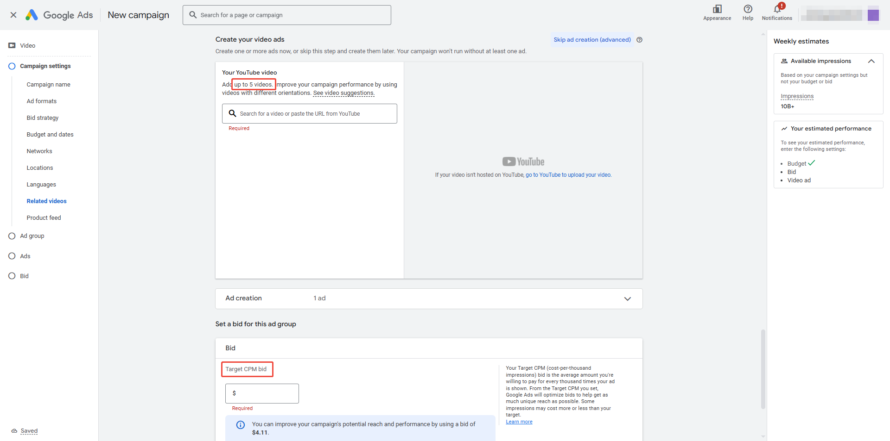

### 创建视频观看广告系列（含上线思维导图及SOP)

> 💡 **提示**：利用“视频观看广告系列”子类型，您可以在效果最佳的位置展示广告，以更低的费用获得更多的视频广告观看次数。

#### 视频观看广告系列的优势 {folded="true"}

- 通过简化的流程轻松设置广告系列，无需再考虑广告格式和格式组合。
- 您的视频可以利用 Google AI 技术以各种广告格式投放，在预算不变的情况下获得更多潜在观看次数，从而提高[**投资回报率 (ROI)**](https%3A%2F%2Fsupport.google.com%2Fgoogle-ads%2Fanswer%2F14090)。
- 在观看者浏览、探索和观看长视频内容，以及欣赏和浏览短视频内容时展示广告，从而提高品牌钟意度。

#### 视频观看广告系列的运作方式 {folded="true"}

- 有些视频广告采用特定广告格式可取得更好的效果。视频观看广告系列使用多格式视频广告，混合搭配多种广告格式的视频广告，以确定在哪些位置投放效果最佳。
- 如果您不想使用多格式视频广告，也可以在单独的广告组中使用可跳过的插播广告或信息流视频广告。不过，使用相同的设置的不同广告组会导致您的广告相互竞争，从而减少广告系列可能获得的总观看次数。使用多格式视频广告可确保您的广告在一个广告组中以所有格式投放，从而最大限度提高您获得的总观看次数。
- Shorts 广告仅适用于多格式广告系列，可与插播广告和信息流视频广告组合使用。

#### 视频观看广告系列中的广告格式 {folded="true"}

- **可跳过的插播广告**在其他视频播放前、播放过程中或播放后播放。在此类广告<text color="red">播放 5 秒钟之后</text>，用户可以选择跳过广告的其余部分。用户必须与视频广告互动或观看视频广告达 30 秒或全部观看（如果广告时长不足 30 秒），才能计为一次观看。
- **信息流视频广告**以缩略图的形式显示，其中包含一张视频图片和一些文字。用户可以观看内嵌的自动播放视频广告，也可以点击缩略图，在更大的屏幕上观看视频广告。用户必须<text color="red">点击缩略图或观看自动播放广告至少 10 秒</text>（如果广告时长不足 10 秒，则要等到广告播放完毕），才会计为一次观看。
  - 注意：在大多数情况下，只有在用户点击广告后，系统才会统计信息流视频广告观看次数。在视频观看广告系列中，只有当信息流视频广告自动播放至少 10 秒或持续播放完毕（如果时长不足 10 秒），才会计为一次观看。这样可增加广告系列的整体观看次数，还能让您更详细地了解哪些人在关注您的广告，从而帮助您改善今后的广告系列效果。
- Shorts 广告在 YouTube 推出的短视频信息流“YouTube Shorts”上播放。用户可以随时跳过广告。用户观看视频广告的时间必须至少达到 10 秒，或看完整个广告（如果广告时长不足 10 秒），才会计为一次观看。

#### 出价策略 {folded="true"}

- 适用于视频观看广告系列的出价策略是<text color="red">“目标每次观看费用 (CPV)”</text>。采用“目标每次观看费用”出价策略时，您需要设置愿意为广告系列获得的每次观看支付的平均金额。
- 我们会根据您设置的目标每次观看费用优化出价，帮助您尽可能获得更多观看次数。部分观看次数的费用可能会高于或低于您设置的目标。
- 如果您选择停用多格式视频广告，则出价策略将改为最高每次观看费用。采用“<text color="red">最高每次观看费用</text>”出价策略时，您需要设置愿意为广告系列获得的每次观看支付的最高金额。

#### 创建视频观看广告系列步骤（有思维导图和后台操作SOP)

##### 创建视频观看广告系列 （思维导图）

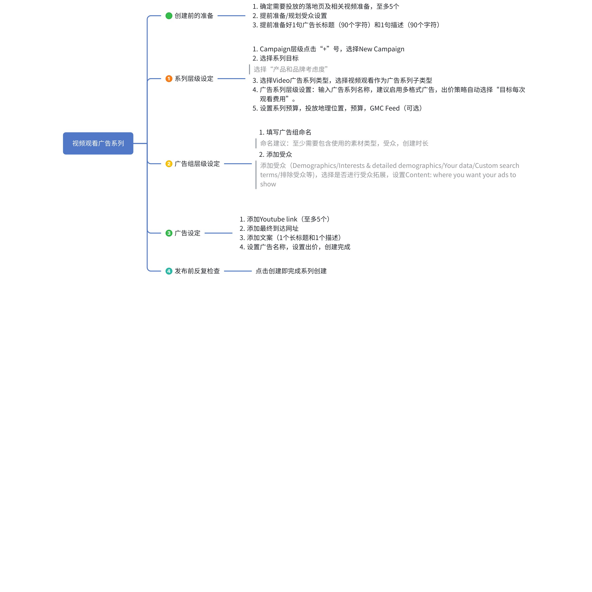

##### 创建视频观看广告系列 （SOP）

###### Campaign层级点击“+”号，选择New Campaign

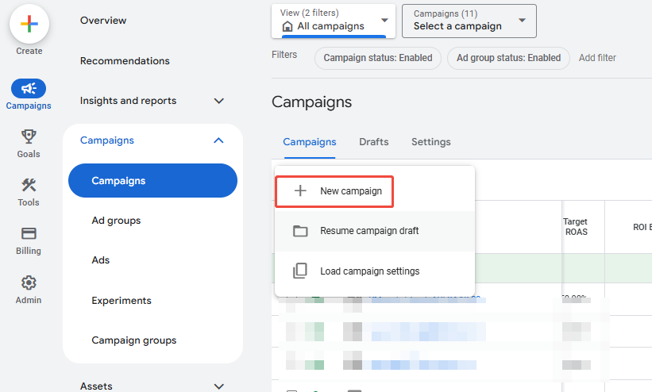

###### 选择认知度和考虑度作为广告系列目标，选择视频广告系列类型，选择视频观看作为广告系列子类型。

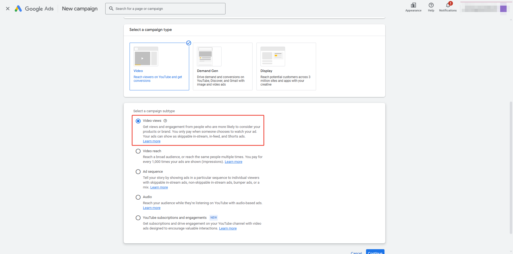

###### 广告系列层级设置：输入广告系列名称，建议启用多格式广告，出价策略自动选择“目标每次观看费用”。

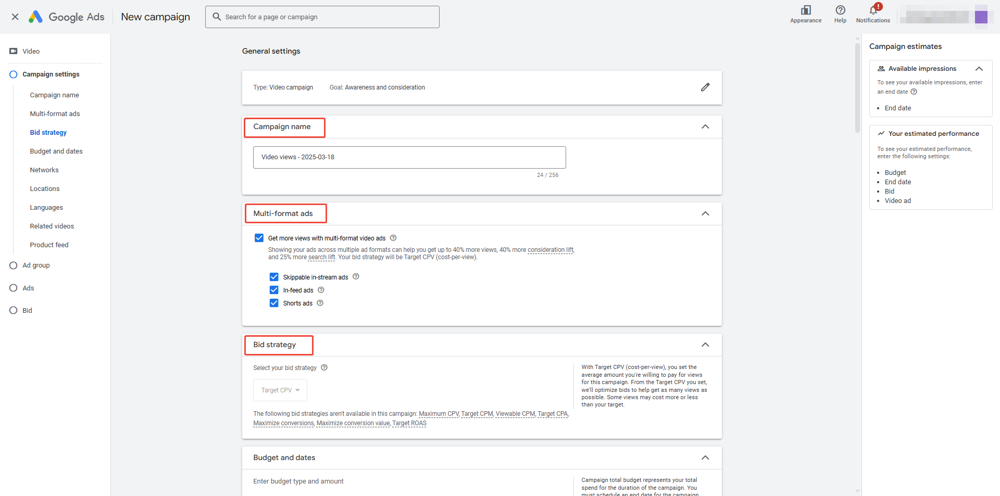

###### 设置系列预算，投放地理位置，预算，GMC Feed（可选）

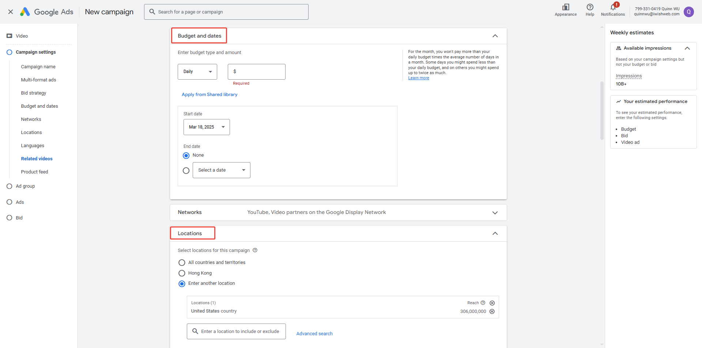

###### 广告组层级设置：输入广告组名称，添加受众（Demographics/Interests & detailed demographics/Your data/Custom search terms/排除受众等)，选择是否进行受众拓展，设置**Content**: where you want your ads to show

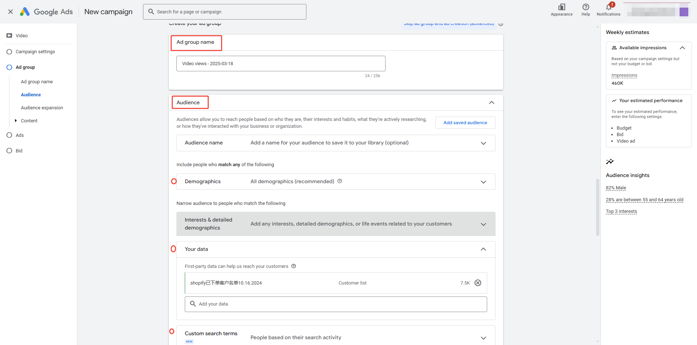

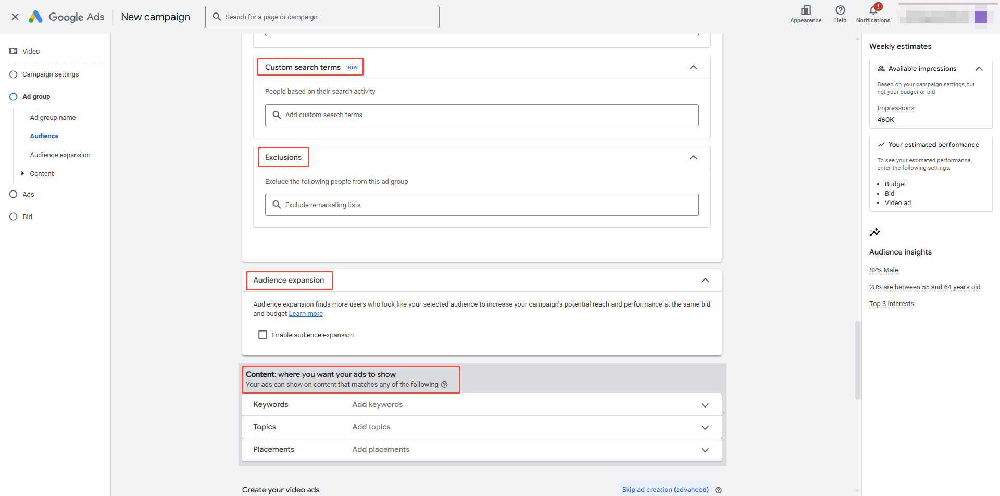

###### 广告设置：添加Youtube link（至多5个），添加最终到达网址，添加文案（1个长标题和1个描述），设置广告名称，设置出价，创建完成。

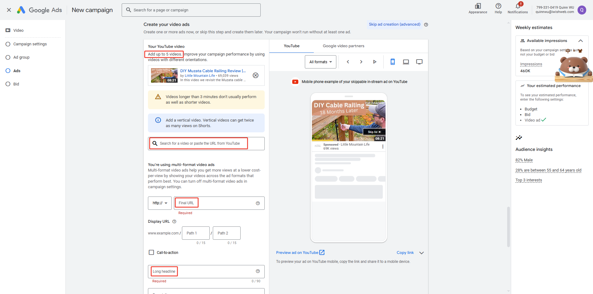

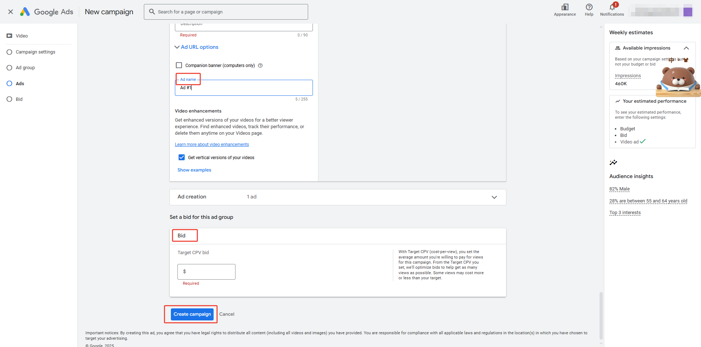

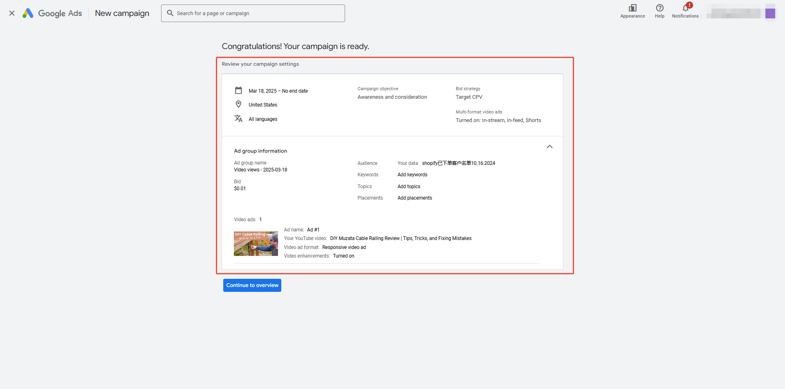

