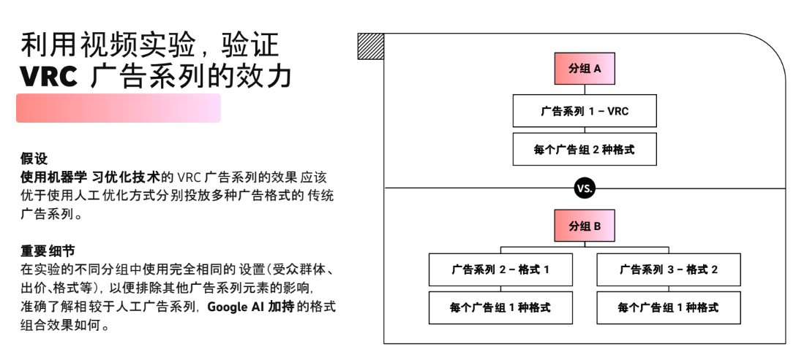

## （三）视频广告的数据指标

#### 关于 YouTube 广告和观看指标

##### YouTube 视频指标的类型 {folded="true"}

1. 展示次数指标：反映了广告系列的覆盖面，以及观看者看到信息流广告缩略图、视频最初的插播广告部分或 Shorts 广告播放的频次。
  1. 插播广告展示次数：当视频广告开始在观看页面上播放时（无论是在观看者自然观看的视频播放前、播放期间还是播放后），系统就会统计一次插播广告展示。
  1. 信息流广告展示次数：当观看者看到视频广告的缩略图时，系统就会统计一次信息流广告展示。
  1. YouTube Shorts 广告展示次数：当视频开始在 Shorts 动态中 Shorts 自然视频之间播放时，系统就会统计一次 YouTube Shorts 广告展示。
1. “付费观看次数”指标反映了观看者看完广告的大部分内容或完整看完广告的次数，程度比展示要深一点。
  1. 插播广告观看次数：当观看者观看视频达 30 秒或完整看完视频（二者取其先）时，系统就会将一次观看计入该指标。与广告的互动也可以增加观看次数。
  1. 信息流广告观看次数：当观看者点击缩略图并转到视频观看页面后，视频观看页面开始加载时，系统就会将一次观看计入该指标。
1. “互动次数”列反映的是视频广告系列的深度互动情况。每当观看者观看广告 10 秒后，系统即会统计一次深度互动。
1. “观看率”指标指带来观看的展示次数所占百分比
  <text color="red">观看率 = 观看次数 / 展示次数</text>
1. 平均每次观看费用（CPV） = 费用 / 观看次数
1. “视频播放至”指标：在启动视频播放器的观看者中，观看视频至 25%、50%、75% 或 100% 的用户所占的百分比。
  <text color="red">“视频播放至 25%”百分比 = </text><text color="red" underline="true">视频播放 25% 之后仍在观看的观看者人数</text><text color="red"> / 视频播放器启动次数</text>
1. 额外带来的操作次数：包括额外带来的观看次数、顶的次数、订阅人数、添加到播放列表的次数和分享次数。
1. “可见度”指标指如果一则广告有至少 50% 的区域在用户视野中持续显示达 1 秒（对于在展示广告网络中投放的广告）或 2 秒（对于视频广告），该广告即被认定为“可见”。

https://support.google.com/google-ads/answer/2375431

##### “品牌认知度和覆盖面”相关指标的衡量方式 {folded="true"}

- 最高每千次展示费用（最高 CPM）：指您为广告系列或广告组设置的出价，它应该是您在竞价中愿意为获得的每千次展示支付的最高金额。
- 平均每千次展示费用（平均 CPM）：CPM 可帮助您确定您为获得的每千次展示支付的平均金额。请注意，良好的平均 CPM 因国家/地区而异，因为 CPM 出价需要满足下限要求有所不同。

CPM = 费用 /（展示次数/1,000） {align="center"}

- “依序播放视频广告的广告系列获得的所有展示次数”：这是指[依序播放视频广告的广告系列](https%3A%2F%2Fsupport.google.com%2Fgoogle-ads%2Fanswer%2F9161595)获得的展示次数与推动了依序播放广告的广告系列展示进度的其他广告系列获得的展示次数的总和。
- 观看时长和每次展示的平均观看时长
  - 观看时长：该指标衡量的是在特定时段内，用户观看您的视频广告的总时长（以秒为单位）。
  - 每次展示的平均观看时长：该指标衡量的是在每次广告展示中，用户观看视频广告的平均秒数。

##### “销售”“网站流量”和“潜在客户”相关指标的衡量方式 {folded="true"}

- 浏览型转化 (VTC)：“浏览型转化”是指当您的广告向用户展示一次（但没有计为一次观看或点击），然后用户在[转化时间范围](https%3A%2F%2Fsupport.google.com%2Fgoogle-ads%2Fanswer%2F7320922)（转化时间范围的长度在您在账号中创建转化操作时确定）内在您的网站上完成转化时，系统记录的转化。
- 点击次数和点击率 (CTR)：每当观看者点击广告的互动元素时，系统便会统计一次点击；与展示次数、观看次数（如果目标为“认知度”）或转化次数（如果目标为“销售”）相比，CTR（点击次数/展示次数）通常不应视为视频广告系列的优先考虑指标。与搜索广告系列相比，视频广告系列的“点击次数”和“CTR”较低属于正常现象。
- 转化次数：在视频广告系列中，如果观看者“观看”了您的广告，然后执行了某项您定义为对您的业务有价值的操作（例如网上购买或通过手机致电您的商家），系统就会统计一次转化。
- 感兴趣的观看转化 (EVC)：如果观看者没有点击您的视频广告，但观看了可跳过的广告（在 5 秒钟后可跳过）至少 10 秒钟，然后在感兴趣的观看转化时间范围内完成了转化，系统会统计一次感兴趣的观看转化。
- 转化率 (CVR)：借助“转化率”指标，您可以深入了解发生一次观看后，您的广告在吸引用户访问您的网站并完成转化方面的效果如何。与其他许多指标一样，良好的 CVR 在因广告客户所在的行业而异。

<text color="red">CVR = 转化次数 / 观看次数</text> {align="center"}

#### 准确衡量广告系列的影响力

##### Q1：我的广告系列是否触达了目标受众群体？用户看到我的广告频次如何？ {folded="true"}

<lark-table rows="5" cols="2" column-widths="286,391">

  <lark-tr>
    <lark-td>
      **解决方案** {align="center"}
    </lark-td>
    <lark-td>
      **关键优势** {align="center"}
    </lark-td>
  </lark-tr>
  <lark-tr>
    <lark-td>
      覆盖的唯一身份用户数
    </lark-td>
    <lark-td>
      在 Google 界面中,跨设备、格式、广告系列和广告资源,了解整体覆盖面和频次情况
    </lark-td>
  </lark-tr>
  <lark-tr>
    <lark-td>
      额外覆盖的用户数
    </lark-td>
    <lark-td>
      利用 Nielsen TAR 了解额外覆盖的用户数（不常用，可研究）
    </lark-td>
  </lark-tr>
  <lark-tr>
    <lark-td>
      每位用户的平均频次，
      平均7天频次
      平均30天频次
    </lark-td>
    <lark-td>
      跨广告系列了解任意 7 天或 30 天时间段内的详细频次效果数据,从而更深入地分析每周和每月的频次效果
    </lark-td>
  </lark-tr>
  <lark-tr>
    <lark-td>
      视频完整播放率（视频播放到100%）
    </lark-td>
    <lark-td>
      了解在多大比例的展示中,用户完整观看了您的广告
    </lark-td>
  </lark-tr>
</lark-table>

##### Q2：我的广告系列是否吸引了注意力？ {folded="true"}

关注广告回想度和品牌认知度，了解用户对您品牌的看法，无需额外付费

##### Q3：如何借助观看时长数据，了解哪些视频吸引他们的时间更长？

- 比较两个包含<text color="red">不同视频广告</text>的相似视频广告系列，或比较两个包含不同视频广告的相似广告组，确定哪个广告能获得更长的观看时间，有助于您了解哪类视频内容可以引起受众群体的共鸣。
- 尝试将相同广告素材应用到不同广告系列配置中，确定哪种广告系列的<text color="red">目标受众群体</text>能带来更高的每次展示的平均观看时长。
- 观看时长显示了用户观看您的广告素材的平均时长（以秒为单位）。您在制作新视频和设置视频广告素材结构时，可以借鉴和参考这些数据。

#### 利用视频实验，验证VRC 广告系列的效力

